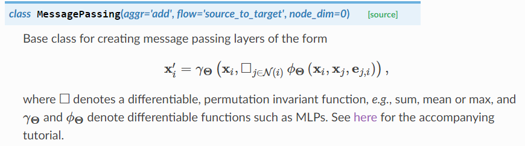
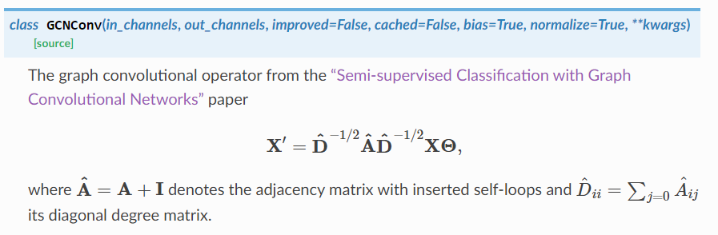
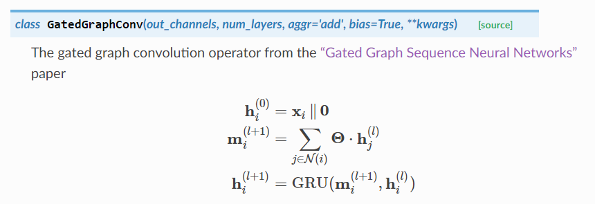
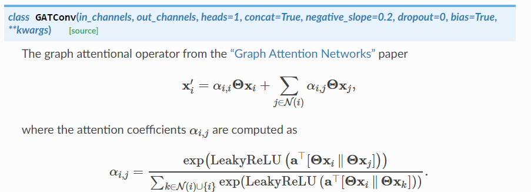
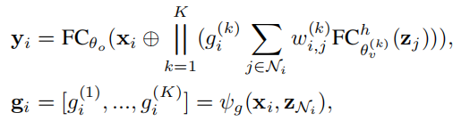
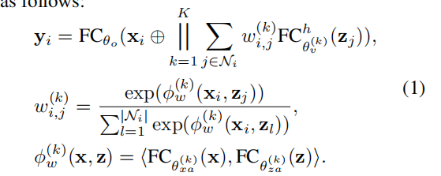
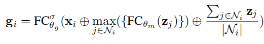

## pyg-gnns

基于pytorch-geometric的图神经网络评测

[message-passing](https://pytorch-geometric.readthedocs.io/en/latest/modules/nn.html#module-torch_geometric.nn.conv.message_passing)

### 1. 简要介绍
#### 1.1 GCN

#### 1.2 GatedGraph

#### 1.3 GAT

#### 1.4 GaAN

主要公式：

1. Attentions与GAT不同之处为：

2. Gated计算公式

### 2. 精度, 准确率结果cora数据集
200轮，在推荐精度下的结果

- gcn: 0.814
- ggnn: 0.662
- gat: 0.824
- gaan: 0.726

### 3. todo
1. 将数据集整理为dataloader格式
2. 修改参数接口 

两种数据划分的方式