# [AliGraph](#ref-AliGraph)

## 数据模型

AliGraph面向的数据模型为Attributed Heterogeneous Graph (AHG)。

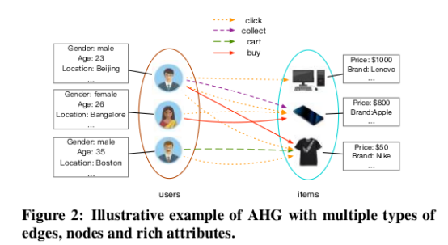

## 算法框架

AliGraph所支持的通用GNN框架。在该框架中，每一层的GNN被拆解为三个基本算子：Sample, Aggregate和Combine。其中Aggregate进行边计算，而Combine进行点计算。

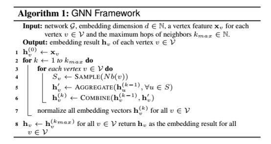

>  注意：在该算法框架中，每一层（hop）都采用了相同的Sample/Aggregate/Combine算子，其不允许不同层采用不同的算子进行组合。

## 系统框架

AliGraph的系统架构如下。最上面是Aggregate和Combine算子的实现，中间是Sampling方法，最下面是图存储。目前的AliGraph主要运行在CPU环境中。

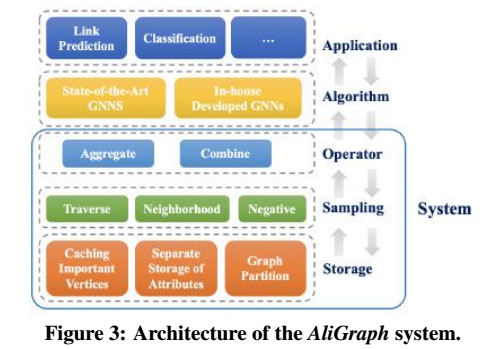

### 图存储

AliGraph采用的是vertex-cut的划分方案，即不同的边被分到不同的机器上。

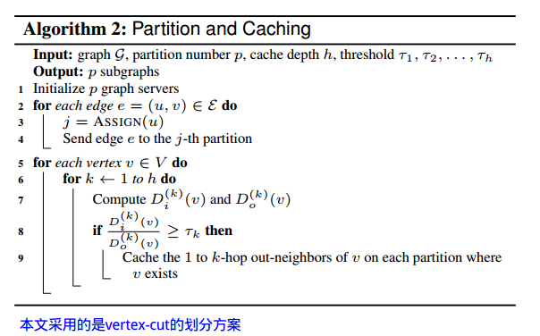

图中顶点和边的属性与图的邻接表**分开存储**，见图[AliGraph-Fig4](#fig-AliGraph-Fig4)。原因有二：

1.  属性信息更占据存储空间。

2. 不同顶点/边的属性有很大的重叠。例如大量顶点都具有共同的标签，例如“男性”、“洗漱用品”等。

通过为顶点属性和边属性建立Index，将图的拓扑信息与图的属性信息建立关联。为了减少对属性信息的访问开销，在每台机器上会对Index中的属性条目建立cache，cache采用LRU替换策略。

同时，每台机器会**缓存**重要顶点的邻接表。采用如下的公式为每个顶点v，确定其k-重要性（k-th importance），其中$D_i^{(k)}(v)$和$D_o^{(k)}(v)$表示顶点v的k跳出/入邻域的大小。每台机器只缓存重要性大于阈值$\tau_k$的顶点v的出边邻接表。实际实践表明考虑至多2跳邻域就足够了，阈值$\tau_k$设置为0.2就效果很好。
$$
Imp^{(k)}(v)=\frac{D_i^{(k)}(v)}{D_o^{(k)}(v)}
$$
与重要性指标相关的一个定理是：如果顶点的度数服从幂率分布，则其k跳邻域的规模也服从幂率分布，从而k-重要性也服从*幂率分布*。

>  对于无向图这个指标无法适用。

[实验](#fig-AliGraph-Fig8)表明因为Importance指标遵从Power-law分布，因此较低的threshold就能够cache足够数量的顶点。同时[缓存替换策略](#fig-AliGraph-Fig9)的实验基于importance指标的cache策略比随机替换和LRU替换都有效，更适合图神经网络。Importance策略和随机替换策略都是静态策略，其会预先cache相应的顶点邻接表。而LRU策略因为其动态特性，会经常剔除、替换已经cache的邻接表，导致额外开销。

<a name="fig-AliGraph-Fig8">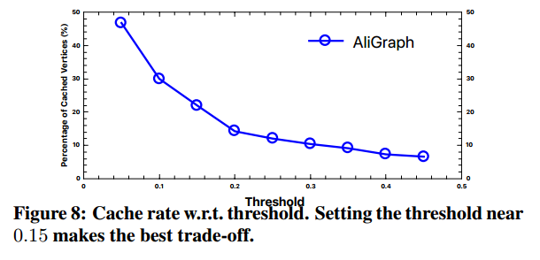</a>

<a name="fig-AliGraph-Fig9">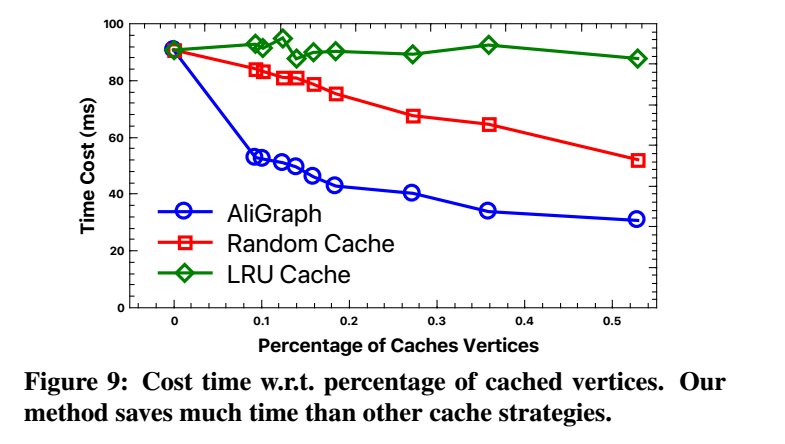</a>

>  如何制定适合图分析的cache策略也是研究方向之一。

在实现时，将边按照source vertex划分成不同的组，每一个组绑定到一个core上。对于该组顶点邻接表的访问与更新操作被组织到一个request-flow桶中，该桶由**[lock-free的队列实现](#fig-AliGraph-Fig6)**。

<a name="fig-AliGraph-Fig6">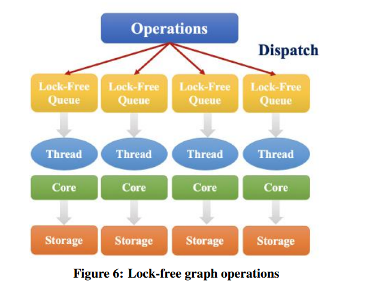</a>

### 图采样

AliGraph中支持3种图采样策略，同时也运行以plugin的形式扩展。

1. Traverse：从一个图分区中采样一批顶点。可以直接从当前服务器的分区中生成。

2. Neighborhood：采样某个顶点的1跳或多跳邻域。如果顶点邻域跨服务器，则分批地从其他图服务器获取邻接表。

3. Negative：生成负采样样本，加速收敛。通常可在本地服务器上完成，按需地查询远程服务器以获得邻接表。

Sampler中的权重也允许根据梯度进行更新。

经过采样，每个顶点的邻域大小被**对齐**，使其可以很容易地被处理。

[实验表明](#fig-aligraph-tab4)通过分布式采样（Batch size=512，Cache size=20%），即使是很大的图，也能非常快地采样完毕。

Neighborhood采样因为要涉及服务器之间的通讯，速度会比另外两个采样慢很多。

采样技术的性能对数据规模不敏感，及时图规模增大6倍，采样时间的变化也不大。

### 计算

编程模型中与计算相关的是Aggregate和Combine。AliGraph也允许以plugin的形式扩展实现这两个算子。需要注意的是，这两个算子需要同时实现其forward计算和backward计算的逻辑。

在计算的过程中，会保存每个顶点v在当前mini-batch中的最新的中间特征向量：$h_v^{(1)},\dots,h_v^{(kmax)}$。

[实验表明](#fig-aligraph-tab5)cache mini-batch的中间特征向量对于提升两个算子的计算速度非常重要。

# [NeuGraph](#ref-NeuGraph)

NeuGraph是微软亚洲研究院提出的面向单机多GPU环境的并行图神经网络训练框架，该框架基于TensorFlow实现。NeuGraph主要面相transductive的setting，即整个图参与训练，在目前的系统中没有考虑sample，但作者说可以集成sample到框架中。

## 编程模型

NeuGraph为图神经网络训练提出了SAGA-NN（Scatter-ApplyEdge-Gather-ApplyVertex with Neural Networks）编程模型。SAGA-NN模型将图神经网络中每一层的前向计算划分为4个阶段：Scatter、ApplyEdge、Gather和ApplyVertex，如[Figure 2](#fig-neugraph-fig2)所示。其中ApplyEdge和ApplyVertex阶段执行用户提供的基于神经网络的边特征向量和点特征向量的计算。Scatter和Gather是由NeuGraph系统隐式触发的阶段，这两个阶段为ApplyEdge和ApplyVertex阶段准备数据。

<a name="fig-neugraph-fig2">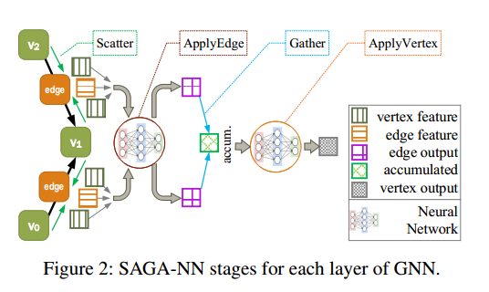</a>

在编程时，用户只需利用给定的算子实现ApplyEdge和ApplyVertex函数，并指定Gather方式，即可利用NeuGraph自动地完成GNN的训练。[Figure 3](#fig-neugraph-fig3)展示了利用SAGA-NN编程模型表达Gated-GCN的编程示例。

<a name="fig-neugraph-fig3">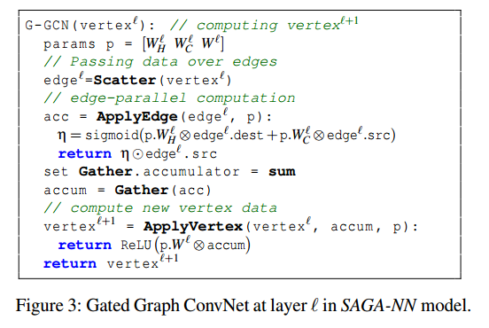</a>

## 系统实现

### Graph-Aware Dataflow Translation

NeuGraph采用2D图划分方法，其将顶点集划分为**P**个分区（trunk），边集（邻接矩阵）划分为$P\times P$个分区，其中边分区$E_{ij}$保存了连接点分区$V_i$和$V_j$的边。NeuGraph基于chunk构建数据流图，如[Figure 5](#fig-neugraph-fig5)所示。

<a name="fig-neugraph-fig5">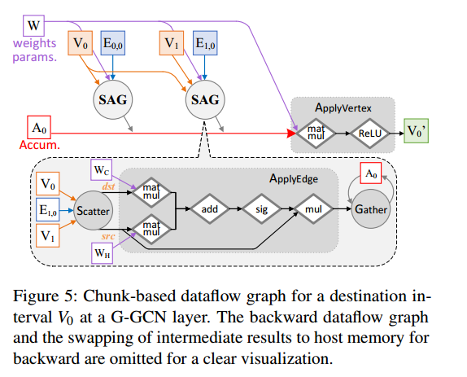</a>

其中Scatter算子接收1个边分区和2个对应的点分区，将数据整理成[src, dst,data]的元组形式，该元组形式将传递给ApplyEdge函数进行处理。

在Forward阶段会产生大量中间计算结果（例如ApplyEdge中的矩阵乘法的结果），NeuGraph为了避免中间结果占用大量的GPU显存，其会将中间结果从GPU端显存上传到Host端的内存中，在Backward阶段再传回GPU端。

为了能在Gather阶段中复用数据，NeuGraph在Forward（Backward）阶段中采用列（行）优先的顺序处理边分区。例如为了在Forward阶段持续累加V0点分区中的点特征向量，其依次处理E(0,0), E(1,0), ..., E(n,0)边分区。

NeuGraph在不超过GPU显存容量限制的情况下选择尽可能小的分区数$P$。

### Streaming Processing out of GPU core

为了能让GPU处理超过其显存容量的数据，必须将数据动态地在GPU和Host端进行交换。

**Selective Scheduling技巧**：一个边分区可能只与对应点分区中少量的点发生关联，因此在从CPU端向GPU端发送点分区数据时，可以只传递点分区中的少部分数据。NeuGraph根据CPU端内存拷贝的带宽、CPU-GPU端数据交换的带宽，动态地确定阈值，来确定是向GPU发送整个点分区，还是只发送点分区中的部分数据。

**Pipeline Scheduling技巧**：将一个边分区进一步划分为sub-trunk，流水线地向GPU发送sub-trunk并在GPU端并发地进行sub-trunk的计算。为了使计算和HtoD数据传输充分地重叠，NeuGraph采用一个基于profile的sub-trunk调度方案，其在头几轮迭代中profile各个sub-trunk的计算开销和数据传输开销，并根据开销计算出更优的调度方案，如[Figure 6](#fig-neugraph-fig6)所示。

### Parallel Multi-GPU Processing

在拥有多GPU卡的环境中，可以充分利用各GPU卡之间的高速P2P PCIe通信来降低Host端PCIe总线带宽压力。NeuGraph将共享PCIe Switch的GPU卡视作一个虚拟GPU卡组，点分区、边分区的数据从Host memory中广播到各个虚拟GPU卡的第一个物理GPU中（例如Figure 8中的GPU0和GPU2）。第一个物理GPU在对该点分区进行处理的同时，并发地将数据发送给同一个虚拟GPU中的下一个物理GPU（例如[Figure 8](#fig-neugraph-fig8)中的GPU1和GPU3），并发地从Host Device载入下一批Vertex Chunk和Edge Chunk数据。流水线地处理，直到所有点分区和边分区均处理完。

### Propagation Engine

NeuGraph在GPU上实现Graph Propagation时额外采用了如下优化手段：

- 在ApplyEdge中出现的只与source vertex或destination vertex相关的计算移动到上一步中的ApplyVertex中进行。这样避免对于每一条边都进行相应的计算。
- 在GPU上实现高效的Scatter和Gather kernel。
- Scatter-ApplyEdge-Gather算子融合：当ApplyEdge算子是element-wise的简单逻辑时，其整个SAG的过程被直接替换为Fused-Gather算子，该算子直接将source vertex和edge data读入到kernel的register中，并在register中完成ApplyEdge的计算，计算结果累加如destination vertex的accumulation向量。通过融合可以避免将中间计算结果保存回GPU显存，节省GPU内存访问开销。

### 其他技巧

- 模型参数每个GPU一份，通过all-reduce在各GPU之间保持同步。
- GPU之间通过P2P通信。

## 实验评估

- 实验在点分类任务上进行，我们可以借鉴论文中的叙述来说明。
    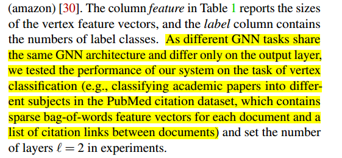
- 数据集的平均度数影响Graph Propagation的时间开销，平均度数越高的数据集其Propagation的开销越高。
- 系统实验中的优化技巧是有效的，能够比单纯在TensorFlow上实现SAGA模型快2.4~4.9倍。
- “The results under other models are similar”这句表达可以借鉴。
- Selectively scheduling适合sparse graph而graph kernel optimization适合dense graph。
- 即使采用了IO（GPU与Host端数据交换）和GPU kernel互相重叠的优化，IO耗时依然长于GPU kernel计算耗时。
    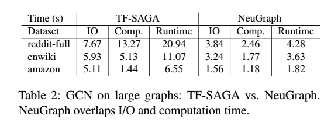
- Chain-based mechanism对于多GPU卡的扩展性至关重要。
    
- 当GPU卡数量上来时，被多GPU共享的CPU和Memory带宽将成为制约多GPU扩展性的瓶颈。
- NeuGraph的speedup曲线虽然是线性的，但距离理想的线性可扩展性还有差距。当其GPU卡数量从1增加到8时，其Speedup的增长远没有到8倍。

# [DGL](#ref-DGL)

DGL是支持多后端（MXNet、TensorFlow、PyTorch）的一个面向深度图神经网络的计算框架。

DGL也采用基于message-passing的编程模型，用户提供自定义的message function（边计算）、update function（点计算）和reduce operation （消息规约操作）。但与PyG不同的是，DGL支持用户提供自定义的reduce operation，而不局限于sum、mean、max等少数几种。

DGL引用了文献[(Xu, 2018)](#ref-Xu-2018)表明aggregator（即reduce）所支持的复杂度与图神经网络的表达能力密切相关。

DGL支持sampling机制，该机制通过指定active vertex/set set实现，以data loader的形式提供给用户。

用户提供的message function和update function必须是向量化的，即可以对多个顶点同时操作。

kernel fusion是一个提高计算性能的有效技巧。
  - kernel fusion将message function与update function合并进行，从而避免生成message的实体中间结果，从而大幅降低计算开销和GPU显存使用量。
  - kernel fusion要求message function非常简单，不能使用任何参数。
  - 实验表明DGL相比PyG的主要性能提升即来自kernel fusion。

# 参考文献

1. Zhu, Rong, Kun Zhao, Hongxia Yang, Wei Lin, Chang Zhou, Baole Ai, Yong Li, and Jingren Zhou. “AliGraph: A Comprehensive Graph Neural Network Platform.” Proceedings of the VLDB Endowment 12, no. 12 (August 1, 2019): 2094–2105. https://doi.org/10.14778/3352063.3352127.
2. L. Ma et al., “NeuGraph: Parallel Deep Neural Network Computation on Large Graphs,” in 2019 USENIX Annual Technical Conference (USENIX ATC 19), Renton, WA, Jul. 2019, pp. 443–458, [Online]. Available: https://www.usenix.org/conference/atc19/presentation/ma.
3. Wang, Minjie, Lingfan Yu, Da Zheng, Quan Gan, Yu Gai, Zihao Ye, Mufei Li, et al. “Deep Graph Library: Towards Efficient and Scalable Deep Learning on Graphs.” ArXiv:1909.01315 [Cs, Stat], September 3, 2019. http://arxiv.org/abs/1909.01315.
4. Keyulu Xu, Weihua Hu, Jure Leskovec, and Stefanie Jegelka. How powerful are graph neural
networks? arXiv preprint arXiv:1810.00826, 2018.

