## Node Level Sample (neighbor smapling)

### GraphSAGE
**标题**
Inductive Representation Learning on Large Graphs

**作者(top2)**
William L. Hamilton∗ wleif@stanford.edu
Rex Ying∗ rexying@stanford.edu Jure

**发表情况**
31st Conference on Neural Information Processing Systems (NIPS 2017), Long Beach, CA, USA

#### 1. 背景
大规模图的顶点的低维嵌入(low-dimensional vector embeddings)通常被用于各种预测和图像分析的任务中。

#### 2. 问题
现有的方法都是集中在从**单个固定图(a single fixed graph)** 中进行学习，他们并未考虑到现实中的应用：这些应用往往要求能够快速地能够应用到对未知的节点，或者对新的（子）图。这种能力即inductive cappability, 在实际中对于高吞吐量和产出，需要快速应用在新的图和位置的节点上的机器学习系统是非常至关重要的。

#### 3. 贡献

我们提出来一种通用的框架GraphSAGE(SAmple and aggreGatE). 跟之前通过特征分解学习嵌入(embedding)的方法不同，我们利用节点的特征来学习**一个嵌入函数(embedding function)**，进而来预测未知的节点。我们的学习算法综合考虑了节点特征，每个节点领域的拓扑结构以及领域节点特征的的分布因素。

**Overview**
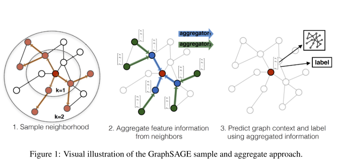

**Algorithm**
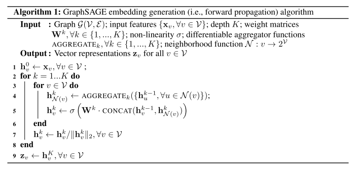

**MiniBatch Algorithm**

#### 4. 结果

我们的算法与三个node-classifiaction benchmarks（Random classifier, logistic regression feature-based classifier, DeepWalk algorithms）的结果进行了对比，使用了citation adtra和Reddit post。

**数据集**
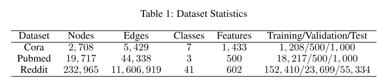
> 来源FastGCN, Training/Validation/Test不可做参考

**精度**
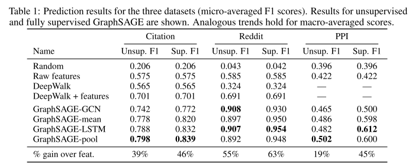

**运行时间, 图的影响**
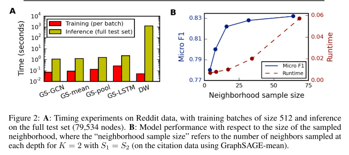

> 图A是训练时间的提升; 图B采样的sample size下精度和Batch Size的变化

### PinSage

**标题**
Graph Convolutional Neural Networks for Web-Scale Recommender Systems

**作者**
Rex Ying∗†, Ruining He∗, Kaifeng Chen∗†, Pong Eksombatchai∗,
William L. Hamilton†, Jure Leskovec∗† ∗Pinterest, †Stanford University
{rhe,kaifengchen,pong}@pinterest.com,{rexying,wleif,jure}@stanford.edu ABSTRACT

**发表情况**
KDD2018

#### 1. 背景

GNN的运用广泛

#### 2. 问题

GNNs在大规模数据集下难以扩展

#### 3. 贡献

我们提出了一种高可扩展性的框架，a random-walk-based GCN, 即PinSage. 设计思路：
- On-the-fly convoluations: 传统的GCN算法通过特征矩阵乘以全图的拉普拉斯得到卷积操作。我们的算法通过采样一个节点的邻居动态地创建训练图
- Producer-consumer minibatch construction: 我们构建了一个生产者-消费者框架，用于确保在模型训练阶段，GPU利用率最大；大型内存和CPU-bound的生产者可以地采样节点邻居来定义卷积的必要功能，而GPU-bound Tensorflow模型消耗这些与定义好的计算图来高效地运行随机梯度
- Efficient MapReduce inference: 对于一个已经训练好的GCN模型，我们设计了有效的MapReduce pipeline，来分发trained model, 来为数十亿个节点生成嵌入embedding, 同时最大限度地减少重复计算

除了这些基本扩展能力的改善，我们介绍了性的训练技术和算法创新点：
- constructing convolutions via random walks: 将节点的完整领域用于执行卷积将导致巨大的计算图，这里通过随机抽样来创建训练图。另外的一个优势就是每个节点都有一个重要性分数，我们在pooling/aggregation步骤中可以使用
- importance pooling: 图卷积的核心组件是图中来自领域信息的聚合。我们基于random walks提供了一种方法来评价节点的重要性，最终在离线评估中带来了46%的收益
- curriculum training: 我们定义了curriculum training模式，在训练阶段，算法被提供越来越难的例子，最终取得了12%的性能提升

#### 4. 结果

Baselines:
- Visual embeddings(Visual): 使用最近的邻居深层的可见嵌入(visual embeddings)用作推荐
- Annoatation embeddings(Annotation): 使用最近邻居的注释嵌入(annotation embeddings)用作推荐
- Combined embeddings(Combined): Visual + Annotation
- Graph-baseed method(Pixie): 基于random walks的方法来产生排名和分数, 去

### VRGCN
**标题**
Stochastic Training of Graph Convolu- tional Networks with Variance Reduction

**作者**
Jianfei Chen, Jun Zhu
Tsinghua University

**发表情况**
ICML2018

#### 1. 背景
图卷积网络(Graph convolution networks)(Kipf&Welling,2017, 即semi-GCN)将卷积网络(CNNs)泛化到图结构数据中，"图卷积"运用相同的线性转换到一个节点的所有邻居，接着为mean pooling和非线性函数。通过堆叠多层卷积层，由此GCNs可以利用更远的邻居来学习到节点的表示。GCNs和它们的变体被广泛应用到各种图任务中。

#### 2. 问题

但是，图卷积操作使得GCNs很难被高效地训练。L层节点的表示需要递归地用到它们的邻居在L-1层的表示，由此随着层数的增加，节点的感受野也是指数级别增长。Kipf&Welling,2017提出通过batch的方法训练，即所有的节点参与训练。**但是，full-batch的训练方式不能处理大规模的数据集，因为其收敛性慢和对GPU内存的高要求（GPU不能容纳下整个数据集）**。

GraphSAGE首次提出了随机训练(stochastic training)的算法，即使用邻居采样(neighbor sampling, NS)的模式对指定的图进行训练, 即在$l-th$层随机采样$D^{(l)}$个邻居，由此感受野的大小减小到了$\prod_l D^{(l)}$. 但是，NS+随机训练是缺乏收敛性的理论证明的。并且时间复杂度仍然是一个无法接受的程度。

#### 3. 贡献

在本文中，我们首次提出了对GCN的基于控制变量的随机近似方法(control variate-based stochastic approximation algorithms)。我们利用节点的历史激活信息(historical activations)作为控制变量(control variate)。

我们展示了NS esimator的方法取决于激活函数的幅度，而本文的算法的方法仅仅由激活值(activation)和其历史信息(historical value)的差值决定。进一步，本文的算法提供了性的理论保证。

在测试时，我么的算法提供了精确和零方差的预测。在训练时，我们的算法可以在不考虑neigbor sampling $D^{(l)}$的大小下取得局部最佳值。该理论结果允许我们通过只采样两个邻居节点来大幅度降低时间复杂度，同时保证了模型的质量（收敛性）

**本文有具体的方差理论证明**

**Overview**

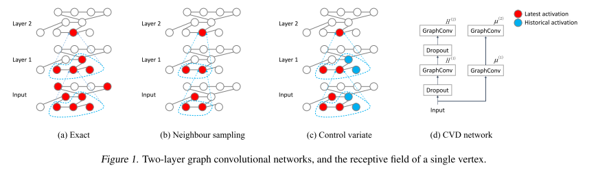

#### 4. 结果

我们在六个数据集上进行了测试，并且表示我们的算法在同样的感受野下可以有效地减少偏差和方差。通过仅仅设置$D^{(l)}=2$，我们的算法在所有取得了和full-batch同样的预测精度。我们减少了时间开销的同时，并没有带来任何收敛速度的损失。我们的算法在Reddit数据集上比其他算法(semi-GCN, GraphSAGE, FastGCN)快了7倍左右。

图像说明：
- Exact为full-batch训练; NS表示GraphSAGE的邻居采样方法; IS表示FastGCN的重要性采样方法; CV表示本文的Control Variate方法;
- M1表示不同于semi-GCN每一层的计算方式
    - semi-GCN: $Z^{(l+1)} = PDropout_p (H^{(l)})W^{(l)}$
    - M1: $Z^{(l+1)} = Dropout_p (P(H^{(l)})W^{(l)}$
- PP表示预处理出$PH^{(0)}$的结果

**数据集**

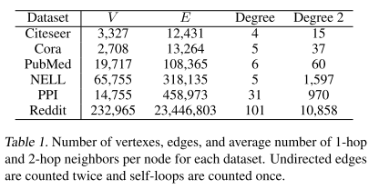

**精度**

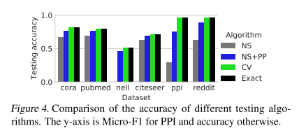

**收敛下的时间**
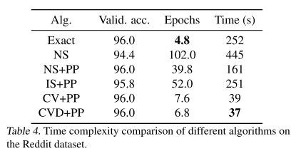

**收敛性：训练损失的变化**
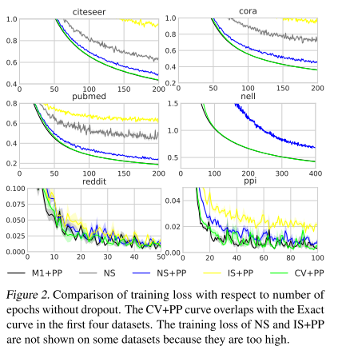

**收敛性：验证集精度的变化**

## Layer Level Sample
### FastGCN
**标题**
FASTGCN: FAST LEARNING WITH GRAPH CONVOLU- TIONAL NETWORKS VIA IMPORTANCE SAMPLING
**作者**
Jie Chen∗, Tengfei Ma∗, Cao Xiao IBM Research

**发表情况**
ICLR 2018

#### 1. 背景
图是二元关系中最普遍的表示，很多现实世界的数据都表示为图的形式，如社交网络，基因表示网络和知识图谱。为了提高基于图学习的任务的表现，比如节点预测和链接预测，出现了很多工作，比如引入RNN和CNN到图数据上。
在本文中，我们关注学习图中节点的特征表示，与此最相关的工作即是kpif&Welling, semi-GCN的工作，其算法可以表示为：
$$H^{(l+1)} = \delta(\hat{A} H^{(l)} W^{(l)})$$
其中， $\hat{A}$是图的邻接矩阵的某种程度的标准化(normalization)

此文的关注点是学习图的inductive能力

#### 2. 问题
对于GCN的一个很严峻的挑战就是在batch训练中，随着层数的增加，邻居将会递归式增长。特别地，对于稠密图，尽管在一个很小的batch size下，mini-batch训练将会涉及到大数量级的数据。因此，扩展性成为GCN应用到大规模稠密图的严重问题。

#### 3. 贡献
为了解决这个问题，我们提供了一个新的角度来看待图的卷积操作：我们可以把它看做是概率度量下嵌入函数(embedding funcitons)的积分变化。这种观点为inductive学习提供了一个原则性机制，从损失的公式和梯度的随机版本。特别地，我们解释到图的顶点时基于某种概览分布的iid(独立同分布)样本，把loss和每个卷积层写成关于顶点嵌入函数的积分。然后，通过蒙特卡罗近似计算样本的loss和梯度。由此，一个思路就是改变样本的分布，如重要性采样来减小近似的方差。

**重要性概率: 基于节点的度数来计算采样的概率**

**Overview**

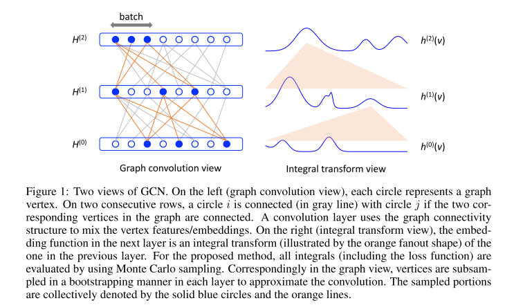

**Algorithm**

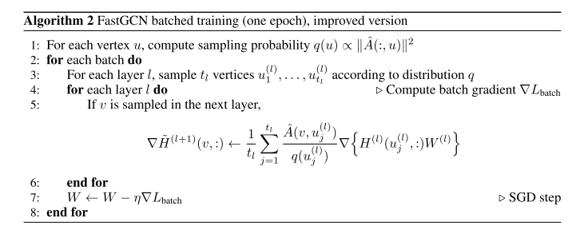

#### 4. 结果
本文提出的方法，FastGCN不仅消除了对测试数据的依赖，而且每个batch的开销是可控的。我们的采样方案更经济，大大节省了梯度计算(**有详细分析**)。并且结果表明，每个batch的计算速度比GraphSAGE快了一个数量级，而且分类精度也有可比性。

**数据集**

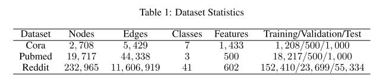

**时间和精度**

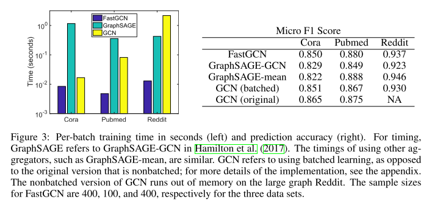

**特别地，本文首次提出了预处理$\hat{A}H^{(0)}$的想法**
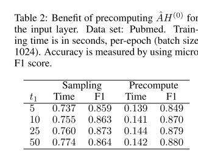

### ASGCN
**标题**
Adaptive Sampling Towards Fast Graph Representation Learning

**作者**
Wenbing Huang1, Tong Zhang2, Yu Rong1, Junzhou Huang1 1 Tencent AI Lab.

**发表情况**
NIPS 2018

#### 1. 背景

目前有很多工作试图发展神经网络到任意结构化的图(arbitrarily structured graphs)。本文的工作主要集中学习节点的表示通过汇聚邻居的特征。最相关的工作即是semi-GCN的工作，它应用顶点间的连接作为卷积来进行邻居汇聚(neighborhood aggregation), semi-GCN也取得了非常好的效果。

#### 2. 问题

一个挑战就是图的扩展性问题。计算卷积网络需要递归地扩展邻居，该操作是极其耗费内存。尽管是很小的batch size，也会在训练中引入大量的顶点。

#### 3. 贡献

为了避免over-expansion问题，我们加速了GCNs的训练，通过控制每层采样邻居的数目。 我们方法是从上到下(top-down)的方式建立网络结构，其中, lower layer的节点是基于upper layer进行某种采样(layer-wise sampling)得到的。这种层次采样方法是高效的，主要表现在两个方面：
1. 我们重利用了采样到邻居的信息，即lower layer的节点是互相可见的，可以拥有相同的upper layer的父亲
2. 这样做可以解决over-expansion的问题，因为lower layer的节点是作为一个整体进行采样的。

本文的核心在于为layer-wise sampling设计合适的采样方法。一个通用的思路是优化最终的方差。由于在我们的网络结构top-down采样和bottom-up传播之间的不一致性，最优采样是不可计算的，这里将不可计算的部分替代为了a self-dependent function, 然后将方差添加到损失函数中。因此，通过训练网络参数和采样，可以显式减少方差。

**本文提出的采样器sampler包含参数，是可以训练的**

另外，我们扩展了如何有效地将消息传递到更远的节点。当前的方法是通过重新排序随机游走的结构来产生multi-hop的邻居。本文，提出了一个新的机制，即在(l+1)层和(l-1)层之间添加连接，由此可以自然地保持二阶接近，而不会产生额外的计算。

**Overview**

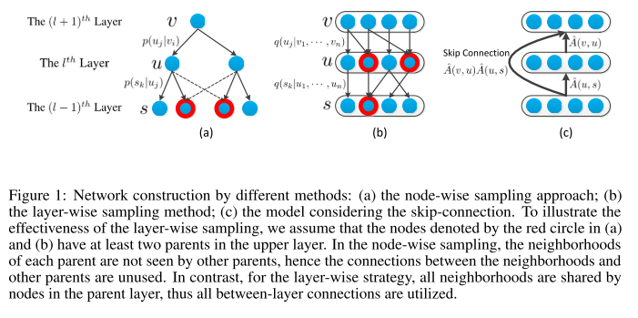

#### 4. 结果

说明：
- Full表示semi-GCN(full-batch)训练，Node-Wise表示GraphSAGE; IID表示FastGCN;

**精度**
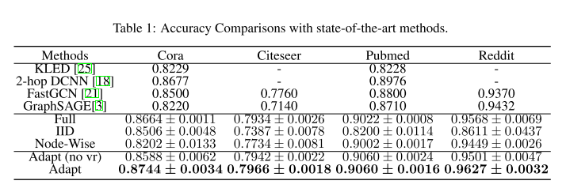

**时间和skip-connection**

**测试集上精度曲线**
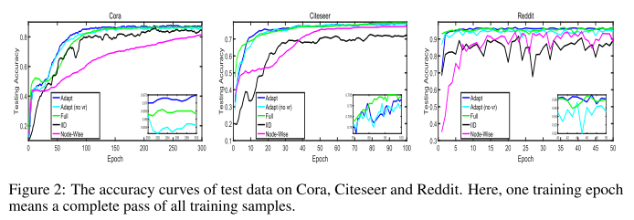

### LADIES
**标题**
Layer-Dependent Importance Sampling for Training Deep and Large Graph Convolutional Networks

**作者(top2)**
Difan Zou∗, Ziniu Hu∗, Yewen Wang, Song Jiang, Yizhou Sun, Quanquan Gu Department of Computer Science, UCLA, Los Angeles, CA 90095 {knowzou,bull,wyw10804,songjiang,yzsun,qgu}@cs.ucla.edu
Abstract

**发表情况**
NIPS2019

#### 1. 背景

GCNs运用场景很广。

#### 2. 问题

训练一个很深的GCN在大规模图仍然是一个巨大的挑战。
为了缓解这个问题，研究者有两种解决思路：
1. node-wise neighbor-sampling method, 如GraphSAGE; ASGCN指出GraphSAGE, 当有多个节点共享邻居时，会被计算多次，如两个邻居shared同样的邻居，邻居的表示embedding会被计算两次; VRGCN通过利用减小方差的技术来提高了采样的效率; ClusterGCN通过将采样邻居限定在了稠密的子图中，从而减少了采样的邻居，实质上并没有解决冗余计算的问题
2. layer-wise importance sampling method, 如FastGCN, 通过节点的度数来计算采样的概率，通过减少估计方差，保证了快和稳定的收敛。但是两层采样的节点之间不一定存在必要的连接。ASGCN提供了可调整和可训练采样sampler来减少估计方差，但是重要性采样在时间和内存上开销在理论上和经验上没有很好的证明。

#### 3. 贡献

本文认为，一个好的采样算法包括三部分：
- layer-wise, 避免冗余考虑
- neighbor-dependent, 保证邻接矩阵是稠密的，没有遗漏太多信息
- importance smapling, 减少采样的方差和加速收敛（有论证的）

本文的LADIES方法如下：
1. 对于每一次层l, 根据upper layer(l+1)层的结果挑选所有的邻居，并重建图
2. 根据当前层节点的度数计算采样概率
3. 根据该概率采样出固定数目的顶点
4. 重建邻接矩阵，并进行标准化normalization 

**Overview**

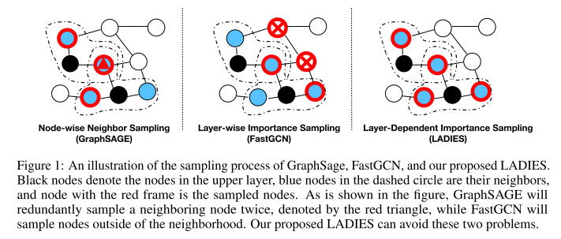

**Summary of Complexity and Variance**

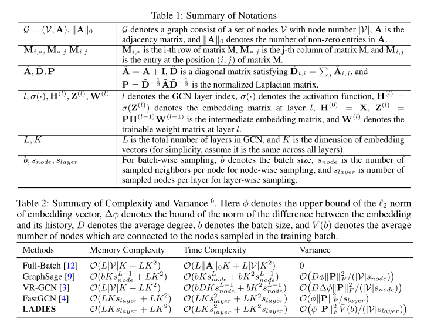

**Algorithm**

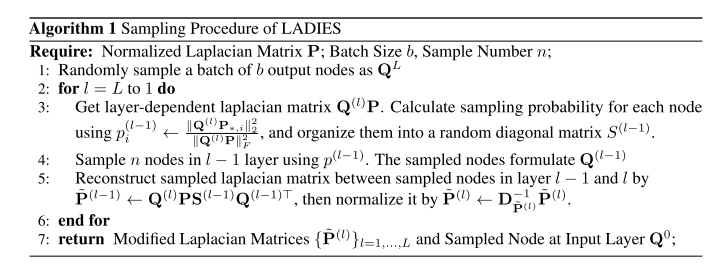

#### 4. 结果

**精度，时间和内存**

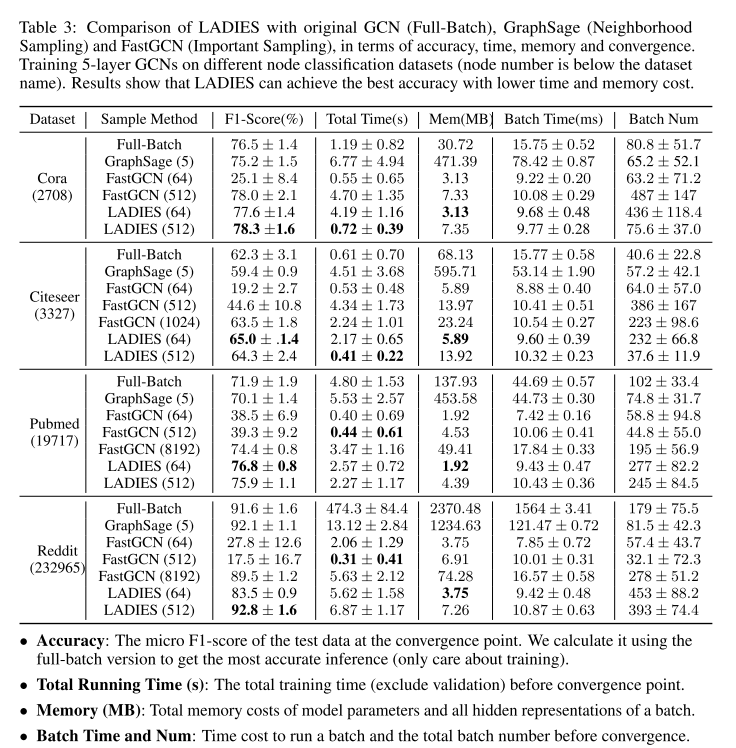

**收敛性**
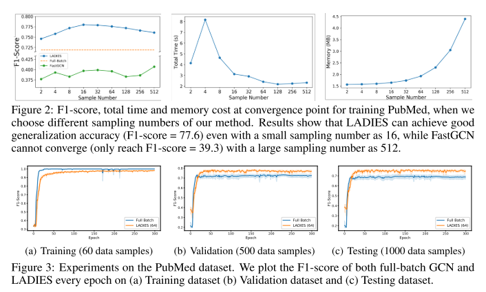

## Graph Level Sample

### ClusterGCN

**标题**
Cluster-GCN: An efficient algorithm for training deep and large graph convolutional networks

**作者(top2)**
Wei-Lin Chiang∗
National Taiwan University r06922166@csie.ntu.edu.tw
Xuanqing Liu∗
University of California, Los Angeles xqliu@cs.ucla.edu
Si Si
Google Research sisidaisy@google.com
Yang Li
Google Research liyang@google.com
Samy Bengio Google Research
bengio@google.com Cho-Jui Hsieh
University of California, Los Angeles chohsieh@cs.ucla.edu

**发表情况**
KDD19

#### 1. 背景

GCNs使用很广泛

#### 2. 问题

GCN需要通过图中节点的交互来传递embedding, 这使得训练变得困难。因为节点的依赖性，GCN的训练变得非常缓慢而且需要大量的内存，后向传播更需要存储计算图中的所有embedding到GPU内存中。

为了使得GCN算法能够扩展到大规模图中，我们从三方面评估了现有的算法：内存需求，每轮的时间和每轮收敛程度。

- full batch训练
    - memory: bad
    - time per epoch: good
    - convergence: bad
- mini-batch SGD(GraphSAGE)
    - memory: good
    - time per epoch: bad
    - convergence: good
- VR-GCN:
    - memory: bad
    - time per epoch: good
    - convergence: good

由此看出，没有一个算法在三方面都展现出很好的特性。

#### 3. 贡献

在本文中，我们通过利用图聚类结构，提出了一种新的图训练算法。我们发现mini-batch算法的有效性可以表示为embedding utilization, 与batch中links的links和batch之间的links成正比(?)。

这个发现启示我们利用图聚类算法来将构建partitions, 使得相同partition比不同partition里拥有更多的links. 基于图聚类的想法，我们提出ClusterGCN, 基于已有的有效的聚类算法(METIS)来设计batch。我们的策略是为了带来内存和计算上的收益。在内存上，我们仅仅存储当前batch内的节点表示O(bFL); 在计算上，我们的算法通过梯度下降实现了同样的每轮训练的时间，并且显著快于邻居搜索策略(Neigborhood searching approaches); 在收敛速度上，我们的算法可以跟其他的基于SGD的算法进行比较。 

**各算法比较结果**

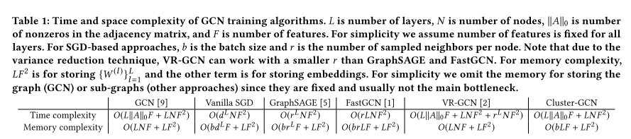

**Overview**

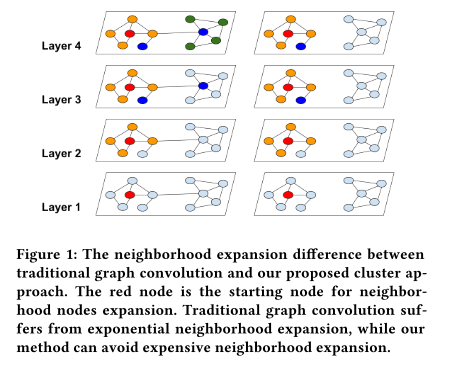

**Algorithms**

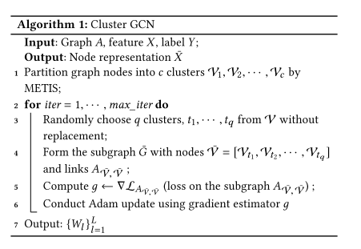

#### 4. 结果

- ClusterGCN实现了最好的内存使用，特别是在大规模图数据上; 
- ClusterGCN达到了和VRGCN相同的训练速度; 
- ClusterGCN可以在一个拥有很大的embedding size的深层网络

**数据集相关**
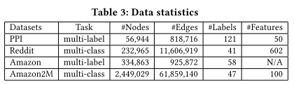
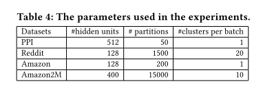
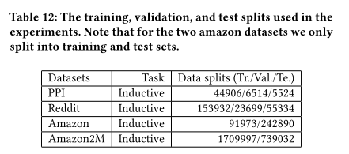

**精度**

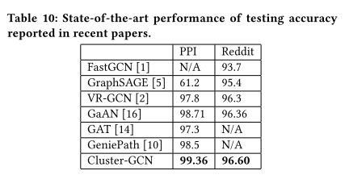

**内存开销**

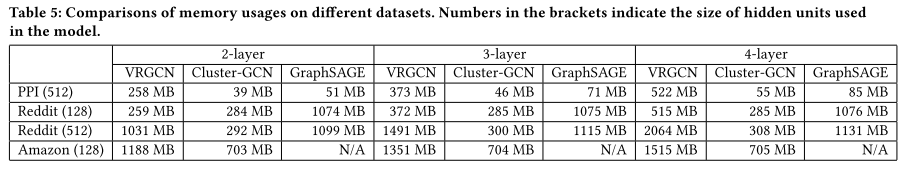

**大数据集下的运行时间，内存和精度的对比**

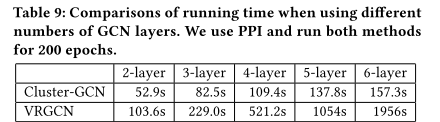

**层数的扩展性**

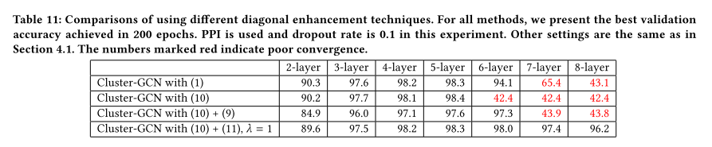

**数据预处理的时间**

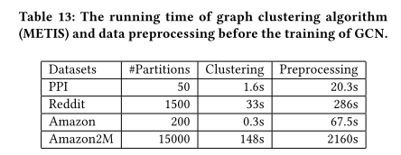
> 这里认为preprocessing包括data loading和paring等多个步骤。而且认为graph clustering本身只需要推导一次，后续训练过程中可以进行多次重用
理解：这里preprocessing的时间实际为我们测试中的总时间

### GraphSAINT
**标题**
GraphSAINT: GRAPH SAMPLING BASED INDUCTIVE LEARNING METHOD

**作者**
Hanqing Zeng∗ University of Southern California zengh@usc.edu
Ajitesh
Hongkuan Zhou∗ University of Southern California hongkuaz@usc.edu

**发表情况**
ICLR2020

#### 1. 背景

图表示学习变得非常普遍。

#### 2. 问题

GCNs训练包含的节点会随着算法的层数增加而指数型增长制约了算法的扩展性.

GraphSAGE, PinSAGE, VRGCN的思路是将邻居的数目限制在了固定值（2-50）; 而FastGCN, ASGCN的思路是将邻居膨胀比例限制为1，即每层采样固定数目的节点。这些方法都在训练速度上取得了进步，但是在扩展性(scalability), 精度和计算复杂度上仍面临挑战

#### 3. 贡献

我们的工作，GraphSAINT(Graph SAmpling based INductive learning meThod)来有效训练深度的GCNs.

一方面，我们采取了一种采样方式——graph sampling的方式，即首先在训练图上进行采样子图，然后在子图上训练GCN算法。该方法直接解决了了“邻居爆炸”的问题

另一方面，graph sampling的方法带来了新的挑战：直觉上，**有高影响力的节点应该有更高的概率被采样到子图中**，即intra subgraph采样到的节点之间应该有强关联性。然而这种策略会导致不同的(non-identical)节点采样概率，从而在minibatch estimator中引入偏差bias。为了解决bias的问题，我们考虑了标准化normalization的方法(update中考虑)来使得特征学习不会优先考虑更频繁被采样到的节点。另外，为了进一步提高训练的质量，我们使用了减少方差分析(variance reduction analysis), 通过量化邻居的“影响”来设计轻量级采样方法。 

**Overview**

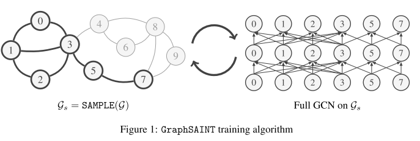

**Algorithms**

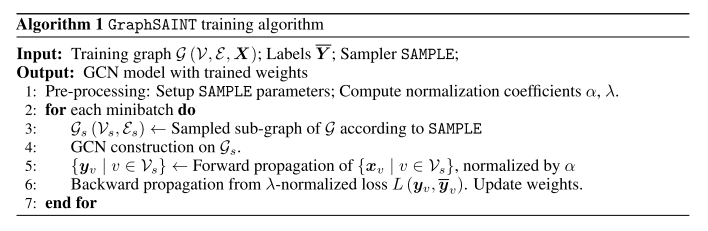

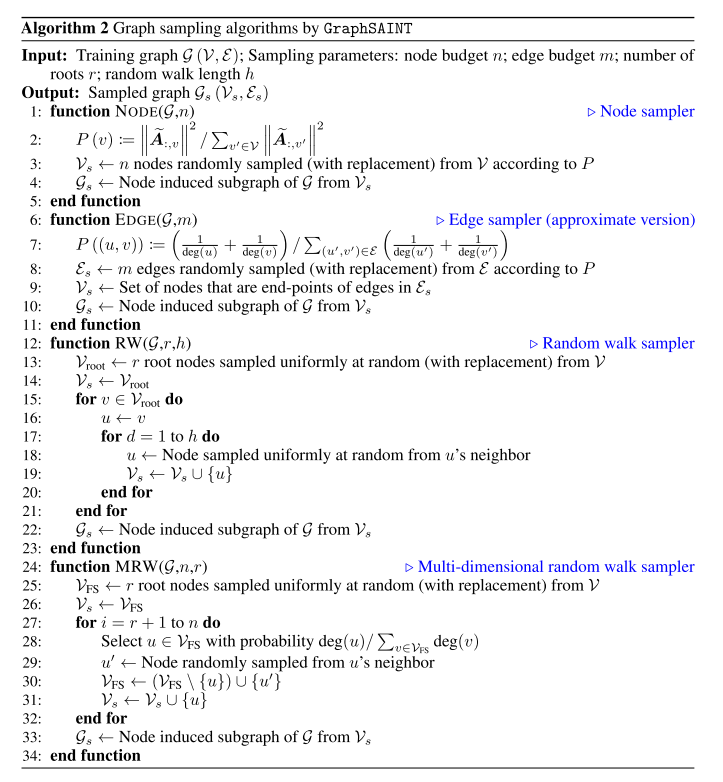

#### 4. 结果

在五个大型数据集上，训练精度和时间都得到了显著提高；另外本文还将GCN的流行架构JK-net和GAT进行了扩展；在深度模型上在PPI和Reddit分别取得了新的F1-score:0.995, 0.970

**四种sampler**
- random node sampler(Node)
- random edge sampler(Edge)
- random walk based sampler(RW)
- multi-dimensional random walk sampler(MRW)

##### 数据集

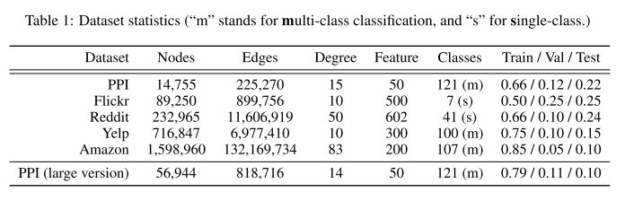

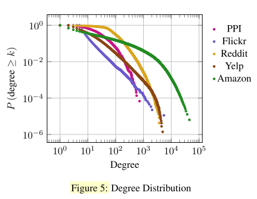

##### 性能表现

**精度**

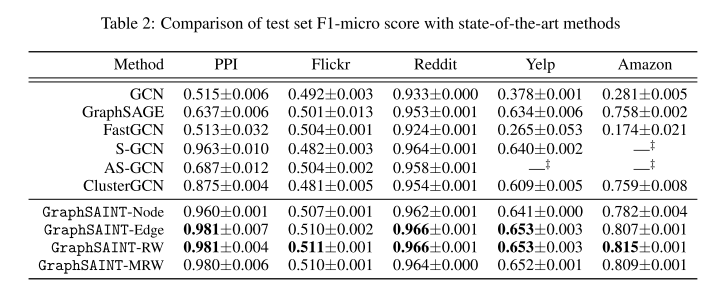
> 这里S-GCN即VR-GCN

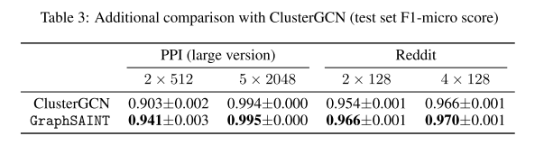

**训练时间**

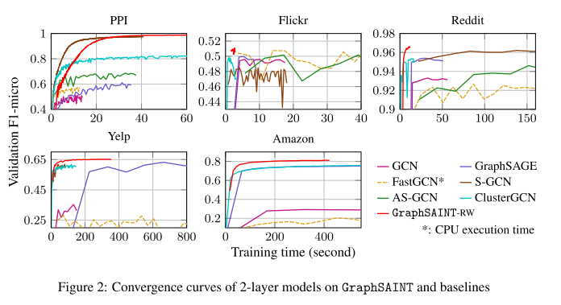

**更深的网络**

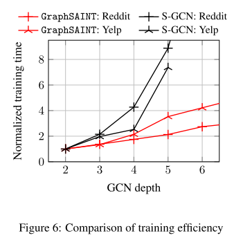

##### 采样开销

**Sampler的时间开销**

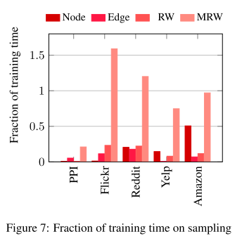
> 比例为：平均采样时间 / 平均训练时间(forward+backward)

**与ClusterGCN的收敛时间对比**

> 比例为：平均采样时间 / 平均训练时间(forward+backward)

##### 其他结果

**Batch Size对精度的影响**

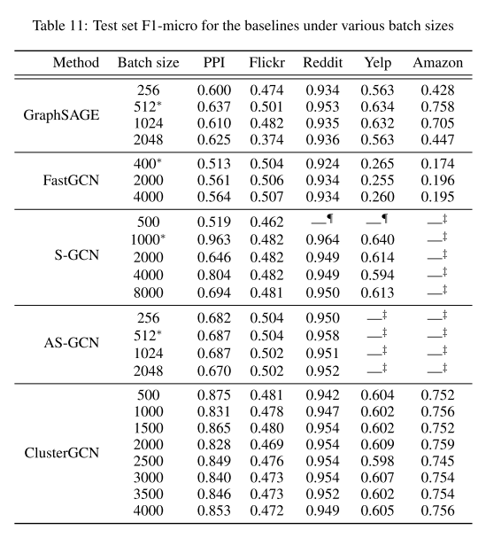

### MVS-GNN

**标题**
Minimal Variance Sampling with Provable Guarantees for Fast Training of Graph Neural Networks
Weilin

**作者**
Weilin Cong
The Pennsylvania State University wxc272@psu.edu

Rana Forsati Microsoft Bing
raforsat@microsoft.com Mehrdad

**发表情况**
KDD2020

#### 1. 背景

图神经网络应用广泛

#### 2. 问题

尽管GNNs的潜力很大，在大规模图数据集上训练GNNs仍然是一个巨大的挑战。为了解决GCN带来的邻居爆炸(neigbor explosiuon)问题. 现有的方法出现了node-wise sampling, layer-wise sampling, subgraph sampling等多种方法。虽然这些经验结果都表示了其对大规模图数据的可扩展性，但是这些方法仍然会产生高方差，从而使得降低收敛性和泛化能力。为了减少采样的方差，我们可以通过增加每层的mini-batch size或者使用自适应(adaptive)的采样方法（梯度信息或者表示）来减小方差。同时，计算和内存也是制约因素之一。

在重要性采样和自适应采样方法中，核心点在于如何利用采样中变化的梯度信息来采样训练节点。对于vanilla SGD, 很多自适应采样算法被提出，但是这些采样算法都仅仅在神经网络训练中取得了很好的效果，还未泛化到GNNs中。在本文的分析中，核心困难在于GNNs中训练损失的多级复合结构，与标准的经验风险最小化不同，任何用于克服邻居爆炸的采样想法都会由于在不同层中估计节点嵌入而产生显著偏差，从而使用难以准确估计最佳的采样分布。

#### 3. 贡献

本文探索的目标是提出了一种decopuled variance reduction的模式来显著降低GNN中基于采样的方法的防擦，并且可以获得自适应重要性采样带来的优势。由于训练阶段的复合结构，随机梯度(stochastic gradient)实质上是full-batch梯度的有偏估计(biased estimation), 它可以被分解为两部分的方差：embedding approximation variance和stochastic gradient variance. 
- embedding approximation variance是由于每层中仅仅通过采样邻居节点的一小部分节点来估计节点的embedding带来的
- stochastic gradient variance是mini-batch用来估计full-batch gradient带来的
此外，随机梯度的偏差与embedding approximation variance成正比，随着embedding approximation variance减小为0，随机梯度变得无偏。

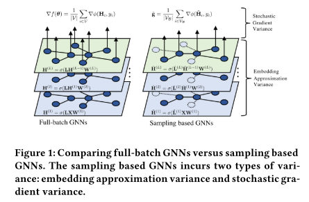

本文提出了minimal variance sampling模型，即MVS-GNN, 核心是通过优化过程中国的动态信息来采样节点，包括两个关键要素：
- 利用历史节点的embeddings来减小embedding approximation variance
- 通过利用节点梯度的近似形式，解决最优化问题来减小stochastic gradient variance

**Algorithm**

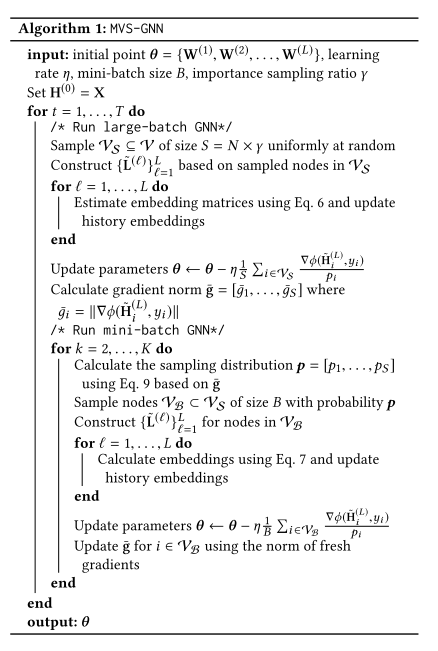

**各算法的approximation方差总结**

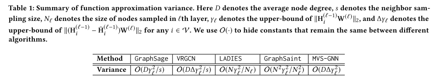

#### 4. 结果

我们理论上证明了该模型是优于uniform sampling和static importance sampling; 另外经验结果也证实了与其他算法相比，该算法在精度上实现了更高的效率

**数据集**

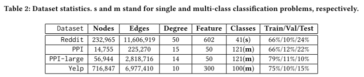

**精度**

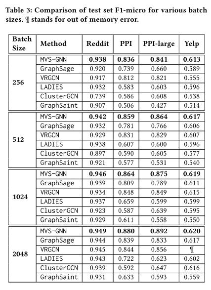

**训练时间**

**收敛和gradient varianace曲线**

## Sample技术的改善

### [NextDoor](https://arxiv.org/pdf/2009.06693.pdf)

**标题**
NextDoor: GPU-Based Graph Sampling for Graph
Machine Learning

**作者**
1. Abhinav Jangda
University of Massachusetts Amherst
United States
2. Sandeep Polisetty
University of Massachusetts Amherst
United States
3. Arjun Guha
Northeastern University
United States

**发表情况**
arxiv上，暂未发表；2020

ACM Reference Format:
Abhinav Jangda, Sandeep Polisetty, Arjun Guha, and Marco Serafini.
2020. NextDoor: GPU-Based Graph Sampling for Graph Machine
Learning. In Proceedings of ACM Conference (Conference’17). ACM,
New York, NY, USA, 14 pages

#### 1. 背景

表示学习(representation learning)不同于特征工程，主要目的是从数据中自动学习。表示学习已经成为机器学习的基本问题之一。表示学习的发展对不同类型的数据在很多领域都取得了卓越的成功，比如，在图像和音频数据，卷积神经网络(Convolutaional Neural Networks)成为了分类和识别的主要方法。

图数据能够有利于发现数据集中实体与实体的关系。表示学习会从图数据中学习到d维的向量表示，这些向量表示用于下游的机器学习任务。图表示学习(Graph Representation learning)现在是多个领域的基本步骤，如社交网络分析，推荐（广告，新闻等等），只是图谱，金融，生物学等等

图数据集的不规整性(irregularity)使得图表示学习非常难。对于图表示学习的算法，一般来说可以分为两步:
- 第一步, graph sampling采样出一个图(input graph)
- 第二步, training, 基于采样的图中训练深度神经网络(deep neural network, DNN). 

采样算法的选择对图表示学习算法十分关键。一些现有的采样方法，如DeepWalk, node2vec, 使用了随机游走(random walks)的变体来采样输入图；GraphSAGE, 采样了中心顶点的k跳邻居，然后使用这些邻居的表示来推导(infer)最终的向量表示。

#### 2. 问题

如何利用GPUs提供的大规模并行性是机器学习和DNNs训练的核心问题。下标展示了在Tensorflow下使用GraphSAGE图采样的影响。在我们的实验中发现，每一轮的速度，31%-82%时间用在采样上，实验环境为Tesla V100 GPU.

**由此可见，graph sampling是耗时的主要开销。但是，其基于GPU的设计是极具挑战的。**
graph sampling是一个"embarassingly parallel"问题，算法设计需要确保计算和内存的访问是规整的(regular), 而图数据本身来说是不规整的。扩展一个sample包括查找完全不相关的顶点的邻居，这就会导致随机内存的访问和控制流的发散。

**现有的系统，一种是基于CPUs, 没有提供给一定的抽象；一种则是没有充分利用GPUs的资源，比如，GNN algorithms(GraphSAGE), 认为samples(subgraphs)即是并行的一个基本单元**

#### 3. 贡献

NEXTDOOR引入了transit-parallelism, 一种新的并行图采样的方法。在这个方法中，并行的基本单元是传输顶点(transit vertex), 该顶点的邻居会全部添加到一个采样集合中。 对于每一个传输顶点, 我们运行几个连续的线程并行地访问该顶点的多个输入，这就降低了偏差，使合并的全局内存访问成为可能，并允许线程在低延迟共享内存中缓存传输顶点。**因此，在图上的不规整运算就变成了规整运算**

transit-parallel的模式包含三个层次嵌套的并行性，自然地映射到GPU的执行过程中。
- 传输顶点映射到一个线程块，每个采样映射为一个warp, 每个线程选择传输顶点的一个邻居，然后加到采样中
- NEXTDOOR有效地平衡跨传输顶点的负载，它可以有非常倾斜的相关的sampler数量。使用不同的调度和缓存策略来为不同的顶点选取不同的kernel内省。因此，它可以有效地缓解负载均衡的问题和利用GPU内存层次来缓存经常访问的数据，从而实现了GPU资源的高利用率
- NEXTDOOR提供了高级别的API来在很少的代码下实现高效的图采样算法。这些API抽象了GPU上低级别的实现细节。一些特化的随机游走APIs, 如KnightKing不能够很好地支持GNN算法如GraphSAGE. NEXTDOOR API更加通用，能够支持这些应用

##### Paradigms for Graph Sampling on GPUs

###### Sample-Parallelism

Graph sampling的并行方法，自然地想法是丙丁地处理每一个采样，即smaple-parallel范式。表示学习方法和随机游走(Random walks)都使用了这种范式。

Algorithm 1展示了一个细粒度的方法(实际采样过程同GraphSAGE采样方法)

这里使用transit vertex表示每次迭代中其邻居可能被加到采样中的顶点。transit vertex实质即是sample的一个成员。在每次迭代中，sample迭代地对每个transit vertex的邻居进行采样,运行next采样方法来得到下一轮采样

> 图中，未看明白的地方： line21 return S中S指的是什么？，line18行中s指的是什么？ 
理解：这里line18中应该是大写的S；这里[s, Ts[s]]即表示每一层的边集([源点, 终点]). N[i]来保证每一层的采样数目

**局限性**
1. 在每次迭代中，使用一个线程来采样邻居。如果两个线程被分配去处理两个有种不同数量邻居的传输顶点，那么较小的邻居需要一直停止直到另一个线程完成
2. 算法负载均衡性问题很差，用户定义函数的工作量很可能取决于传输顶点的邻居数量
3. 任何合理大小的图都必须存储在全局内存中，因此访问邻接表G.E[t]会有很好的延迟。而且，块中的每个线程都要访问不同传输顶点的邻居(Alg1, line13). 这些访问没有空间局部性，所以如果邻接表从全局内存读取，GPU不能合并读取。此外，访问没有时间局部性，因此邻接表也不能有效地缓存在共享内存中

###### Transit-Parallelism

提出了一种新的转换并行范式，它解决了以前方法的局限性。传输-并行范式有三个层次的并行性，它的最外层循环遍历传输而不是样本。解决了线程发散、负载均衡和内存访问多个方面的问题

> 理解：感觉实质上是运用的是局部性原理

**优势**
Transit-parallel执行可以确保相邻的线程执行相同数量的工作并访问相邻的内存位置。
首先，我们会安排每个线程块分配给一个传输顶点t，所有线程都从加载t的邻居开始。浙江产生一个从全局内怒合并读取的操作。由于块中的所有线程都与同一组邻居一起工作，因此我们将其复制到共享内存以提高速度。在内存循环中，每个线程使用user-defined function离开对所有并行的边进行迭代

**Three-level parallelism**
Transit-parallelism有three-level方法来并行化:
1. 将每个传输举证分配到线程块
2. 每个块中，安排连续的线程
3. 同个warp中执行的是同样的操作

##### The NextDoor API

1. 用户需要定义采样函数来实现next的运算，该函数接收四个参数：
- 输入的采样集合sample set, s
- 传输顶点trn
- 传输顶点的领结边 tranEdges
- 当前步 step

#### 4. 结果

NEXTDOOR实现了显著的性能改进。
当执行随漫步时，对比KnightKing实现了高达696倍的采样吞吐量。
当执行GraphSAGE的k-hop邻居时，NEXTDOOR的表现比GraphSAGE好1300倍以上

### C-SAW
