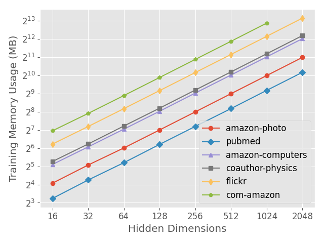
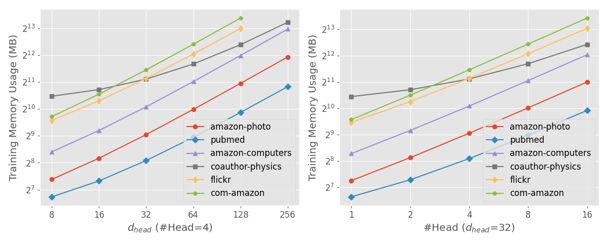
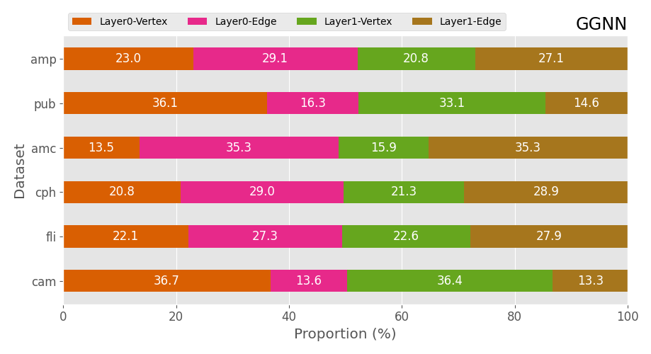
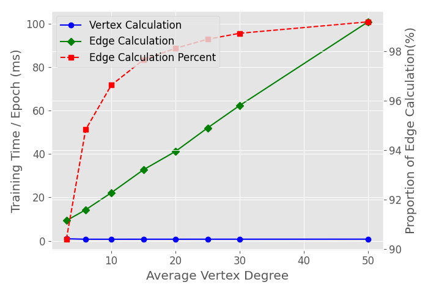
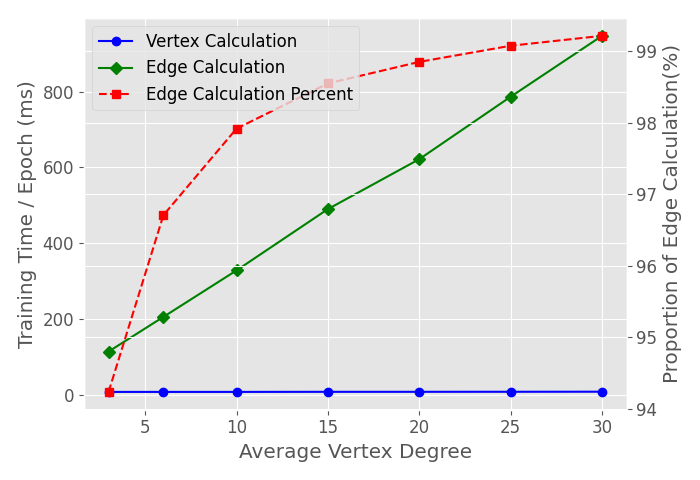

# 1 绪论

# 2 图神经网络

## 2.1 图神经网络的通用结构

## 2.2 图神经网络的分类

[@tbl:gnn_overview]中列出了我们调研到的典型的图神经网络算法.表中列出了各个GNN中点/边计算的表达式,表达式中的大写粗体字母表示GNN模型参数.表中的网络类型划分依据[@zhou2018_gnn_review].因为本文主要关注GNN算法的计算特性,我们分析了各GNN算法的点、边计算的计算复杂度,并根据计算复杂度将GNN算法划分到四个象限中,如[@fig:GNN_complexity_quadrant]所示.

|          名称          |            网络类型             | 边计算 $\Sigma$  | 边计算 $\phi$                                                                                                                                                                                                                                                                                                                                                                                                                             |          边计算复杂度           | 点计算 $\gamma$                                                                                                                                                                                                                                                                                                                                                                                                                                                         |                     点计算复杂度                     |
| :--------------------: | :-----------------------------: | :--------------- | :---------------------------------------------------------------------------------------------------------------------------------------------------------------------------------------------------------------------------------------------------------------------------------------------------------------------------------------------------------------------------------------------------------------------------------------- | :-----------------------------: | :---------------------------------------------------------------------------------------------------------------------------------------------------------------------------------------------------------------------------------------------------------------------------------------------------------------------------------------------------------------------------------------------------------------------------------------------------------------------- | :--------------------------------------------------: |
|  ChebNet (ICLR, 2016)  |        Spectral Methods         | sum              | $\vec{m}_{ij, k}^l = T_k(\widetilde{L} )_{ij} \vec{h}_j^l$                                                                                                                                                                                                                                                                                                                                                                                |         $O(K * h_{in})$         | $\vec{h}_i^{l+1} = \sum_{k=0}^K \mathbf{W}^k \cdot \vec{s}_{i, k}^{l} $                                                                                                                                                                                                                                                                                                                                                                                                 |                $O(h_{in} * h_{out})$                 |
|    GCN (ICLR, 2017)    |        Spectral Methods         | sum              | $\vec{m}_{ij}^l = e_{ij} \vec{h}_j^l$                                                                                                                                                                                                                                                                                                                                                                                                     |           $O(h_{in})$           | $\vec{h}_i^{l+1} = \mathbf{W} \cdot \vec{s}_i^{l}$                                                                                                                                                                                                                                                                                                                                                                                                                      |                $O(h_{in} * h_{out})$                 |
|   AGCN (AAAI, 2018)    |        Spectral Methods         | sum              | $\vec{m}_{ij}^l = \tilde{e}_{ij}^l \vec{h}_j^l$                                                                                                                                                                                                                                                                                                                                                                                           |           $O(h_{in})$           | $\vec{h}_i^{l+1} = \mathbf{W} \cdot \vec{s}_i^{l}$                                                                                                                                                                                                                                                                                                                                                                                                                      |                $O(h_{in} * h_{out})$                 |
| GraphSAGE(NIPS, 2017)  |          Non-spectral           | sum, mean, max   | $\vec{m}_{ij}^l =  \vec{h}_j^l$                                                                                                                                                                                                                                                                                                                                                                                                           |             $O(1)$              | $\vec{h}_i^{l+1} =   \delta(\mathbf{W} \cdot [\vec{s}_i^{l} \parallel \vec{h}_i^l])$                                                                                                                                                                                                                                                                                                                                                                                    |                $O(h_{in} * h_{out})$                 |
| Neural FPs(NIPS, 2015) |      Non-spectral Methods       | sum              | $\vec{m}_{ij}^l = \vec{h}_j^l$                                                                                                                                                                                                                                                                                                                                                                                                            |           $O(h_{in})$           | $\vec{h}_i^{l+1} = \delta(\mathbf{W}^{\mathbf{N}_i} \cdot \vec{s}_i^{l})$                                                                                                                                                                                                                                                                                                                                                                                               |                $O(h_{in} * h_{out})$                 |
|    SSE(ICML, 2018)     | Recurrent Graph Neural Networks | sum              | $\vec{m}_{ij}^l = [\vec{h}_i^{l} \parallel \vec{h}_j^l]$                                                                                                                                                                                                                                                                                                                                                                                  |             $O(1)$              | $\vec{h}_i^{l+1} = (1 - \alpha) \cdot \vec{h}_i^l +\alpha   \cdot \delta(\mathbf{W}_1 \delta(\mathbf{W}_2), \vec{s}_i^l)$                                                                                                                                                                                                                                                                                                                                               |                $O(h_{in} * h_{out})$                 |
|    GGNN(ICLR, 2015)    |   Gated Graph Neural Networks   | sum              | $m_{ij}^l = \mathbf{W} \vec{h}_j^l$                                                                                                                                                                                                                                                                                                                                                                                                       |      $O(h_{in} * h_{out})$      | $\vec{z}_i^l = \delta ( \mathbf{W}^z \vec{s}_i^l + \mathbf{b}^{sz} + \mathbf{U}^z \vec{h}_i^{l} + \mathbf{b}^{hz}) \\ \vec{r}_i^l = \delta ( \mathbf{W}^r \vec{s}_i^l+ \mathbf{b}^{sr} +\mathbf{U}^r \vec{h}_i^{l} + \mathbf{b}^{hr}) \\ \vec{h}_i^{l+1} = tanh ( \mathbf{W} \vec{s}_i^l + \mathbf{b}^s + \mathbf{U} ( \vec{r}_i^l \odot \vec{h}_i^{l} + \mathbf{b}^h))) \\ \vec{h}_i^{l+1} = (1 - \vec{z}_i^l) \odot \vec{h}_i^l +  \vec{z}_i^l \odot \vec{h}_i^{l+1}$ |         $O(max(h_{in}, h_{out}) * h_{out})$          | $O(h_{in}, h_{out})$ |
|  Tree-LSTM(ACL, 2015)  |           Graph LSTM            | sum              | $\vec{m}_{ij}^l = \vec{h}_j^l$                                                                                                                                                                                                                                                                                                                                                                                                            |             $O(1)$              | $h_i^{l+1} = LSTM(\vec{s}_i^l, \vec{h}_i^{l})$                                                                                                                                                                                                                                                                                                                                                                                                                          |                $O(h_{in} * h_{out})$                 |
|    GAT(ICLR, 2017)     |    Graph Attention Networks     | sum, mean        | $\alpha_{ij}^k = \frac {\exp(LeakyReLU(a^T [ \mathbf{W}^k \cdot \vec{h}_i^l \parallel \mathbf{W}^k \cdot \vec{h}_j^l] ))} {\sum_{k \in \mathcal{N}(i)}\exp(LeakyReLU(a^T [ \mathbf{W}^k \cdot \vec{h}_i^l \parallel \mathbf{W}^k \cdot \vec{h}_k^l] ))} \\  \vec{m}_{ij}^l = \parallel_{k=1}^K \delta(\alpha_{ij}^k \mathbf{W}^k \vec{h}_j^{l})$                                                                                          |    $O(K * h_{in} * h_{out})$    | $\vec{h}_i^{l+1} = \vec{s}_i^l$                                                                                                                                                                                                                                                                                                                                                                                                                                         |                        $O(1)$                        |
|    GaAN(UAI, 2018)     |    Graph Attention Networks     | sum + max + mean | $\alpha_{ij}^k = \frac {\exp(\mathbf{W}^a \cdot [ \mathbf{W}^a \cdot \vec{h}_i^l \parallel \mathbf{W}^a \cdot \vec{h}_j^l] )} {\sum_{k \in \mathcal{N}(i)}\exp(a^T [ \mathbf{W}^k \cdot \vec{h}_i^l \parallel \mathbf{W}^k \cdot \vec{h}_k^l] )} \\  \vec{m}_{ij, 1}^l = \parallel_{k=1}^K \delta(\alpha_{ij}^k \mathbf{W}^k_v \vec{h}_j^{l}) \\ \vec{m}_{ij, 2}^l = \mathbf{W}_m \cdot \vec{h}_j^{l} \\ \vec{m}_{ij, 3}^l = \vec{h}_j^l$ | $O(max(d_a, d_m) * K * h_{in})$ | $\vec{g}_i = \mathbf{W}_g \cdot [\vec{h}_i^{l} \parallel s_{i, 2}^l \parallel s_{i, 3}^l]  \\ \vec{h}_i^{l+1} = \mathbf{W}_o [\vec{h}_i^l \parallel (\vec{g}_{i} \odot s_{i, 3}^l) ]$                                                                                                                                                                                                                                                                                   | $O(max(h_{in} + K * d_v, 2 * h_{in} + d_m) h_{out})$ |

: 图神经网络概览 {#tbl:gnn_overview}

{#fig:GNN_complexity_quadrant width=60%}

## 2.3 典型图神经网络

## 2.4 采样技术

## 2.5 图神经网络训练中的梯度更新

# 3 实验设计

## 3.1 实验环境

## 3.2 实验数据集

|                       数据集                        |  点数   |  边数   | 平均度数 | 输入特征向量维度 | 特征稀疏度 | 类别数 | 图类型 |
| :-------------------------------------------------: | :-----: | :-----: | :------: | :--------------: | :--------: | :----: | :----: |
| pubmed (pub) [@yang2016_revisiting_semisupervised]  | 19,717  | 44,324  |   4.5    |       500        |    0.90    |   3    | 有向图 |
|   amazon-photo (amp) [@shchur2018_pitfall_of_gnn]   |  7,650  | 119,081 |   31.1   |       745        |    0.65    |   8    | 有向图 |
| amazon-computers (amc) [@shchur2018_pitfall_of_gnn] | 13,752  | 245,861 |   35.8   |       767        |    0.65    |   10   | 有向图 |
| coauthor-physics (cph) [@shchur2018_pitfall_of_gnn] | 34,493  | 247,962 |   14.4   |       8415       |   0.996    |   5    | 有向图 |
|         flickr (fli) [@zeng2020_graphsaint]         | 89,250  | 899,756 |   10.1   |       500        |    0.54    |   7    | 无向图 |
|        com-amazon (cam) [@yang2012_defining]        | 334,863 | 925,872 |   2.8    |        32        |    0.0     |   10   | 无向图 |

: 实验数据集概览 {#tbl:dataset_overview}

实验中为了测量图的关键拓扑特征(例如平均度数)对性能的影响情况, 我们也利用R-MAT生成器[@rmat-generator]生成随机图.
如果不额外说明, 随机图顶点的特征向量为随机生成的32维稠密向量, 将顶点随机分到10个类别中, 75%的顶点参与训练.

## 3.3 图神经网络算法选择与实现

## 3.4 数据处理方法

## 3.5 实验方案概览

- 实验 1：第2.2节中的计算复杂度分析是否与实际表现相符合？

# 4 实验结果与分析

## 4.1 实验1：超参数的影响

本实验的目标是通过观察GNN的超参数(例如$h_{in}$、$h_{out}$、$K$等)对训练耗时、显存使用的影响, 验证[@tbl:gnn_overview]中复杂度分析的准确性.

[@fig:exp_absolute_training_time]中比较了各GNN每个epoch的训练耗时,其排名为GaAN >> GAT > GGNN > GCN. 其耗时排名与复杂度分析相符. 因为图中边的数量一般远超点的数量, 因此边计算复杂度更高的GAT算法比点计算复杂度高的算法GGNN更耗时. [@fig:exp_absolute_training_time] 同时表明个别epoch的训练耗时异常地高, 其主要是由profiling overhead和python解释器的GC停顿造成.该现象证实了去处异常epoch的必要性.

{}
{}
{}

{}
{}
{}

训练耗时的影响

根据[@tbl:gnn_overview]中的复杂度分析, 各GNN的点、边计算复杂度与各算法超参数(例如$h_{dim}$、$K$等)呈线性关系.
为了验证该线性关系, 我们测量了各GNN的训练时间随超参数的变化情况.

GCN和GGNN的计算复杂度受隐向量维度$h_{dim}$影响.
$h_{dim}$同时影响Layer0的输出隐向量维度和Layer1的输入隐向量维度（即$h_{dim}=h^0_{out}=h^1_{in})$.
[@fig:exp_hyperparameter_on_vertex_edge_phase_time_gcn]和[@fig:exp_hyperparameter_on_vertex_edge_phase_time_ggnn]展示了GCN和GGNN训练耗时受$h_{dim}$的影响情况.
随着$h_{dim}$的增加,训练耗时呈线性增长.

GAT采用了多头机制,其计算复杂度受输入隐向量维度$h_{in}$, 每个头的隐向量维度$h_{head}$和头数$K$的影响.
每一层的输出隐向量维度$h_{out}=K h_{head}$.
因为在GAT结构中$h^1_{in}=h^0_{out}$, 调整$h_{head}$和$K$即相当于调整了Layer1的$h^1_{in}$.
[@fig:exp_hyperparameter_on_vertex_edge_phase_time_gat]展示了GAT训练耗时受超参数$h_{head}$和$K$的影响.
GAT训练耗时随$h_{head}$和$K$呈线性增长.

GaAN同样采用多头机制,其计算复杂度受$h_{in}$、$d_v$、$d_a$和头数$K$的影响.
[@fig:exp_hyperparameter_on_vertex_edge_phase_time_gat]展示了GaAN训练耗时受超参数的影响.
实验验证了[@tbl:gnn_overview]中给出的复杂度分析结果,各GNN算法的训练耗时随着超参数的增加呈线性增长.
当隐向量维度$h_{in}$过低时, 涉及隐向量的计算占总计算时间比例很低, 导致其总训练耗时变化不明显.
当隐向量维度足够大时, 总训练时间随$h_{in}$呈线性增长.

{#fig:exp_hyperparameter_on_vertex_edge_phase_time_gcn}
{#fig:exp_hyperparameter_on_vertex_edge_phase_time_ggnn}

{#fig:exp_hyperparameter_on_vertex_edge_phase_time_gat}
{#fig:exp_hyperparameter_on_vertex_edge_phase_time_gaan}

超参数对GNN中点/边计算耗时的影响

[@fig:exp_hyperparameter_on_memory_usage]同时展示了各GNN对GPU显存的使用情况随算法超参数的变化情况.
随着超参数的增加,GNN的显存使用也线性增长.

{}
{}

{}
{}

超参数对训练阶段显存使用的影响(不含数据集本身)

实验验证了[@tbl:gnn_overview]中复杂度分析的有效性.
*GNN的训练耗时与显存使用均与超参数呈线性关系*.
这允许算法工程师使用更大的超参数来提升GNN的复杂度,而不用担心训练耗时和显存使用呈现爆炸性增长.

## 4.2 实验2: 训练耗时分解

本实验的目标是通过对训练耗时的分解, 发掘GNN训练中的计算性能瓶颈.

对于点计算和边计算, [@fig:exp_vertex_edge_cal_proportion]展示了各算法不同GNN层点/边计算耗时占总训练耗时的比例情况(含forward, backward和evaluation阶段).
GCN算法在大多数数据集上边计算耗时占据主导.
只有`cph`数据集是特例, 因为该数据集输入特征向量维度非常高, 导致Layer0的点计算耗时额外的高.
GGNN因为其点计算复杂度高, 使其点计算耗时占比明显高于其他算法, 但在大多数数据集上依然是边计算占据主要的计算耗时.
只有在`pub`和`cam`数据集上,边计算开销和点计算开销接近,因为两个数据集平均度数较低 (仅为4.5和2.8).
对于GAT和GaAN算法, 因为其边计算复杂度高, 其边计算耗时占绝对主导.
综上, *边计算是GNN训练的主要耗时因素*, 尤其是在边计算较为复杂的情况下.

实验也表明*数据集的平均度数影响点/边计算的耗时比例*.
我们固定图的顶点数为50k, 利用R-MAT生成器生成平均度数在10到100之间的随机图.
我们测量了各GNN中点/边计算的耗时比例随图平均度数的变化情况, 如[@fig:exp_avg_degree_vertex_edge_cal_time]所示.
边计算的耗时随着平均度数的增加呈线性增长, *边计算耗时在绝大部分情况下主导了整个计算耗时*, 只有在点计算复杂度非常高且平均度数非常低的情况下点计算耗时才能赶超边计算耗时.
因此, *GNN训练优化的重点应该是提升边计算的效率*.

点/边计算耗时占比

平均顶点度数对点/边计算耗时比例的影响

边计算阶段可以进一步分解为collect, message, aggregate和update四个步骤, 如[@fig:steps_in_edge_calculation]所示.
假设当前正在进行第$l$层GNN的边计算过程.
edge index是一个保存由图的边集的规模为M*2的矩阵, 其中M是图的边数, 该矩阵的两列分别保存每条边的源顶点和目标顶点.
edge index在整个计算过程中保持不变.
其中collect步骤用于准备边计算所需要的数据结构.
该步骤将输入GNN层的顶点隐向量$h_i^l (1 \leq i \leq N)$根据edge index拷贝到各边的两层, 构成输入边计算函数$\phi$的两个输入参数矩阵.
在步骤没有计算,只涉及数据访问.
message步骤调用用户给出的函数$\phi$完成边计算过程, 并得到每条边的消息向量$m_{ij}^l ((i,j) \in E(G))$.
该步骤主要涉及计算.
aggregate步骤根据每条边的目标顶点, 将目标顶点相同的消息向量通过聚合算子$\Sigma$聚合在一起, 得到每个顶点聚合向量$a_i^l (1 \leq i \leq N)$.
该步骤既涉及计算, 也涉及数据访问和数据同步(避免并发更新同一个顶点的聚合向量).
最后的update步骤是可选的, 其可以对聚合向量做额外的变换, 例如进行bias修正(例如在GCN和GAT).
该步骤主要涉及计算.

{#fig:steps_in_edge_calculation}

图X进一步分解了各GNN边计算阶段各步骤的耗时比例(含forward和backward阶段).
对于GCN算法, 其消息向量$m_{ij}^l=h_{i}^l$,所以message步骤耗时为0.

## 4.2 GPU显存使用

## 4.3 算法超参数影响

## 4.4 数据扩展性

## 4.5 采样技术的影响

# 5 系统设计建议

# 6 相关工作

# 7 总结与展望
