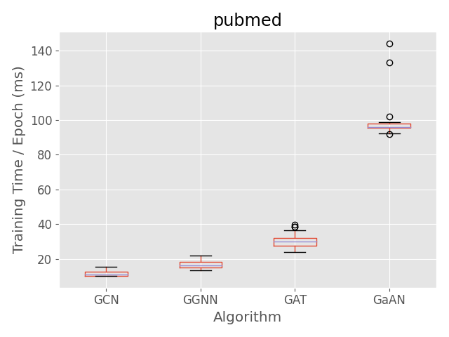
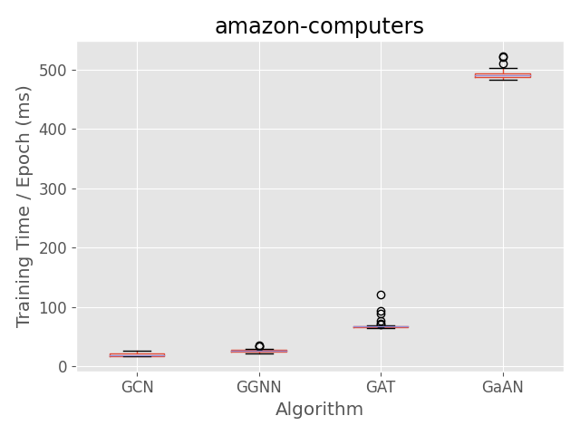

# 1 绪论

# 2 图神经网络

## 2.1 图神经网络的通用结构

## 2.2 图神经网络的分类

[@tbl:gnn_overview]中列出了我们调研到的典型的图神经网络算法。表中列出了各个GNN中点/边计算的表达式，表达式中的大写粗体字母表示GNN模型参数。表中的网络类型划分依据[@zhou2018_gnn_review]。因为本文主要关注GNN算法的计算特性，我们分析了各GNN算法的点、边计算的计算复杂度，并根据计算复杂度将GNN算法划分到四个象限中，如[@fig:GNN_complexity_quadrant]所示。

|          名称          |   网络类型   | $\Sigma$         | $\phi$                                                                                                                                                                                                                                                                                                                                                                                                                                    |         边计算复杂度         | $\gamma$                                                                                                                                                                                                                                                                                                                                                           |                  点计算复杂度                   |
| :--------------------: | :----------: | :--------------- | :---------------------------------------------------------------------------------------------------------------------------------------------------------------------------------------------------------------------------------------------------------------------------------------------------------------------------------------------------------------------------------------------------------------------------------------- | :--------------------------: | :----------------------------------------------------------------------------------------------------------------------------------------------------------------------------------------------------------------------------------------------------------------------------------------------------------------------------------------------------------------- | :---------------------------------------------: |
|  ChebNet (ICLR, 2016)  |   Spectral   | sum              | $\vec{m}_{ij, k}^l = T_k(\widetilde{L} )_{ij} \vec{h}_j^l$                                                                                                                                                                                                                                                                                                                                                                                |         $O(Kh_{in})$         | $\vec{h}_i^{l+1} = \sum_{k=0}^K \mathbf{W}^k \cdot \vec{s}_{i, k}^{l}$                                                                                                                                                                                                                                                                                             |               $O(h_{in}h_{out})$                |
|  **GCN** (ICLR, 2017)  |   Spectral   | sum              | $\vec{m}_{ij}^l = e_{ij} \vec{h}_j^l$                                                                                                                                                                                                                                                                                                                                                                                                     |         $O(h_{in})$          | $\vec{h}_i^{l+1} = \mathbf{W} \cdot \vec{s}_i^{l}$                                                                                                                                                                                                                                                                                                                 |               $O(h_{in} h_{out})$               |
|   AGCN (AAAI, 2018)    |   Spectral   | sum              | $\vec{m}_{ij}^l = \tilde{e}_{ij}^l \vec{h}_j^l$                                                                                                                                                                                                                                                                                                                                                                                           |         $O(h_{in})$          | $\vec{h}_i^{l+1} = \mathbf{W} \cdot \vec{s}_i^{l}$                                                                                                                                                                                                                                                                                                                 |               $O(h_{in}h_{out})$                |
| GraphSAGE(NIPS, 2017)  | Non-spectral | sum, mean, max   | $\vec{m}_{ij}^l =  \vec{h}_j^l$                                                                                                                                                                                                                                                                                                                                                                                                           |            $O(1)$            | $\vec{h}_i^{l+1} =   \delta(\mathbf{W} \cdot [\vec{s}_i^{l} \parallel \vec{h}_i^l])$                                                                                                                                                                                                                                                                               |               $O(h_{in}h_{out})$                |
| Neural FPs(NIPS, 2015) | Non-spectral | sum              | $\vec{m}_{ij}^l = \vec{h}_j^l$                                                                                                                                                                                                                                                                                                                                                                                                            |         $O(h_{in})$          | $\vec{h}_i^{l+1} = \delta(\mathbf{W}^{\mathbf{N}_i} \cdot \vec{s}_i^{l})$                                                                                                                                                                                                                                                                                          |               $O(h_{in}h_{out})$                |
|    SSE(ICML, 2018)     |  Recurrent   | sum              | $\vec{m}_{ij}^l = [\vec{h}_i^{l} \parallel \vec{h}_j^l]$                                                                                                                                                                                                                                                                                                                                                                                  |            $O(1)$            | $\vec{h}_i^{l+1} = (1 - \alpha) \cdot \vec{h}_i^l +\alpha   \cdot \delta(\mathbf{W}_1 \delta(\mathbf{W}_2), \vec{s}_i^l)$                                                                                                                                                                                                                                          |               $O(h_{in}h_{out})$                |
|  **GGNN**(ICLR, 2015)  |    Gated     | sum              | $m_{ij}^l = \mathbf{W} \vec{h}_j^l$                                                                                                                                                                                                                                                                                                                                                                                                       |     $O(h_{in} h_{out})$      | $\vec{z}_i^l = \delta ( \mathbf{W}^z \vec{s}_i^l + \mathbf{U}^z \vec{h}_i^{l}) \\ \vec{r}_i^l = \delta ( \mathbf{W}^r \vec{s}_i^l+ \mathbf{U}^r \vec{h}_i^{l}) \\ \vec{h}_i^{l+1} = tanh ( \mathbf{W} \vec{s}_i^l + \mathbf{U} ( \vec{r}_i^l \odot \vec{h}_i^{l}))) \\ \vec{h}_i^{l+1} = (1 - \vec{z}_i^l) \odot \vec{h}_i^l +  \vec{z}_i^l \odot \vec{h}_i^{l+1}$ |        $O(h_{out}\max(h_{in}, h_{out}))$        |
|  Tree-LSTM(ACL, 2015)  |     LSTM     | sum              | $\vec{m}_{ij}^l = \vec{h}_j^l$                                                                                                                                                                                                                                                                                                                                                                                                            |            $O(1)$            | $h_i^{l+1} = LSTM(\vec{s}_i^l, \vec{h}_i^{l})$                                                                                                                                                                                                                                                                                                                     |               $O(h_{in} h_{out})$               |
|  **GAT**(ICLR, 2017)   |  Attention   | sum, mean        | $\alpha_{ij}^k = \frac {\exp(LeakyReLU(a^T [ \mathbf{W}^k \cdot \vec{h}_i^l \parallel \mathbf{W}^k \cdot \vec{h}_j^l] ))} {\sum_{k \in \mathcal{N}(i)}\exp(LeakyReLU(a^T [ \mathbf{W}^k \cdot \vec{h}_i^l \parallel \mathbf{W}^k \cdot \vec{h}_k^l] ))} \\  \vec{m}_{ij}^l = \parallel_{k=1}^K \delta(\alpha_{ij}^k \mathbf{W}^k \vec{h}_j^{l})$                                                                                          |    $O(K h_{in} h_{head})$    | $\vec{h}_i^{l+1} = \vec{s}_i^l$                                                                                                                                                                                                                                                                                                                                    |                     $O(1)$                      |
|  **GaAN**(UAI, 2018)   |  Attention   | sum + max + mean | $\alpha_{ij}^k = \frac {\exp(\mathbf{W}^a \cdot [ \mathbf{W}^a \cdot \vec{h}_i^l \parallel \mathbf{W}^a \cdot \vec{h}_j^l] )} {\sum_{k \in \mathcal{N}(i)}\exp(a^T [ \mathbf{W}^k \cdot \vec{h}_i^l \parallel \mathbf{W}^k \cdot \vec{h}_k^l] )} \\  \vec{m}_{ij, 1}^l = \parallel_{k=1}^K \delta(\alpha_{ij}^k \mathbf{W}^k_v \vec{h}_j^{l}) \\ \vec{m}_{ij, 2}^l = \mathbf{W}_m \cdot \vec{h}_j^{l} \\ \vec{m}_{ij, 3}^l = \vec{h}_j^l$ | $O(K h_{in} \max(d_a, d_m))$ | $\vec{g}_i = \mathbf{W}_g \cdot [\vec{h}_i^{l} \parallel s_{i, 2}^l \parallel s_{i, 3}^l]  \\ \vec{h}_i^{l+1} = \mathbf{W}_o [\vec{h}_i^l \parallel (\vec{g}_{i} \odot s_{i, 3}^l) ]$                                                                                                                                                                              | $O(h_{out}\max(h_{in} + K d_v, 2h_{in} + d_m))$ |

: 图神经网络概览 {#tbl:gnn_overview}

{#fig:GNN_complexity_quadrant width=60%}

## 2.3 典型图神经网络

## 2.4 采样技术

## 2.5 图神经网络训练中的梯度更新

# 3 实验设计

## 3.1 实验环境

## 3.2 实验数据集

|                    数据集                     |  点数   |  边数   | 平均度数 | 输入特征向量维度 | 特征稀疏度 | 类别数 | 图类型 |
| :-------------------------------------------: | :-----: | :-----: | :------: | :--------------: | :--------: | :----: | :----: |
|  pubmed[@yang2016_revisiting_semisupervised]  | 19,717  | 44,324  |   4.5    |       500        |    0.90    |   3    | 有向图 |
|   amazon-photo [@shchur2018_pitfall_of_gnn]   |  7,650  | 119,081 |   31.1   |       745        |    0.65    |   8    | 有向图 |
| amazon-computers [@shchur2018_pitfall_of_gnn] | 13,752  | 245,861 |   35.8   |       767        |    0.65    |   10   | 有向图 |
| coauthor-physics [@shchur2018_pitfall_of_gnn] | 34,493  | 247,962 |   14.4   |       8415       |   0.996    |   5    | 有向图 |
|         flickr [@zeng2020_graphsaint]         | 89,250  | 899,756 |   10.1   |       500        |    0.54    |   7    | 无向图 |
|        com-amazon [@yang2012_defining]        | 334,863 | 925,872 |   2.8    |        32        |    0.0     |   10   | 无向图 |

## 3.3 图神经网络算法选择与实现

## 3.4 数据处理方法

## 3.5 实验方案概览

- 实验 1：第2.2节中的计算复杂度分析是否与实际表现相符合？

# 4 实验结果与分析

## 4.1 实验1：超参数的影响分析

本实验的目标是通过观察GNN的超参数（例如$h_{in}$、$h_{out}$、$K$等）对训练耗时、显存使用的影响，验证[@tbl:gnn_overview]中复杂度分析的准确性。

[@fig:exp_absolute_training_time]中比较了各GNN每个epoch的训练耗时，其排名为GaAN >> GAT > GGNN > GCN。其耗时排名与复杂度分析相符。因为图中边的数量一般远超点的数量，因此边计算复杂度更高的GAT算法比点计算复杂度高的算法GGNN更耗时。[@fig:exp_absolute_training_time]同时表明个别epoch的训练耗时异常地高，其主要是由profiling overhead和python解释器的GC停顿造成。该现象证实了去处异常epoch的必要性。

{width=25%}
{width=25%}
{width=25%}

{width=25%}
{width=25%}
{width=25%}

Training time comparison.

根据[@tbl:gnn_overview]中的复杂度分析，各GNN的点、边计算复杂度与各算法超参数（例如$h_{dim}$、$K$等）呈线性关系。
为了验证该线性关系，我们测量了各GNN的训练时间随超参数的变化情况。GCN和GGNN的计算复杂度受隐向量维度$h_{dim}$影响。
$h_{dim}$同时影响Layer1的输出隐向量维度和Layer2的输入隐向量维度（即$h_{dim}=h^1_{out}=h^2_{in})$。
[@fig:exp_hyperparameter_on_vertex_edge_phase_time_gcn]和[@exp_hyperparameter_on_vertex_edge_phase_time_ggnn]展示了GCN和GGNN训练耗时受$h_{dim}$的影响情况，随着$h_{dim}$的增加，训练耗时呈线性增长。
GAT采用了多头机制，其计算复杂度受输入隐向量维度$h_{in}$、每个头的隐向量维度$h_{head}$、头数$K$的影响。
我们调整Layer1的$K$和$h_{head}$（即同时调整了Layer2的$h_{in}$），[@fig:exp_hyperparameter_on_vertex_edge_phase_time_gat]展示了GAT训练耗时受超参数的影响，随着超参数的增长，训练耗时呈线性增长。
GaAN同样采用多头机制，其计算复杂度受$h_{in}$、$d_v$、$d_m$、$h_{out}$、$K$等超参数的影响。
我们同时调整Layer1和Layer2的$K$等参数，[@fig:exp_hyperparameter_on_vertex_edge_phase_time_gat]展示了GaAN训练耗时受超参数的影响。
实验验证了表[@tbl:gnn_overview]中给出的复杂度分析结果，各GNN算法的训练耗时随着超参数的增加呈线性增长。

[@fig:exp_hyperparameter_on_memory_usage]同时展示了各GNN对GPU显存的使用情况随算法超参数的变化情况，在统计GPU显存使用情况时不包含图数据集本身。
随着超参数的增加，GNN的显存使用也线性增长。

实验验证了[@tab:gnn_overview]中复杂度分析的有效性。
GNN的训练耗时与显存使用均与超参数呈线性关系。
这允许算法工程师使用更大的超参数来提升GNN的复杂度，而不用担心训练耗时和显存使用呈现爆炸性增长。

## 4.2 训练耗时分解

## 4.2 GPU显存使用

## 4.3 算法超参数影响

## 4.4 数据扩展性

## 4.5 采样技术的影响

# 5 系统设计建议

# 6 相关工作

# 7 总结与展望
