[[toc]]

# 1 绪论

近年来，图神经网络是人工智能领域内的研究热点，在多种任务多个领域下取得了卓越的成果. 这些成功与graph structure相比于grid data structure有更强大的表现能力，以及深度学习端到端强大的学习能力息息相关。随着图神经网络在多个领域取得好的结果，在系统领域也陆续提出了一系列并行或分布式的图神经网络计算系统。这些系统从大量图神经网络中抽象出图神经网络计算模型，并针对计算模型设计了高效的实现。并在实现中使用了大量的性能优化技巧。
1. message-passing通用模型
PyG[@PyG], DGL[@DGL]基于message-passing机制[@gilmer_messgae_passing]的计算系统，$\boldsymbol{h}_i^{l+1}  = \gamma (\boldsymbol{h}_i^{ll}, \Sigma_{j \in \mathcal{N}(i)} \phi(\boldsymbol{h}_i^l, \boldsymbol{h}_j^l, \boldsymbol{e}_{j, i}^l))$, 将图卷积操作定义边计算操作message function、聚合操作reduction fucnction和点计算操作update function. 该论文对应的代码实现即pytorch-geometric, 基于PyTorch后端的图神经网络的计算框架。DGL也是基于message-passing的编程模型

2. SAGA-NN通用模型
NeuGraph[4]为图神经网络训练提出了SAGA-NN（Scatter-ApplyEdge-Gather-ApplyVertex with Neural Networks）编程模型。SAGA-NN模型将图神经网络中每一层的前向计算划分为4个阶段：Scatter、ApplyEdge、Gather和ApplyVertex。其中ApplyEdge和ApplyVertex阶段执行用户提供的基于神经网络的边特征向量和点特征向量的计算。Scatter和Gather是由NeuGraph系统隐式触发的阶段，这两个阶段为ApplyEdge和ApplyVertex阶段准备数据。在编程时，用户只需利用给定的算子实现ApplyEdge和ApplyVertex函数，并指定Gather方式，即可利用NeuGraph自动地完成GNN的训练。

3. Sample + Aggregate + Combine通用模型
在AliGraph[5]所支持的通用GNN框架中，每一层的GNN被拆解为三个基本算子: Sample, Aggregate和Combine。其中Sample对应于采样，Aggregate进行边计算，Combine对应于点计算。因为AliGraph面对的是实际大规模图数据，所以AliGraph重点放在了图存储，图采样，图计算三个部分。在图存储上，采用了vertex-cut的方式，即不同的边分配到不同的机器上。在图采样上，支持三种采样方式，Traverse: 从一个图分区中采样一批顶点。Neighborhood, 采样某个顶点的1跳或多跳邻域。Negative,生成负采样样本，加速收敛。特别地，Sampler中的权重也允许根据梯度更新。

在这些图神经网络计算系统实现中，各自用了不同的性能优化技巧，然而这些性能优化技巧是否真正解决了GNN训练过程中的性能瓶颈研究还存有疑问。目前来说，对于图神经网络训练的具体性能瓶颈的分析工作很少，最近的工作[6]Architectural Implications of GNNs, 基于SAGA-NN编程模型和DGL计算系统进行实验，作者认为GNN没有固定的性能瓶颈，性能瓶颈会随着数据集和算法的不同而变化，但是该工作中选择的图的阶数都是很低的情况，而且没有对图的规模和GNN的点边的复杂度进行探讨。工作[7]分析了GCN类的算法在inference阶段的特性，同时与经典的图分析算法(PageRank)和基于MLP的经典神经网络的特性进行了对比分析，发现实际图中的顶点度数分布符合幂等律分布的特性，因此缓存高度数的顶点，有可能可以提升硬件的cache的命中率，因为向量化原子访问可以提升aggregation阶段的效率，但是该工作只选取了某个特定的GNN算法，不能很好地表示大部分的GNN的训练分析。

由于图神经网络每层最本质的操作实际上可以概括为aggregate和update两个操作，aggregate操作即收集邻居顶点的信息, 时间和计算开销与图的边数直接相关；update操作进行顶点信息的变换. 时间和计算开销与图的顶点数直接相关。本文在不考虑复合GNN模型的情况下，将3篇综述中的大多数GNN模型进行了点计算和边计算计算量的统计。从点边高低四个象限中选择了四个典型算法，GCN, GGNN, GAT, GaAN进行讨论，作为此次选取的典型GNN算法。此外，本文从Performance执行时间分解，Resource Usage GPU显存使用，Scalability三个方面设计指标，
1. Performance执行时间分解： 对于一个深度学习算法来说，执行所花费的总时间主要是由两部分构成的：time per epoch 和 convergence speed(loss reduction) per epoch. 第二部分是由算法本身决定的，不属于本文的讨论范围。所以这里主要是对time per epoch该部分进行了分析。首先，实验验证了每个epochs训练用时是稳定的；其次，由于目前不支持多GPU背景下训练a big graph, 所以此时我们分析了单GPU下Transductive learning下深度学习训练的分析，将time per epoch划分为了forward, backward, evaluation三个阶段的分析；然后，对GNN模型的每层耗时进行了分解；
2. Resource Usage: 这里考虑使用GPU加速情况下的表现，对应指标为GPU显存占比
3. Scalability: 从三个方面，算法的超参数影响，数据扩展性（特征的维度、稀疏性，图的顶点数和阶数），采样技术三个方面进行了探讨。

本次实验使用message-passing机制

# 2 图神经网络

符号定义
- 标量: 小写字母
- 向量: 加粗小写字母
- 矩阵: 加粗大写字母
- 集合: mathcal字体
- $\delta$, $LeakyReLU$: 激活函数(可微函数)
- $\mathbf{W}^lx$: 默认为矩阵乘法, 即mm
- $\odot$: 元素乘法
- $[\parallel, \parallel]$, $\parallel_{k=1}^K$, 表示向量拼接

图定义：
A graph is representeed as $\mathcal{G}=(\mathcal{V}, \mathcal{E})$, where V is the set of vertices or nodes (we will use nodes throughtout this article), and $E$ is the set of edges. Let $n = |\mathcal{V}|$ and $m = \mathcal{E}$. Let $v_i \in \mathcal{V}$ to denote a node and $\boldsymbol{e}_{i, j} = (v_i, v_j) \in \mathcal{E}$ to denote an edge pointing from $v_j$ to $v_i$. The neighborhood of a node $v$ is defined as $\mathcal{N}(v) = \{u \in \mathcal{V} | (v, u) \in \mathcal{E}\}$. The adjacency matrix $\boldsymbol{A}$ is a $n \times n$ matrix with $A_{ij}=1$ if $e_{j, i} \in \mathcal{E}$ and $A_{ij}=0$ if $e_{j, i} \notin \mathcal{E}$.A graph may have node features $\boldsymbol{X}$, where $\boldsymbol{X} \in \boldsymbol{R}^{n \times f}$, $f$ is the number of feature dims. 

## 1. 2.1 图神经网络的通用结构

从[@comprehensive-survey-wu-2020], 我们总结出GNN通用网络结构往往可以表示为以下形式：
Input Layer + 若干 GNN Layers + Prediction Layer
其中，Input Layer是GNN的输入层，GNN Layer是GNN的信息更新层，Prediction Layer为输出层，与实际GNN处理的任务场景有关，常见的有node classification, link prediction, graph classification等等。

{#fig:GNN_common_architecture width=60%}

如图[#fig:GNN_common_architecture]，这里以node classification为说明，展示了两层GNN Layer下通用图神经网络的网络结构图: 
1. 图中节点特征$\boldsymbol{X}$作为Input Layer的输出隐向量。
2. 网络结构中每个Layer之间节点的连接关系由图的拓扑结构$\boldsymbol{A}$决定，以GNN Layer1中节点$v_3$的输出隐向量为例，它是通过汇聚($\Sigma$)已经经过某种变换($\phi$)的来自GNN Layer1的$v_2$, $v_4$, $v_5$的表示，再经过更新$\gamma$得到的，而$v_2$, $v_4$, $v_5$这些点的指定是由Training Graph中的$e_{2, 3}, e_{4, 3}, e_{5, 3}$决定的。
3. 图中每个节点可以看作是图神经网络结构中的基本单元。这个基本单元又可以看作是一个小型的网络结构，它是图神经网络中每一层信息的更新。

本文采用message-passing机制[@gilmer_messgae_passing]来表示GNN Unit的更新[#fig:GNN_Unit]即GNN Layer $l+1$ 节点 $v_i$的输出隐向量可以表示为:
$$\boldsymbol{h}_i^{l+1}  = \gamma (\boldsymbol{h}_i^l, \Sigma_{j \in \mathcal{N}(i)} \phi(\boldsymbol{h}_i^l, \boldsymbol{h}_j^l, \boldsymbol{e}_{j, i}^l))$$
where $\Sigma$ denotes a differntiable, permutation invariant function, e.g., sum, mean or max, and $\gamma$ and $\phi$ denote differentiable functions such as MLPs.
细致地，这里我们可以把GNN Unit划分为三个基础组件:
- 边操作函数$\phi$, 对边的信息做变换, $\boldsymbol{m}_{j, i}^l = \phi(\boldsymbol{h}_i^l, \boldsymbol{h}_j^l, \boldsymbol{e}_{j, i}^l)$
- 聚合函数$\Sigma$, 使用某种方式(sum, max, min, mean, LSTM)聚集邻居节点信息和历史信息，$\boldsymbol{s}_i^l =  \Sigma_{j \in \mathcal{N}(i)} \boldsymbol{m}_{j, i}^l $
- 点操作函数$\gamma$, 进行点信息的更新, $\boldsymbol{h}_i^{l+1}  = \gamma(\boldsymbol{s}_i^l)$

> 在后面的实验中，将1和2视为了边计算，3视为了点计算
> message-passing结构存在的问题:
> 这里的$\gamma$的参数在某些算法中可以为任意节点的历史信息，$h_i^k, i \in \mathcal{V}, k \in [0, l]$

{#fig:GNN_Unit width=60%}

## 2. 2.2 图神经网络的分类

根据2.1的分析，GNN的通用网络结构的基本单元实际上为GNN Unit。对于某个算法来做实际的计算量，直接与$\phi$, $Sigma$, $gamma$这三个参数的计算量相关，近似地，计算量可以认为是$m * (O(\phi) + O(\Sigma)) + n * O(\gamma)$, 所以我们通过从边计算量、点计算量两个维度来划分现有的GNN算法。

[@tbl:gnn_overview]中列出了我们调研到的典型的图神经网络算法.表中列出了各个GNN中点/边计算的表达式,表达式中的大写粗体字母表示GNN模型参数.表中的网络类型来源于文献[@zhou2018_gnn_review].因为本文主要关注GNN算法的计算特性,我们分析了各GNN算法的点、边计算的计算复杂度,并根据计算复杂度将GNN算法划分到四个象限中,如[@fig:GNN_complexity_quadrant]所示.

其中, $d_{in}, d_{out}, k, d_a, d_v, d_m, K$为算法的超参数

**表: 图神经网络概览** [tbl:gnn_overview]

|                       名称                       |            网络类型             | 边计算 $\Sigma$  | 边计算 $\phi$                                                                                                                                                                                                                                                                                                                                                                                                                                                                                                                                                    |          边计算复杂度           | 点计算 $\gamma$                                                                                                                                                                                                                                                                                                                                                                                                                                                                                                                                                                                                                    |                     点计算复杂度                     |
| :----------------------------------------------: | :-----------------------------: | :--------------- | :--------------------------------------------------------------------------------------------------------------------------------------------------------------------------------------------------------------------------------------------------------------------------------------------------------------------------------------------------------------------------------------------------------------------------------------------------------------------------------------------------------------------------------------------------------------- | :-----------------------------: | :--------------------------------------------------------------------------------------------------------------------------------------------------------------------------------------------------------------------------------------------------------------------------------------------------------------------------------------------------------------------------------------------------------------------------------------------------------------------------------------------------------------------------------------------------------------------------------------------------------------------------------- | :--------------------------------------------------: |
|  ChebNet (ICLR, 2016) [@defferrad2016_chebnet]   |        Spectral Methods         | sum              | $\boldsymbol{m}_{j, i, , k}^l = T_k(\widetilde{L} )_{j, i} \boldsymbol{h}_j^l$                                                                                                                                                                                                                                                                                                                                                                                                                                                                                   |         $O(K * d_{in})$         | $\boldsymbol{h}_i^{l+1} = \sum_{k=0}^K \boldsymbol{W}^{l,k}  \boldsymbol{s}_{i, k}^{l} $                                                                                                                                                                                                                                                                                                                                                                                                                                                                                                                                           |                $O(K * d_{in} * d_{out})$                 |
|       **GCN** (ICLR, 2017)[@kipf2017_gcn]        |       Spectral Aprroaches       | sum              | $\boldsymbol{m}_{j, i}^l = e_{j, i} \boldsymbol{h}_j^l$                                                                                                                                                                                                                                                                                                                                                                                                                                                                                                          |           $O(d_{in})$           | $\boldsymbol{h}_i^{l+1} = \boldsymbol{W}^l  \boldsymbol{s}_i^{l}$                                                                                                                                                                                                                                                                                                                                                                                                                                                                                                                                                                  |                $O(d_{in} * d_{out})$                 |
|         AGCN (AAAI, 2018)[@li2018_agcn]          |       Spectral Aprroaches       | sum              | $\boldsymbol{m}_{j, i}^l = \tilde{e}_{j, i}^l \boldsymbol{h}_j^l$                                                                                                                                                                                                                                                                                                                                                                                                                                                                                                |           $O(d_{in})$           | $\boldsymbol{h}_i^{l+1} = \boldsymbol{W}^l  \boldsymbol{s}_i^{l}$                                                                                                                                                                                                                                                                                                                                                                                                                                                                                                                                                                  |                $O(d_{in} * d_{out})$                 |
|  GraphSAGE(NIPS, 2017)[@hamilton2017_graphsage]  |     Non-spectral Aprroaches     | mean, LSTM   | $\boldsymbol{m}_{j, i}^l =  \boldsymbol{h}_j^l$                                                                                                                                                                                                                                                                                                                                                                                                                                                                                                                  |             $O(1)$              | $\boldsymbol{h}_i^{l+1} =   \delta(\boldsymbol{W}^l  [\boldsymbol{s}_i^{l} \parallel \boldsymbol{h}_i^l])$                                                                                                                                                                                                                                                                                                                                                                                                                                                                                                                         |                $O(d_{in} * d_{out})$                 |
| Neural FPs(NIPS, 2015)[@duvenaud2015_neural_fps] |     Non-spectral Aprroaches     | sum              | $\boldsymbol{m}_{j, i}^l = \boldsymbol{h}_j^l$                                                                                                                                                                                                                                                                                                                                                                                                                                                                                                                   |           $O(d_{in})$           | $\boldsymbol{h}_i^{l+1} = \delta(\boldsymbol{h}_i^l +\boldsymbol{W}^{\boldsymbol{N}_i}  \boldsymbol{s}_i^{l})$                                                                                                                                                                                                                                                                                                                                                                                                                                                                                                                                         |                $O(d_{in} * d_{out})$                 |
|                 SSE(ICML, 2018)                  | Recurrent Graph Neural Networks | sum              | $\boldsymbol{m}_{j, i}^l = [\boldsymbol{h}_i^{l} \parallel \boldsymbol{h}_j^l]$                                                                                                                                                                                                                                                                                                                                                                                                                                                                                  |             $O(1)$              | $\boldsymbol{h}_i^{l+1} = (1 - \alpha)  \boldsymbol{h}_i^l +\alpha    \delta(\boldsymbol{W}^l_1 \delta(\boldsymbol{W}^l_2), \boldsymbol{s}_i^l)$                                                                                                                                                                                                                                                                                                                                                                                                                                                                                   |                $O(d_{in} * d_{out})$                 |
|        **GGNN**(ICLR, 2015)[@li2015_ggnn]        |   Gated Graph Neural Networks   | sum              | $\boldsymbol{m}_{j, i} = \boldsymbol{W}^l \boldsymbol{h}_j^l$                                                                                                                                                                                                                                                                                                                                                                                                                                                                                                    |      $O(d_{in} * d_{out})$      | $\boldsymbol{z}_i^l = \delta ( \boldsymbol{W}^z \boldsymbol{s}_i^l + \boldsymbol{b}^{sz} + \boldsymbol{U}^z \boldsymbol{h}_i^{l} + \boldsymbol{b}^{hz}) \\ \boldsymbol{r}_i^l = \delta ( \boldsymbol{W}^r \boldsymbol{s}_i^l+ \boldsymbol{b}^{sr} +\boldsymbol{U}^r \boldsymbol{h}_i^{l} + \boldsymbol{b}^{hr}) \\ \boldsymbol{h}_i^{l+1} = tanh ( \boldsymbol{W}^l \boldsymbol{s}_i^l + \boldsymbol{b}^s + \boldsymbol{U} ( \boldsymbol{r}_i^l \odot \boldsymbol{h}_i^{l} + \boldsymbol{b}^h))) \\ \boldsymbol{h}_i^{l+1} = (1 - \boldsymbol{z}_i^l) \odot \boldsymbol{h}_i^l +  \boldsymbol{z}_i^l \odot \boldsymbol{h}_i^{l+1}$ |         $O(max(d_{in}, d_{out}) * d_{out})$          |
|   Tree-LSTM(ACL, 2015) [@zhang2018_tree_lstm]    |           Graph LSTM            | sum              | $\boldsymbol{m}_{j, i}^l = \boldsymbol{h}_j^l$                                                                                                                                                                                                                                                                                                                                                                                                                                                                                                                   |             $O(1)$              | $h_i^{l+1} = LSTM(\boldsymbol{s}_i^l, \boldsymbol{h}_i^{l})$                                                                                                                                                                                                                                                                                                                                                                                                                                                                                                                                                                       |                $O(d_{in} * d_{out})$                 |
|       **GAT**(ICLR, 2017)[@huang2018_gat]        |    Graph Attention Networks     | sum       | $\alpha_{j, i}^k = \frac {\exp(LeakyReLU(\boldsymbol{a}^T [ \boldsymbol{W}^{l,k}  \boldsymbol{h}_j^l \parallel \boldsymbol{W}^{l,k}  \boldsymbol{h}_j^l] ))} {\sum_{k \in \mathcal{N}(i)}\exp(LeakyReLU(\boldsymbol{a}^T [ \boldsymbol{W}^{l,k}  \boldsymbol{h}_j^l \parallel \boldsymbol{W}^{l,k}  \boldsymbol{h}_k^l] ))} \\ Multi-head concatenation: \boldsymbol{m}_{j, i}^l = \parallel_{k=1}^K \delta(\alpha_{j, i}^k \boldsymbol{W}^{l,k} \boldsymbol{h}_j^{l}) \\  Multi-head average: \boldsymbol{m}_{j, i}^l = \frac{1}{K} \sum_{k=1}^K \delta(\alpha_{j, i}^k \boldsymbol{W}^{l,k} \boldsymbol{h}_j^{l})$                                                                                                                   |    $O(K * d_{in} * d_{out})$    | $\boldsymbol{h}_i^{l+1} = \boldsymbol{s}_i^l$                                                                                                                                                                                                                                                                                                                                                                                                                                                                                                                                                                                      |                        $O(1)$                        |
|       **GaAN**(UAI, 2018)[@zhang2018_gaan]       |    Graph Attention Networks     | sum + max + mean | $\alpha_{j, i}^k = \frac {\exp(\boldsymbol{a}^T [ \boldsymbol{W}^{l, k}_{xa} \boldsymbol{h}_j^l \parallel \boldsymbol{W}^{l,k}_{ya} \boldsymbol{h}_i^l] )} {\sum_{k \in \mathcal{N}(j)}\exp(\boldsymbol{a}^T [ \boldsymbol{W}^{l,k}_{xa} \boldsymbol{h}_j^l \parallel \boldsymbol{W}^{l,k}_{ya}  \boldsymbol{h}_k^l] )} \\  \boldsymbol{m}_{j, i, 1}^l = \parallel_{k=1}^K \delta(\alpha_{j, i}^k \boldsymbol{W}^{l,k}_v \boldsymbol{h}_j^{l}) \\ \boldsymbol{m}_{j, i, 2}^l = \boldsymbol{W}^l_m \boldsymbol{h}_j^{l} \\ \boldsymbol{m}_{j, i, 3}^l = \boldsymbol{h}_j^l$ | $O(max(d_a, d_m) * K * d_{in})$ | $\boldsymbol{g}_i = \boldsymbol{W}^l_g  [\boldsymbol{h}_i^{l} \parallel \boldsymbol{s}_{i, 2}^l \parallel \boldsymbol{s}_{i, 3}^l]  \\ \boldsymbol{h}_i^{l+1} = \boldsymbol{W}^l_o [\boldsymbol{h}_i^l \parallel (\boldsymbol{g}_{i} \odot \boldsymbol{s}_{i, 1}^l) ]$                                                                                                                                                                                                                                                                                                                                                             | $O(max(d_{in} + K * d_v, 2 * d_{in} + d_m) d_{out})$ |

> 备注： Tree-LSTM的点计算公式不能直接用LSTM表示，所以去除
> 这里的图以论文中的图为标准
计算复杂度中的算法：GMM, Tree-LSTM-Nary, Tree-LSTM-Child, HGNN, single parameter

> 点,边复杂度的定义，当边的复杂度仅仅为$d_in$的小常数倍为边低，否则为边高; 当点的复杂度为$d_{in} * d_{out}$的小常数倍为点低，否则为点高;

**图: GNN的计算复杂度象限图** [@fig:GNN_complexity_quadrant]

## 3. 2.3 典型图神经网络

### 3.1. GCN
提出了Spectral Graph Convolutions的一阶近似方法，将复杂度降到了与图边数的线性的数量级，并且能够学习局部图形结构和节点特征，沟通了Spectral-based方法和Spatial-based方法。
The propagation rule of GCN at layer l+1 is defined as follows:
$$\boldsymbol{h}_i^{l + 1} = \delta (\boldsymbol{W}^l sum_{j \in \mathcal{N}(i)} (e_{j, i}\boldsymbol{h}_j^{l}))$$

参数：
$d_{in}$是layer $l$的输入维度
$d_{out}$是layer $l$的输出维度

权重：
$\boldsymbol{W}^l \in \mathbb{R}^{d_{out} \times d_{in}}$

### 3.2. GGNN
在图神经网络的前期工作GNN上，首次提出采用了a gated recurrent unit(GRU)作为循环函数，将循环次数减少到了固定步骤数，不再需要约束参数以保证收敛
GNN Layer $l$ node $v_i$的更新公式为:
$$\boldsymbol{s}_i^{l} = sum_{j \in \mathcal{N}(i)} (\boldsymbol{h}_j^{l}) \\ \boldsymbol{z}_i^l = \delta ( \boldsymbol{W}^z \boldsymbol{s}_i^l + \boldsymbol{b}^{sz} + \boldsymbol{U}^z \boldsymbol{h}_i^{l} + \boldsymbol{b}^{hz}) \\ \boldsymbol{r}_i^l = \delta ( \boldsymbol{W}^r \boldsymbol{s}_i^l+ \boldsymbol{b}^{sr} +\boldsymbol{U}^r \boldsymbol{h}_i^{l} + \boldsymbol{b}^{hr}) \\ \boldsymbol{h}_i^{l+1} = tanh ( \boldsymbol{W} \boldsymbol{s}_i^l + \boldsymbol{b}^s + \boldsymbol{U} ( \boldsymbol{r}_i^l \odot \boldsymbol{h}_i^{l} + \boldsymbol{b}^h))) \\ \boldsymbol{h}_i^{l+1} = (1 - \boldsymbol{z}_i^l) \odot \boldsymbol{h}_i^l +  \boldsymbol{z}_i^l \odot \boldsymbol{h}_i^{l+1}$$

参数：
$d_{in}$是layer $l$的输入维度
$d_{out}$是layer $l$的输出维度

权重：
$\boldsymbol{W}^z, \boldsymbol{W}^r, \boldsymbol{W}, \boldsymbol{U}^z, \boldsymbol{U}^r, \boldsymbol{U}^l  \in \mathbb{R}^{d_{out}\times d_{in}}$
$\boldsymbol{b}^{sz}, \boldsymbol{b}^{hz}, \boldsymbol{b}^{sr}, \boldsymbol{b}^{hr}, \boldsymbol{b}^s, \boldsymbol{b}^r  \in \mathbb{R}^{d_{out}}$

注意：
> GGNN是所有层共享同一参数，其他模型GCN,GAT,GaAN的参数每层都是不一样的

### 3.3. GAT
采用了Attention机制来了解两个连接节点的相对权重，并且使用了multi-head机制来增加模型的表现能力
GNN Layer $l$ node $v_i$的更新公式为:
$$\boldsymbol{h}_i^{l + 1} = \parallel_{k=1}^K \delta(sum_{j \in \mathcal{N}(i)} \alpha_{j, i}^k \boldsymbol{W}^{l,k} \boldsymbol{h}_j^{l}) \\
or \quad \boldsymbol{h}_i^{l + 1} = \delta(\frac{1}{K} sum_{j \in \mathcal{N}(i)} \alpha_{j, i}^k \boldsymbol{W}^{l,k} \boldsymbol{h}_j^{l}) \\
\alpha_{j, i}^k = \frac {\exp(LeakyReLU(a^T [ \boldsymbol{W}^{l,k} \boldsymbol{h}_j^l \parallel \boldsymbol{W}^{l,k} \boldsymbol{h}_j^l] ))} {\sum_{k \in \mathcal{N}(i)}\exp(LeakyReLU(a^T [ \boldsymbol{W}^{l,k} \boldsymbol{h}_j^l \parallel \boldsymbol{W}^{l,k} \boldsymbol{h}_k^l] ))}$$

参数：
$d_{in}$是layer $l$的输入维度
$d_{out}$是layer $l$的输出维度
$K$是多头机制的heads数

权重:
$\bold{W}^{l,k} \in \mathbb{R}^{d_{out} \times d_{in}}, \boldsymbol{a} \in \mathbb{R}^{2 * d_{out}}$

### 3.4. GaAN
在传统的mulit-head机制上，引入了a convolutional subnetwork来控制每个Attention head的重要性
GNN Layer $l$ node $v_i$的更新公式为:

$$ \boldsymbol{h}_i^{l+1} = \boldsymbol{W}^l_o [\boldsymbol{h}_i^l \parallel (\boldsymbol{g}_{i} \odot sum_{j \in \mathcal{N}(i)}  (\parallel_{k=1}^K \delta(\alpha_{j, i}^k \boldsymbol{W}^{l,k}_v \boldsymbol{h}_j^{l}) ) ] \\ \boldsymbol{g}_i = \boldsymbol{W}^l_g  [\boldsymbol{h}_i^{l} \parallel max_{j \in \mathcal{N}(i)} (\boldsymbol{W}^l_m \boldsymbol{h}_j^{l})  \parallel mean_{j \in \mathcal{N(i)}} \boldsymbol{h}_j^l] 
\\ \alpha_{j, i}^k = \frac {\exp(\boldsymbol{a}^T [ \boldsymbol{W}^{l,k}_{xa} \boldsymbol{h}_j^l \parallel \boldsymbol{W}^{l,k}_{ya} \boldsymbol{h}_i^l] )} {\sum_{s \in \mathcal{N}(j)}\exp(\boldsymbol{a}^T [ \boldsymbol{W}^{l,k}_{xa} \boldsymbol{h}_j^l \parallel \boldsymbol{W}^{l,k}_{ya}  \boldsymbol{h}_s^l] )}$$

参数：
$d_{in}$是layer $l$的输入维度
$d_{out}$是layer $l$的输出维度
$K$是多头机制的heads数

权重:
$\bold{W}^l_o \in \mathbb{R}^{d_{out} \times (K * d_v + d_{in})}, \boldsymbol{a} \in \mathbb{R}^{2 * d_a}$
$\bold{W}^l_g \in \mathbb{R}^{K \times (2 * d_{in} + d_m)}$
$\boldsymbol{W}^{l,k}_{xa}, \boldsymbol{W}^{l,k}_{ya} \in \mathbb{R}^{d_a}$

## 4. 2.4 采样技术

在实际训练中，当遇到特别大的图时，使用整张图参与训练，内存就成为最大的限制，这是低效而且不可行的。所以，采样技术也纳入为了模型的一部分。
为了能够扩展到更大的图上，出现了大量的采样方面的工作，即将一个大图采样为一个小图进行minibatch训练。采样技术的工作出现了很多，大致来说，我们可以分为两大类(分类标准来自[@zeng2020_graphsaint])
1. layer Sampling (Neighbor Sampling) 特点：根据层选择点或者边
layer Sampling一般来说包括三部步骤：1) Construct a complete GCN on the full traning graph. 2) Sampling nodes or edges of each layer to form minibatches 3) Propagate forward and backward among the sampled GCN.
Step 2)和3) 迭代地进行梯度更新
GraphSAGE[@hamilton2017_graphsage]是最早出现的layer Sampling方法，它通过最终层需要训练的节点，反向每层按照指定邻居节点构成训练的子图。PinSage [@ying2018_pinsage] proposed sampling neighbors using random walks on graphs along with several implementation improvements including coordination between the CPU and GPU, a map-reduce inference pipeline, and so on。 FastGCN[@chen2018_fastgcn]则在[@hamilton2017_graphsage]基础上，enhances the layer sampler by introducing an importance score to each neighbor. The algorithm presumably leads to less information loss due to weighted（每层采样相同数目固定的点） aggregation. StochasticGCN [@chen2018_sgcn]further proposed reducing the sampling variances by using the historical activations of the last batches as a control variate, allowing for arbitrarily small sample sizes with a theoretical guarantee. Adapt [@huang2018_adap] further proposed sampling nodes in the lower layers conditioned on their top layer; this approach was more adaptive and applicable to explicitly reduce variances. 

2. Graph Sampling (Edge Sampling) 特点：保证了每层的顶点的连接关系一致
AESG(这个名称是自己定的) [@zeng2018_aesg], Cluster-GCN[@chiang2019_cluster_gcn], GraphSAINT [@zeng2020_graphsaint]不同于layer Sampling的想法，build mini-batches from subgraphsa.  AESG [@zeng2018_aesg] proposes a specific graph sampling algorithm to ensure connectivity among minibatch nodes. Cluster-GCN[@chiang2019_cluster_gcn] proposes graph clustering based minibatch training. During pre-processing, the training graph is partitioned into densely connected clusters. During training, clusters are randomly selected to form minibatches, and intra-cluster edge connections remain unchanged. GraphSAINT[@zeng2020_graphsaint]也采用了graph sampling的方法，并且decouple the sampling from the forward and backward propagation, and extend GraphSAINT with many architecture variants

在实验中，考虑采样技术时，我们从以上两大类采样算法中选取了代表性的采样算法作为训练前的一个形成Dataloader的步骤，分析了加入采样技术后GPU性能瓶颈的变化。 对于layer Sampling采样，我们选取了最经典的GraphSAGE作为研究，主要原因是它的实用性；另外对于Graph Sampling采样方法，我们选取了Cluster-GCN算法，因为该算法是最早开源的。

对于layer sampling, 我们这里以GraphSAGE(figs/illustration/layer_sampling.png){#fig:Layer_Sampling width=60%}作为展示说明; 以Cluster-GCN进行展示graph_sampling
{#fig:Graph_Sampling width=60%}

# 3 实验设计

## 1. 3.1 实验环境

NVIDIA Tesla T4 15079MiB X 1
Linux gpu1 3.10.0-957.el7.x86_64 #1 SMP Thu Nov 8 23:39:32 UTC 2018 x86_64 x86_64 x86_64 GNU/Linux
Python 3.7.7, PyTorch 1.5.0, Pytorch Geometric 1.5.0

本实验采用GPU单卡训练，因为目前多GPU不支持训练一张大图

## 2. 3.2 实验数据集

**表: 实验数据集概览** {#tbl:dataset_overview}

|                       数据集                        |  点数   |  边数   | 平均度数 | 输入特征向量维度 | 特征稀疏度 | 类别数 | 图类型 |
| :-------------------------------------------------: | :-----: | :-----: | :------: | :--------------: | :--------: | :----: | :----: |
| pubmed (pub) [@yang2016_revisiting_semisupervised]  | 19,717  | 44,324  |   4.5    |       500        |    0.90    |   3    | 有向图 |
|   amazon-photo (amp) [@shchur2018_pitfall_of_gnn]   |  7,650  | 119,081 |   31.1   |       745        |    0.65    |   8    | 有向图 |
| amazon-computers (amc) [@shchur2018_pitfall_of_gnn] | 13,752  | 245,861 |   35.8   |       767        |    0.65    |   10   | 有向图 |
| coauthor-physics (cph) [@shchur2018_pitfall_of_gnn] | 34,493  | 247,962 |   14.4   |       8415       |   0.996    |   5    | 有向图 |
|         flickr (fli) [@zeng2020_graphsaint]         | 89,250  | 899,756 |   10.1   |       500        |    0.54    |   7    | 无向图 |
|        com-amazon (cam) [@yang2012_defining]        | 334,863 | 925,872 |   2.8    |        32        |    0.0     |   10   | 无向图 |

实验中为了测量图的关键拓扑特征(例如平均度数)对性能的影响情况, 我们也利用R-MAT生成器[@rmat-generator]生成随机图.
如果不额外说明, 随机图顶点的特征向量为随机生成的32维稠密向量, 将顶点随机分到10个类别中, 75%的顶点参与训练.

注:
> 1. 有向图: 平均度数 = 2 * 边数 / 点数 (实际过程中，有向图PyG会预处理为无向图)
> 2. 无向图: 平均度数 = 边数 / 点数
> 3. 单个节点特征稀疏度=1 - 非零数/特征维度， 特征稀疏度为所有节点特征稀疏度的平均值

## 3. 3.3 图神经网络算法选择与实现

### 3.1. 3.3.1 学习任务

常见的Learning Task可分为[@comprehensive-survey-wu-2020]:
- Node Level: node regression and node classification
- Edge Level: edge classification and link prediction
- Graph Level: graph classification

我们选择了node classificaton，因为其在实际应用中使用广泛、公开数据集充足。

### 3.2. 3.3.2 学习类型

学习类型可以分为两种：
1. transductive learning: 在训练、验证和测试三个阶段均使用一张图
2. inductive learning: 在训练阶段，只能看到部分图，在验证和测试阶段，针对原图中没有的顶点进行预测

在实验1,2,3分析中，我们采用transductive learning, 对整个epoch分析 
在实验4的sampling实验中，我们采用inductive learning, 对train阶段分析

> 为什么用两种setting? 为什么分析阶段不同？
> 初衷：
在transductive learning中，train, eval往往为一个epoch的两个过程, 而且两个过程操作图都相同，不影响分析; 
由于Sampling技术的实验多设置在Inductive learning, 舍去了Evalutaion阶段的分析

### 3.3. 3.3.3 算法实现

我们根据算法的点边计算复杂度选择了GCN, GGNN, GAT, GaAN四个代表性算法

**算法实现细节**
1. 网络结构:
> Input Layer + 2 * GNN Lyaer + Prediction Layer 
> 实际上, GCN, GAT, GaAN论文中的网络结构即为2, 为了保持统一， GGNN也设置为2

2. Layer的实现
> - 对于GCN, GAT, GaAN算法采用PyG自带的, GaAN基于PyG框架下手动实现（已保证正确性)
> - 对于GCN, GAT算法，PyG实现中，将点计算$\gamma$放在了$\phi$和$\Sigma$之前
> - 对于GGNN算法，由于该算法GNN Layer更新公式要求$d_{in}=d_{out}, f <= d_{in}$, 所以，在输入前和输出后做了MLP转换。

**超参数设计**[#config_exp]
1. weight_decay=0.005, lr=0.01, Adam优化器
2. hidden_dims=64, Heads = 8, GAT算法: $d_{head}=8$; GaAN算法: $d_a = d_v = 8$, $d_m = 64$.

### 3.4. 3.3.4 采样实现

这里使用了PyG集成的采样方法的工具包
[torch_geometric.data](https://pytorch-geometric.readthedocs.io/en/latest/modules/data.html) 中的Loader进行集成采样算法

**1. `NeighborSampler()` [@hamilton2017_graphsage]**

GraphSAGE: Neighborhood Sampling, 每层的图的规模不一样
参数: 
- S1=25(GNN Layer1), S2=10(GNN Layer0)
- batch_size=512, 来源：论文中使用的batch_size数目

其他特殊处理：
- 对于GCN算法，预处理出整个Training Graph的边的权重，然后对于每层sampling出的结果，取权重的index;  
- PyG的Message Passing机制支持指定源点和终点的列表, 即对于GraphSAGE算法，Layer0采样节点列表为$\mathcal{X}_0$, Layer1采样节点列表为$\mathcal{X}_1$, $|\mathcal{X}_0| > |\mathcal{X}_1|$, $\mathcal{X}_0, \mathcal{X}_1$可以进行指定

**2. `ClusterData(), ClusterLoader()` [@chiang2019_cluster_gcn]**
ClusterGCN: Edge Sampling, 每层的图结构固定
参数: total_partitions=1500,  batch_partitions=20, 来源：论文中使用的数据

特别说明：
对于GCN算法，对于ClusterGCN采用出的子图，使用PyG的GCNConv提供的`gcn_norm`生成了边的权重

**3. 训练方式**
每个epoch定义为所有的图数据利用一次, 即遍历一遍train_loader的数据
每个epoch的batch数
1. GraphSAGE:  = floor(#Training_nodes / batch_size) = len(Neighborhoo)
2. ClusterGCN = floor(total_partitions / batch_partitions)

## 4. 3.4 数据处理方法

对于3.2中{#tbl:dataset_overview}中的数据集:
1. 所有数据集处理同原论文
> 注：有向图统一预处理为了无向图
2. 使用了`torch_geometric.transforms.NormalizeFeatures`预处理了特征
> 注: row-normalizes node features to sum-up to one.

## 5. 3.5 实验方案概览

- 实验 1：第2.2节中的计算复杂度分析是否与实际表现相符合？
  - epochs耗时稳定性分析: 去除异常epochs的必要性
  - 各算法点边计算耗时随参数的变化：
- 实验 2: 训练耗时分解
  - 点边计算耗时比例
  - 点边计算耗时占比随度数的变化
  - 边计算耗时分解
  - 热点算子分析
- 实验 3：GPU内存使用分析
  - 随Input Feature Dimension的变化
  - 随顶点数的变化
  - 随阶数的变化
- 实验 4：采样技术
  - 随batch_size的变化
    - graph_info
      > 度数图：散点图
  - 耗时占比的变化
  - 峰值内存的变化

**GPU内存分析中Peak Memory, Expansion Ratio如何获取？**
1. 代码执行流程：
  - 非采样算法背景下: 
      准备data和model到GPU上 -> 执行多轮epoch(每轮epoch包括train, eval两个阶段)
  - 采样算法背景下：
    准备DataLoader(GPU)和model(GPU), Data -> 执行多伦epoch(每轮epoch执行多个batch, batch数量由DataLoader决定) 

2. GPU内存测量
- 非采样算法背景下
  - 使用torch.cuda.memory_stats(), 主要关注了allocated_bytes.all.current, allocated_bytes.all.peak两个指标
  - 在代码执行过程中，取了dataload, warmup, forward_start, layer0, layer1, forward_end, backward_end, eval_end多个阶段进行记录GPU内存信息
  > peak memory = 各个stages的peak memory的最大值
  > expansion ratio = peak memory / dataload的allocated_bytes_all_current值
- 采样算法的背景下
  - 使用torch.cuda.memory_stats(), 主要关注了allocated_bytes.all.current, allocated_bytes.all.peak两个指标
  - 在代码执行过程中，标记了model load, warmup, batch_start, layer0, laye1, dataload, forward_end, backward_end多个阶段
  > peak memory = 各个stages的peak memory的最大值
  > expansion ratio = peak memory / dataload的allocated_bytes_all_current值

> 统计每个stages的allocated_bytes.all.peak, 已使用torch.cuda.reset_max_memory_allocated(device)释放内存
> 对于分析的对象，去除1轮epochs或batch作为warmup; 取后面所有epoch或batch的平均值作为标准，然后再取所有stages的最大值作为peak memory

**GPU显存内存膨胀爆栈情况原因剖析**
- Pytorch本身内存管理
关于tensor的管理通过Python对象管理一样，不可能再被后面的计算用到

-  深度学习中GPU显存的利用
    - 数据，模型本身
    - 模型中的参数
    - forward过程中的中间变量
      - 一般来说，每一个有参数层的输入和输出会保存为中间变量
    - backward过程中的中间变量
    - 优化器和动量，每个参数对应的梯度需要保存
    - 框架本身的内存

- Pytorch提供的机制
  - 算子的inplace参数，计算得到的新值会直接覆盖原来的值
  - checkpoint机制，牺牲计算速度减少显存使用

> 参考来源：
> 1. https://www.zhihu.com/question/314312876
> 2. https://oldpan.me/archives/how-to-calculate-gpu-memory
> 3. https://oldpan.me/archives/how-to-use-memory-pytorch

# 4 实验结果与分析

## 1. 4.1 实验1：超参数对训练耗时的影响分析

本实验的目标是通过观察GNN的超参数(例如$d_{in}$、$d_{out}$、$K$等)对训练耗时、显存使用的影响, 验证[@tbl:gnn_overview]中复杂度分析的准确性.

[@fig:exp_absolute_training_time]中比较了各GNN每个epoch的训练耗时,其排名为GaAN >> GAT > GGNN > GCN. 其耗时排名与复杂度分析相符. 因为图中边的数量一般远超点的数量, 因此边计算复杂度更高的GAT算法比点计算复杂度高的算法GGNN更耗时. [@fig:exp_absolute_training_time] 同时表明个别epoch的训练耗时异常地高, 其主要是由profiling overhead和python解释器的GC停顿造成.该现象证实了去处异常epoch的必要性.

(a) pubmed

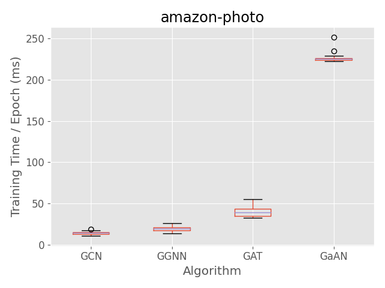

(b) amazon-photo

(c) amazon-computers

(d) coauthor-physics

(e) flickr

(f) com-amazon

**图: 训练耗时的影响 [@fig:exp_absolute_training_time].**

根据[@tbl:gnn_overview]中的复杂度分析, 各GNN的点、边计算复杂度与各算法超参数(例如$d_{dim}$、$K$等)呈线性关系.
为了验证该线性关系, 我们测量了各GNN的训练时间随超参数的变化情况.

GCN和GGNN的计算复杂度受隐向量维度$d_{dim}$影响.
$d_{dim}$同时影响Layer0的输出隐向量维度和Layer1的输入隐向量维度（即$d_{dim}=d^0_{out}=d^1_{in})$.
[@fig:exp_hyperparameter_on_vertex_edge_phase_time_gcn]和[@fig:exp_hyperparameter_on_vertex_edge_phase_time_ggnn]展示了GCN和GGNN训练耗时受$d_{dim}$的影响情况.
随着$d_{dim}$的增加,训练耗时呈线性增长.

GAT采用了多头机制,其计算复杂度受输入隐向量维度$d_{in}$, 每个头的隐向量维度$h_{head}$和头数$K$的影响.
每一层的输出隐向量维度$d_{out}=K d_{head}$.
因为在GAT结构中$d^1_{in}=d^0_{out}$, 调整$d_{head}$和$K$即相当于调整了Layer1的$d^1_{in}$.
[@fig:exp_hyperparameter_on_vertex_edge_phase_time_gat]展示了GAT训练耗时受超参数$d_{head}$和$K$的影响.
GAT训练耗时随$d_{head}$和$K$呈线性增长.

GaAN同样采用多头机制,其计算复杂度受$d_{in}$、$d_v$、$d_a$和头数$K$的影响.
[@fig:exp_hyperparameter_on_vertex_edge_phase_time_gat]展示了GaAN训练耗时受超参数的影响.
实验验证了[@tbl:gnn_overview]中给出的复杂度分析结果,各GNN算法的训练耗时随着超参数的增加呈线性增长.
当隐向量维度$d_{in}$过低时, 涉及隐向量的计算占总计算时间比例很低, 导致其总训练耗时变化不明显.
当隐向量维度足够大时, 总训练时间随$d_{in}$呈线性增长.

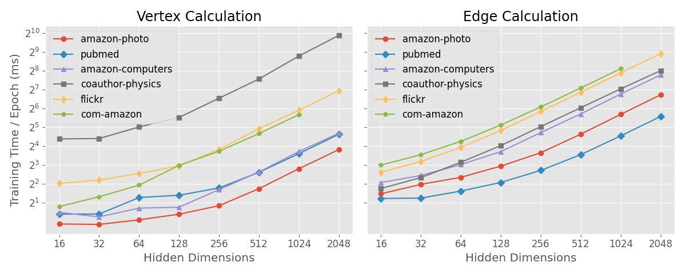

(a) GCN [#fig:exp_hyperparameter_on_vertex_edge_phase_time_gcn]

(b) GGNN [#fig:exp_hyperparameter_on_vertex_edge_phase_time_ggnn]

(c) GAT [#fig:exp_hyperparameter_on_vertex_edge_phase_time_gat]

(d) GaAN [#fig:exp_hyperparameter_on_vertex_edge_phase_time_gaan]

**图: 超参数对GNN中点/边计算耗时的影响** [#fig:exp_hyperparameter_on_vertex_edge_phase_time]

[@fig:exp_hyperparameter_on_memory_usage]同时展示了各GNN对GPU显存的使用情况随算法超参数的变化情况.
随着超参数的增加,GNN的显存使用也线性增长.

(a) GCN

(b) GGNN

(c) GAT

(d) GaAN

**图: 超参数对训练阶段显存使用的影响(不含数据集本身).** [#fig:exp_hyperparameter_on_memory_usage]

实验验证了[@tbl:gnn_overview]中复杂度分析的有效性. *GNN的训练耗时与显存使用均与超参数呈线性关系*. 这允许算法工程师使用更大的超参数来提升GNN的复杂度,而不用担心训练耗时和显存使用呈现爆炸性增长.

## 2. 4.2 实验2: 训练耗时分解

本实验的目标是通过对训练耗时的分解, 发掘GNN训练中的计算性能瓶颈.

**点/边计算耗时比例分析**: 对于点计算和边计算, [@fig:exp_vertex_edge_cal_proportion]展示了各算法不同GNN层点/边计算耗时占总训练耗时的比例情况(含forward, backward和evaluation阶段). GCN算法在大多数数据集上边计算耗时占据主导. 只有`cph`数据集是特例, 因为该数据集输入特征向量维度非常高, 导致Layer0的点计算耗时额外的高. GGNN因为其点计算复杂度高, 使其点计算耗时占比明显高于其他算法, 但在大多数数据集上依然是边计算占据主要的计算耗时. 只有在`pub`和`cam`数据集上,边计算开销和点计算开销接近,因为两个数据集平均度数较低 (仅为4.5和2.8). 对于GAT和GaAN算法, 因为其边计算复杂度高, 其边计算耗时占绝对主导. 综上, *边计算是GNN训练的主要耗时因素*, 尤其是在边计算较为复杂的情况下.

 (a) GCN

 (b) GGNN

 (c) GAT

 (d) GaAN

**图: 点/边计算耗时占比.** [#fig:exp_vertex_edge_cal_proportion]

实验也表明 *数据集的平均度数影响点/边计算的耗时比例*. 我们固定图的顶点数为50k, 利用R-MAT生成器生成平均度数在10到100之间的随机图. 我们测量了各GNN中点/边计算的耗时比例随图平均度数的变化情况, 如[@fig:exp_avg_degree_vertex_edge_cal_time]所示. 边计算的耗时随着平均度数的增加呈线性增长, *边计算耗时在绝大部分情况下主导了整个计算耗时*, 只有在点计算复杂度非常高且平均度数非常低的情况下点计算耗时才能赶超边计算耗时. 因此, *GNN训练优化的重点应该是提升边计算的效率*.

 (a) GCN

 (b) GGNN

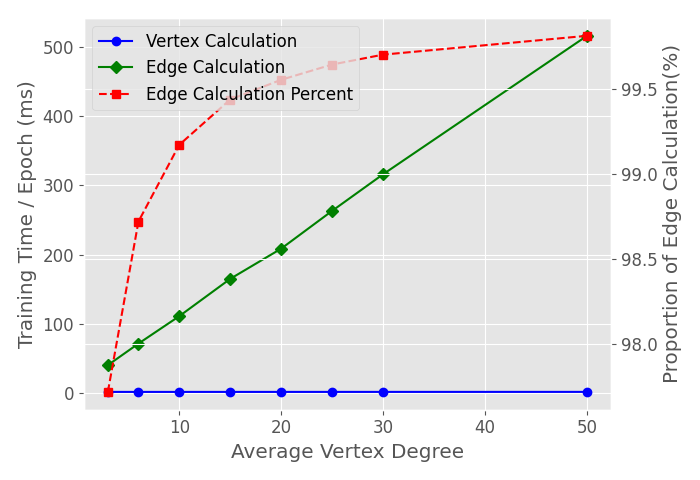 (c) GAT

 (d) GaAN

**图: 平均顶点度数对点/边计算耗时比例的影响.** [#fig:exp_avg_degree_vertex_edge_cal_time]

**边计算耗时分解分析**: 边计算阶段可以进一步分解为collect, message, aggregate和update四个步骤, 如图[@fig:steps_in_edge_calculation]所示. 图中展示的是第$l$层GNN的边计算过程. edge index是一个保存由图的边集的规模为M*2的矩阵, 其中M是图的边数, 该矩阵的两列分别保存每条边的源顶点和目标顶点. edge index在整个计算过程中保持不变. 其中collect步骤用于准备边计算所需要的数据结构. 该步骤将输入GNN层的顶点隐向量$\boldsymbol{h}_i^l (1 \leq i \leq N)$根据edge index拷贝到各边的两层, 构成输入边计算函数$\phi$的输入参数张量(包含$\boldsymbol{h}_i^l$,$\boldsymbol{h}_j^l$和$\boldsymbol{e}_{j, i}^l$). 此步骤没有计算,只涉及数据访问. message步骤调用用户给出的函数$\phi$完成边计算过程, 并得到每条边的消息向量$\boldsymbol{m}_{j, i}^l (\boldsymbol{e}_{j, i}^l \in E(G))$. aggregate步骤根据每条边的目标顶点, 将目标顶点相同的消息向量通过聚合算子$\Sigma$聚合在一起, 得到每个顶点聚合向量$\boldsymbol{a}_i^l (1 \leq i \leq N)$. 最后的update步骤是可选的, 其可以对聚合后的向量进行额外的修正处理(例如在GCN增加bias).经过update处理后的聚合向量$a_i^l$将被输入到点计算函数$\gamma$中作为输入参数.

**图: 边计算的步骤分解.** [#fig:steps_in_edge_calculation]

我们对各GNN算法在不同数据集上的边计算过程进行了执行时间分解, 结果如图[fig:exp_edge_cal_decomposition](#fig:exp_edge_cal_decomposition)所示.各GNN的边计算耗时分解比较稳定, 与数据集关联性不强. collect步骤虽然只进行了数据准备, 但其在所有的GNN中均占据了不少的执行时间. 对于message步骤, 在边计算复杂度高的GNN (GAT和GaAN)中其,占据了绝对主导; 在GCN中虽然其边计算只有简单的数乘操作, 但其耗时依然有20%以上; 在GGNN中, 因为其边计算函数$\boldsymbol{m}_{j,i}^l=\boldsymbol{W}^l\boldsymbol{h}_{j}^l$只与源顶点有关, 所以在PyG的实现中将$\boldsymbol{W}^l\boldsymbol{h}_j^l$的计算移动到边计算开始之前预先进行 (因为这部分计算只与顶点相关, 因此我们将该计算计入点计算阶段), 计算出的结果被缓存下来, 在进行message步骤时直接读取, 因而GGNN的message步骤耗时为0. 对于aggregate步骤, 在边计算复杂度低的GNN (GCN和GGNN)中其占据了至少35%的耗时, 而在边计算复杂度高的GNN (GAT和GaAN), 其耗时与collect步骤接近, 均远低于message步骤. 实验表明*对于边计算复杂度高的算法, 其message步骤是其性能的瓶颈, 应重点优化*; 而**对于边计算复杂度低的算法, 优化collect和aggregate步骤能显著降低训练耗时*.

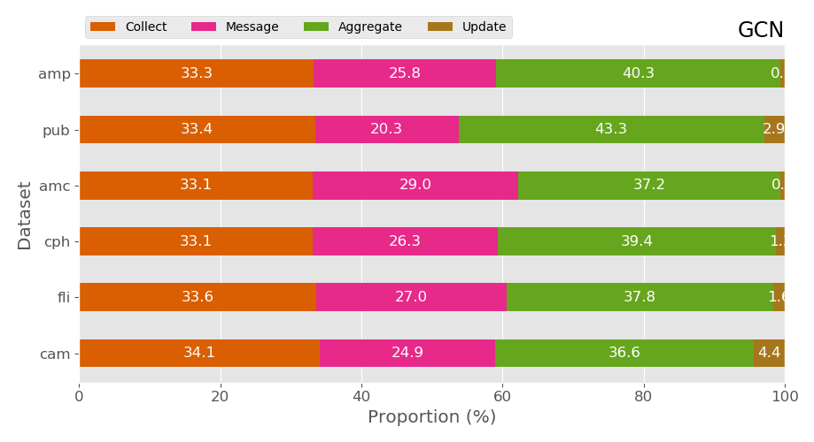 (a) GCN

 (b) GGNN

 (c) GAT

 (d) GaAN

<a name="fig:exp_edge_cal_decomposition"> **图: 边计算耗时分解 (包含Layer0和Layer1).** </a>

**热点算子分析**: 点/边计算的各种函数$\phi, \Sigma,\gamma$由一系列基本算子构成, 基本算子被映射到GPU上的具体基本算子(例如矩阵乘法mm, 按元素数乘elementwise_kernel和张量按index选择index_select). 图[@fig:exp_top_basic_ops](#fig:exp_top_basic_ops)展示了各GNN中耗时比例最高的5个算子, 图例中算子顺序由平均耗时占比确定.

 (a) GCN

 (b) GGNN

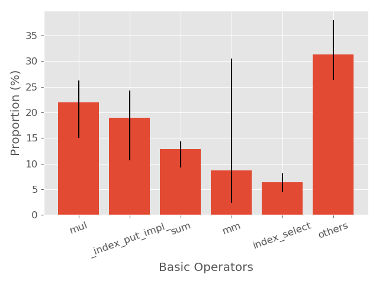 (c) GAT

 (d) GaAN

<a name="fig:exp_top_basic_ops"> **图: 基本算子的耗时比例 (含forward, backward和evaluation阶段)** </a>

各算法的高耗时算子分析如下:

- GCN中矩阵乘法算子mm主要用于点计算中$\gamma$,  该算子在cph数据集上尤其耗时, 因为cph输入的顶点特征向量维度非常高, 使得Layer0的点计算中矩阵乘法的计算量很高. mul是边计算函数$\phi$中的数乘操作. scatter_add和gather均用于实现边计算中的聚合步骤$\Sigma$, 其中前者用于forward阶段后者用于backward阶段. index_select算子用于边计算中的collect步骤. 对于GCN算法来说, 边计算相关算子占据了主要的耗时, 各算子之间耗时比较平均, 没有特别突出的性能瓶颈.
- GGNN中最耗时的也是矩阵乘法mm算子, 主要用于点计算函数$\gamma$. scatter_add, index_select和gather算子用于边计算. 而thnn_fused_gru_cell用于GRU的backward计算中. GGNN因为点计算复杂度的提升, mm算子的耗时时间明显提高.
- GAT中最耗时的4个算子均与边计算相关. mul,_index_put_impl和sum用于实现边计算函数$\phi$. index_select算子用于边计算中的collect阶段. mm算子用于点计算函数$\gamma$.
- GaAN中最耗时的矩阵乘法算子mm同时用于边计算和点计算, 其中边计算占主导. mul和cat用于边计算中的$\phi$函数.

从共性来说, **GNN计算的主要耗时还是在矩阵乘法mm, 按元素数乘mul等算子**, 因此非常适合用GPU进行计算.  边计算中的aggregate步骤虽然计算较为简单, 但因为涉及数据同步和非规整计算(不同顶点的度数差距很大), 其相关算子scatter_add和gather的依然占据了一定的耗时. 边计算中的collect步骤虽然没有任何的计算, 但是其相关算子index_select依然占据了10%左右的耗时. **aggregate步骤和collect步骤是所有GNN训练的计算性能瓶颈之一**, 优化相应的算子将能提升所有GNN的训练效率.

性能瓶颈总结:

- **GNN训练性能瓶颈受数据集的平均度数影响**. 因为绝大部分现实世界中的图的平均度数在10度以上[@network-repository], GNN训练中的性能瓶颈将集中在边计算部分.
- **根据边计算函数$\phi$的计算复杂度不同, GNN的在边计算中的性能瓶颈不同**:
  - 如果$\phi$的计算复杂度较高, 性能瓶颈集中在实现$\phi$所用的基本算子. 优化相应基本算子的实现将能提升这类GNN的训练性能. 以GAT为例, GAT中最耗时的算子_index_put_impl主要用于$\phi$中softmax计算(\alpha^k_{ij})的backward阶段, 该算子只涉及数据移动. 优化的softmax在GPU上的实现能够显著降低GAT的训练耗时.
  - 如果$\phi$的计算复杂度较低, 其边计算中的collect和aggregate步骤是计算性能瓶颈. collect步骤只涉及大量的数据移动. 而aggregate步骤计算较为简单(例如求和/平均/最大值等), 但因为涉及数据同步和不规整计算, 其耗时依然显著. 优化这两个步骤在GPU上的实现将能提升这类GNN的训练性能.

## 3. 4.3 实验3: GPU内存使用分析

目前PyG在利用GPU训练GNN的过程中所有数据(含数据集和中间计算结果)均保存在GPU的内存中. 相比系统的主存, GPU上内存容量非常有限. *GPU内存容量是限制能够训练的数据集规模的决定因素*. GaAN在训练`cph`数据集的过程中,因为内存溢出导致无法完成训练.

图[@fig:exp_memory_usage_stage_amp](#fig:exp_memory_usage_stage_amp)展示了各个GNN在cam数据集上训练时各个阶段的峰值内存使用的情况, 其他的数据集上情况类似. *GNN训练中的内存使用在forward阶段和backward阶段达到峰值*, 因为在forward阶段会生成大量临时计算结果, 并对其中关键的中间计算结果进行缓存, 缓存的中间结果将用于backward阶段的梯度计算. 图[@fig:ggnn_vertex_func_computation_graph](#fig:ggnn_vertex_func_computation_graph)展示了GGNN的点计算函数$\gamma$的计算图, 可见GGNN点计算中会涉及大量的算子并产生大量的中间计算结果, 关键计算结果还会被缓存, 加剧了内存使用. 在loss阶段的峰值内存使用中大部分来自缓存的中间计算结果. 随着backward阶段的结束, 中间计算结果的内存被释放. 在evaluation阶段, 因为不需要缓存用于梯度计算的中间结果, 峰值内存使用大幅下降.

<a name="fig:exp_memory_usage_stage_amp">**图: 各阶段中最大内存使用. Data Load指数据载入后的内存使用. 数据集:amp.其他数据集情况类似.**</a> 

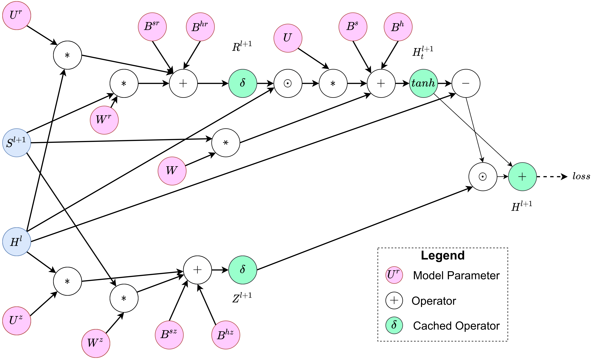

<a name="fig:ggnn_vertex_func_computation_graph">**图: GGNN中点计算函数$\gamma$的计算图.Cached Operator的输出结果将被缓存, 用于backward过程中的梯度计算.**</a>

值得注意的是*GNN训练过程中的峰值内存远超过数据集本身的内存使用*. 我们训练过程中最高峰值内存使用相比于Data Load之后的内存使用的比例定义为内存膨胀比例. 图[@fig:exp_memory_expansion_ratio](#fig:exp_memory_expansion_ratio)中比较了各GNN在不同数据集上的内存膨胀比例. GCN的膨胀比例最低, 在5-14倍之间, 而GaAN的膨胀比例最高, 可达101倍. *非常高的膨胀比例严重限制了GNN的数据扩展性, 使得GPU无法处理大规模图数据集*, 尤其限制了边计算复杂度高的GNN.

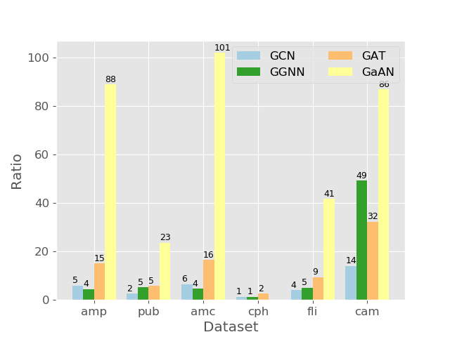

<a name="fig:exp_memory_expansion_ratio" > **图: 各GNN在不同数据集上的内存膨胀比例.** </a>

图[@fig:exp_memory_expansion_ratio](#fig:exp_memory_expansion_ratio)同时表明同一个GNN在同样的超参数下膨胀比例随数据集的不同而变化. 因为cph数据集的输入特征维度远高于GNN层中隐向量的维度, 导致图的输入特征向量矩阵的规模远高于缓存的中间计算结果的矩阵规模, 因此其膨胀比例特别低, 而cam数据集正相反. 为了测量输入特征向量维度对内存膨胀比例的影响, 我们为不同数据集随机生成了特定维度的特征向量, 图[@fig:exp_memory_expension_ratio_input_feature_dimension](#fig:exp_memory_expension_ratio_input_feature_dimension)展示了不同输入特征向量维度下的膨胀比例变化情况. *在同样的GNN结构和超参数设置下, 使用更高维的输入特征向量能够降低内存膨胀比例*. 

<a name="#fig:exp_memory_expansion_ratio"> **图: 内存膨胀比例随输入特征向量维度的变化情况. 数据集:cam, 其他数据集情况类似.** </a>

不同的GNN因其点/边计算复杂度的不同, 生成的中间结果的规模对图的点/边数量的敏感度不同, 导致内存膨胀比例受图的平均度数的影响. 我们测量了GPU峰值内存使用和膨胀比例受图规模的影响.

在固定图中顶点数的情况下, 我们利用R-MAT生成器生成平均度数(边数)不同的随机图, 图[@fig:exp_memory_expansion_ratio_input_graph_number_of_edges](#fig:exp_memory_expansion_ratio_input_graph_number_of_edges)展示了训练中的内存使用随平均度数的变化情况. *随着平均度数的增加, 峰值内存使用呈线性增长,  边计算产生的中间结果逐渐占据主导, 各GNN的内存膨胀比例逐渐稳定*, 膨胀比例受边计算的复杂度影响. 除GGNN之外, 其余GNN的内存膨胀比例均随度数的增加而增加. GGNN因为点计算复杂度高, 当平均度数较低时, 其内存膨胀比例主要受点计算中间结果的影响; 当平均度数增高时, 其内存膨胀比例逐渐受边计算复杂度决定, 因为GGNN具有最低的边计算复杂度, 所以其稳定后的膨胀比例最低. 

我们在固定图中边数的情况下, 利用R-MAT生成器生成顶点数不同的随机图, 图[@fig:exp_memory_expansion_ratio_input_graph_number_of_vertices_fixed_edge](#fig:exp_memory_expansion_ratio_input_graph_number_of_vertices_fixed_edge)中展示了训练中内存使用随顶点数的变化情况. 除GGNN之外, 各个GNN对顶点数量的变化不敏感, 随着顶点数量的大幅增长, 顶点输入特征向量矩阵规模变大, 但峰值内存使用只有轻微的增长, 使得内存膨胀比例出现一定程度的下降. 只有GGNN因为点计算复杂度高, 点计算过程中产生了大量的中间计算结果, 使其内存膨胀因子有小幅增长. 实验数据表明*边计算产生的中间结果是内存使用的主导因素, 各GNN的峰值内存使用均随边数的增长呈线性增加*.

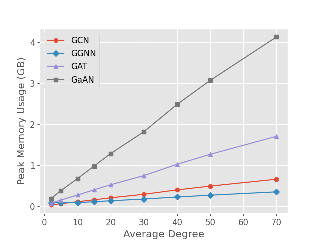 (a)

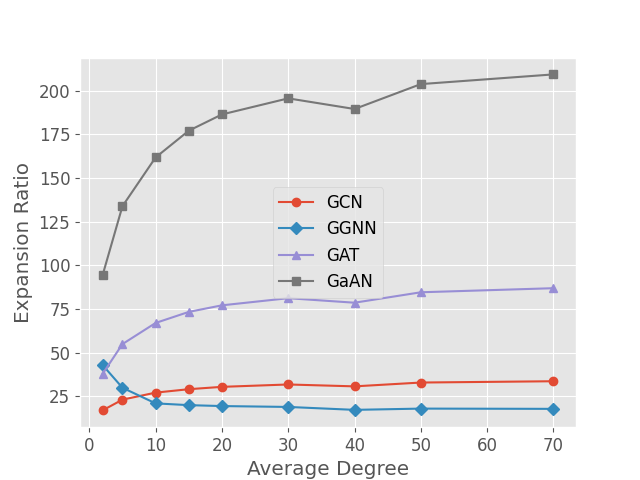 (b)

<a name="fig:exp_memory_expansion_ratio_input_graph_number_of_edges"> **图: 内存使用随图平均度数的变化情况 (R-MAT随机图, 顶点数固定为10k, 输入特征向量维度为32).** </a>

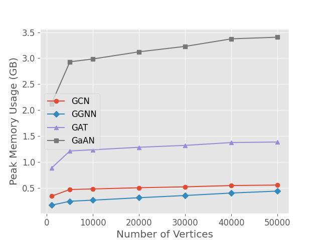 (a)

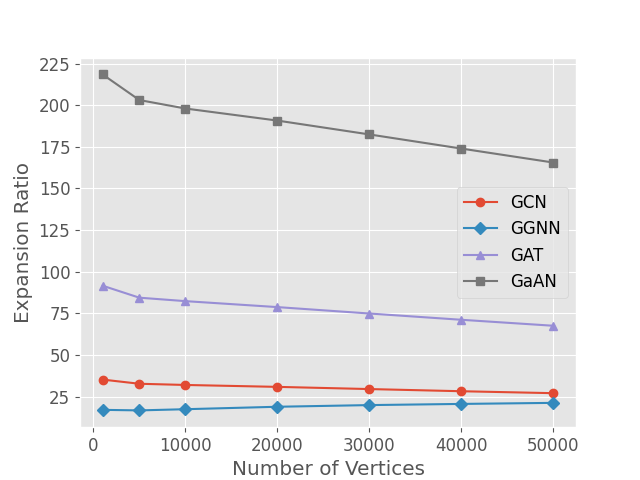 (b)

<a name="fig:exp_memory_expansion_ratio_input_graph_number_of_vertices_fixed_edge"> **图: 内存使用随图顶点数的变化情况 (R-MAT随机图, 边数固定为500k, 输入特征向量维度为32).** </a>

**制约数据扩展性的瓶颈**:

- *GPU内存容量是限制训练的数据集规模扩展性的决定性因素*.
- *GPU内存使用主要来自计算过程中产生的中间计算结果, 尤其是边计算的中间计算结果*. 因为部分中间计算结果会被缓存以参与backward计算, 因此高GPU内存使用贯穿forward和backward阶段.
- *GNN在训练过程中的峰值内存使用可以达到输入数据规模的数十倍甚至数百倍*. GPU有限的内存容量严重限制了能够训练的输入数据规模.
- 在固定顶点数的情况下, *GNN的峰值内存使用随图边数的增长呈线性增加*, *内存膨胀比例会逐渐稳定到由边计算复杂度决定的固定值*.
- 在网络结构和各项超参数固定的情况下, *采用更高维的输入特征向量可以降低GPU内存使用膨胀比例*.

## 4. 4.4 实验4: 采样技术对训练性能的影响分析

在没有采样技术之前, GNN的训练都是full batch的, 即训练集中所有的顶点和边同时参与训练并计算梯度. full batch训练能保证收敛, 但是每次训练开销较大, 导致收敛速度慢. 受随机梯度下降中基于mini batch训练方式的启发, 一系列的GNN采样技术被提出. 采样技术将全图的训练(即epoch)分解为若干batch, 每个batch只使用图的部分顶点和边参与训练并进行梯度更新,  大幅降低了每个batch的训练时间, 使得固定的时间内可以进行多轮梯度下降, 从而加速收敛. 本节实验主要分析采样技术对训练性能的影响.

在目前PyG的实现中,  GNN的模型参数始终驻留在GPU上, 数据集驻留在主存中. 在处理每个epoch时, 由CPU在主存中对图数据集进行采样, 生成若干batch, 每个batch都是数据集的一个小规模子图. 在训练每个batch时, PyG将该batch对应的子图数据拷贝到GPU的内存中, 基于该子图进行训练并根据梯度更新模型参数. 基于采样技术和SGD优化技术之后, 对模型参数的evaluation隔若干epoch进行一次, evaluation可以在CPU进行也可以在GPU进行. 故本节实验中的统计数据均不包含evaluation阶段. 本节选用neighbor sampler和cluster sampler两个典型的图采样技术进行分析.

图[@fig:exp_sampling_minibatch_graph_info]展示了两个采样技术中采样出的子图的规模随batch size的变化情况. 对于neighbor sampler, relative batch size等于最后一层GNN中采样的顶点数相对于全图顶点数的比例. 对于cluster sampler, batch size等于采样的partition的数量相比于全图所有partition的数量. *neighbor sampler对于batch size的增长非常敏感*. 随着batch size的增大, 其采样子图的顶点数/边数和平均度数均快速增长后趋于稳定. *cluster sampler对于batch size的增长较不敏感*, 其顶点数/平均度数均随batch size的增长呈线性增长，边数在batch size相对较小时也呈线性增长. 

值得注意的是*采样出的子图的平均度数远低于全图的平均度数, 尤其是在relative batch size较低的情况下*. 以neighbor sampler在relative batch size为6%时为例, `amp`数据集的平均度数为31.1, 但是采样出的子图的平均度数只有5.8, 远低于全图平均度数; cluster sampler采样出的子图的平均度数更低， 只有3.0. 图[@exp_sampling_minibatch_degrees_distribution]展示了采样出的子图的度数分布与原图的对比. 两个采样技术采样出来的度数分布整体低于原图. 其原因是实际图数据集中的顶点度数分布服从幂率分布, 少量顶点的度数非常高, 从而提升了平均度数. 而在采样的过程中, 因为采样方法会对顶点的邻域规模做限制, 从而降低了顶点度数上限, 使平均度数下降明显. 结合4.2节的实验结果， 采样子图的平均度数下降将使得点计算的耗时占比提升，对于点计算复杂度高的GGNN其点计算将取代边计算成为性能瓶颈。

(a) Neighbor sampler

(b) Cluster sampler

**图[@fig:exp_sampling_minibatch_graph_info]: 采样子图规模随batch size的变化情况. 每个batch size下采样50次, error bar表示标准差. relative batch size是相对于全图的比例.**

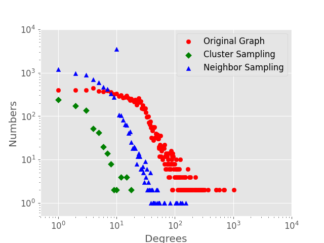

**图[@exp_sampling_minibatch_degrees_distribution]: 采样子图与原始图的顶点度数分布对比. 数据集:amp. Batch size = 512 (neighbor sampler) / 20 (cluster sampler).**

图[@fig:exp_sampling_batch_train_time]中展示了采用采样技术之后在`amc`和`fli`数据集上每个batch的训练耗时情况随batch size的变化情况. 对于neighbor sampler, 只有在batch size非常小, 花在训练阶段的耗时相比全图训练才有明显的降低。在batch size特别小时才体现出训练时间的明显降低. 但因为采样本身存在额外开销, 同时将采样出来的子图传输到GPU上也存在开销， 使得整个batch的训练耗时反而有可能超过全图训练耗时. 对于cluster sampler, 在相同的relative batch size下其采样出的子图比neighbor sampler更小, 从而使采样技术的效果更加明显. 但是当relative batch size增大时，采样技术的额外开销增加非常明显，当relative batch size $\geq$ 25%时, 采样技术每个batch的总耗时甚至远超全图训练耗时。实验表明*现阶段PyG中采样技术的实现非常低效，额外开销较高*。 当batch size稍大时，采样技术的额外开销占整个batch的训练总开销的50%以上。*采样技术只有在非常小的batch上才能降低训练耗时*。

(a) Neighbor sampler on `amc`

(b) Neighbor sampler on `fli`

 

(c) Cluster sampler on `amc`

(d) Cluster sampler on `fli`

**图[@fig:exp_sampling_batch_train_time]: 每个batch的训练耗时随batch size的变化情况. FULL表示全图参与训练阶段(不含evaluation).**

但*采样技术的优势在于能大幅降低峰值内存使用开销，使大规模图神经网络训练成为可能*。图[@fig:exp_sampling_memory_usage](#fig:exp_sampling_memory_usage)展示了采用采样技术后训练过程中峰值内存使用情况随relative batch size的变化情况. 采样采样技术后，峰值内存使用均大幅度降低。Cluster sampler的降低幅度比neighbor sampler更大。

(a) Neighbor sampler, `amc`

(b) Neighbor sampler, `fli`

(c) Neighbor sampler, `amc`

(d) Neighbor sampler, `fli`

**图[@fig:exp_sampling_memory_usage]: 训练内存峰值使用随batch size的变化情况。FULL表示不采用采样技术时的情况（不含evaluation阶段）。**

# 5 系统设计建议

# 6 相关工作

1. Survey
[@comprehensive-survey-wu-2020] 提出了新的GNN的分类，将GNNs分为recurrent GNNs, convolutional GNNs, graph autoencoders and spatial-temproal GNNs四大类，给出了the most comprehensive overview of modern deep learning techniques for graph data. 并且给出了一些开源资源
[@zhou2018_gnn_review] 介绍了original models, its variants和一些general frameworks, present different propagation steps in different models using representation，系统地将applications进行了分类，分为structual scenarios, non-structural scenarios和其他scenarios.
[@zhang2018_gnn_survey]根据model architectures和training strategies将现有模型分为了五大类，然后分析这些方法的组成部分和不同

总说：这三篇论文按照各自的角度对GNN进行了划分，然后对其构成和组成部分进行了详尽地说明，并介绍相关公开的数据集和资源

2. GNN训练系统方面的相关工作
在系统方面， PyG[@PyG], DGL[@DGL], Euler[@website_euler], PGL[@website_pgl], NeuGraph[@ma2019_neugraph], AliGraph[@zhu2019_aligraph]等系统都提供了对图神经网络训练的支持。
PyG[@PyG], DGL[@DGL], PGL[@website_pgl]都是基于message-passing编程模型的面向深度图神经网络的计算框架, 但是它们所支持的后端不同，PyG, PGL支持的后端分别是PyTorch, PaddlePaddle; DGL[@DGL]支持多后端(MXNet, TensorFlow, PyTorch). DGL[@DGL]相对于PyG为用户提供了更多可用的reduce operation, PGL[@website_pgl]则在DGL基础上对reduce functions进行了进一步的优化。
Euler[@website_euler]是基于大规模分布式的图学习框架，支持Tensorflow计算后端. 另外，它还支持大规模图分布式存储，并且对GNN类的算法通过Message Passing建模范式的抽象，将一个GNN类的算法模型定义为子图抽样，图卷积和可选的池化模块。
NeuGraph[@ma2019_neugraph]为图神经网络训练提出了新的编程模型，SAGA-NN(Scater-ApplyEdge-Gather-ApplyVertex with Neural Networks), 使用了2D图划分技术将图划分为多个子图进行训练，并在单机多GPU的环境下从硬件角度进行了高效地实现。
AliGraph[@zhu2019_aligraph]对于大规模图提出了AliGraph系统，由storage layer, sampling layer和operator三部分组成，storage layer利用namely structual and attributed specific storage, graph partition和caching neighbors of some import vertics实现了high-level操作和算法对数据的快速获取，sampling layer将采样技术划分为了三种采样方法, Traverse, Neigborhood, Negative, 分别复杂点采样，邻居采样和采样; operator layer则提供了多种关于Aggregate(边计算), Combine(点计算)的扩展。

3. GNN评测方面的工作
[@shchur2018_pitfall_of_gnn] 研究了train/val/test的划分比例对不同算法在不同数据集上的表现，表示仅考虑单个train/val/test划分比结果是很脆弱的，更简单的模型更能支持复杂的参数选择。
[@dwivedi2020_benchmark_of_gnn](Benchmarking Graph Neural Networks) 探讨了不同GNN算法在不同场景的图数据集下的性能表现, 给出了不同场景下设计effective GNNs的key operators。
[@yan2020_analysis_gcns_gpu]通过GNN算法与Graph Processing任务(选择PageRank)和MLP-based Neural Network任务(MLP-MNIST)在GPU下的特性进行了分析，发现实际图中的顶点度数分布符合幂律分布的特性，因此缓存高度数的顶点，有可能可以提升硬件Cache的命中率。因为aggregation阶段需要并发地、原子地更新顶点的输出特征向量，因此向量化原子访问有可能可以提升aggregation阶段的效率。
[@zhang2020_analysis_neugraph]在DGL上基于SAGA-NN编程模型对GNN的GPU训练在inference阶段的性能热点进行了探讨，通过对SAGA-NN编程模型各阶段的分析，作者发现GNN没有固定的性能瓶颈，认为各部分都有优化的价值

# 7 总结与展望

# 参考文献

1. ZHOU J, CUI G, ZHANG Z, 等. Graph Neural Networks: A Review of Methods and Applications[J]. 2018.[@zhou2018_gnn_review]
2. YANG Z, COHEN W W, SALAKHUTDINOV R. Revisiting Semi-Supervised Learning with Graph Embeddings[C]//BALCAN M, WEINBERGER K Q. Proceedings of the 33nd International Conference on Machine Learning, ICML 2016, New York City, NY, USA, June 19-24, 2016. JMLR.org, 2016, 48: 40–48. [@yang2016_revisiting_semisupervised]
3. SHCHUR O, MUMME M, BOJCHEVSKI A, 等. Pitfalls of Graph Neural Network Evaluation[J]. CoRR, 2018, abs/1811.05868. [@shchur2018_pitfall_of_gnn]
4. ZENG H, ZHOU H, SRIVASTAVA A, 等. GraphSAINT: Graph Sampling Based Inductive Learning Method[C]//8th International Conference on Learning Representations, ICLR 2020, Addis Ababa, Ethiopia, April 26-30, 2020. OpenReview.net, 2020. [@zeng2020_graphsaint]
5. YANG J, LESKOVEC J. Defining and Evaluating Network Communities Based on Ground-Truth[C]//ZAKI M J, SIEBES A, YU J X, 等. 12th IEEE International Conference on Data Mining, ICDM 2012, Brussels, Belgium, December 10-13, 2012. IEEE Computer Society, 2012: 745–754. [@yang2012_defining]
6. CHAKRABARTI D, ZHAN Y, FALOUTSOS C. R-MAT: A Recursive Model for Graph Mining[C]//Proceedings of the 2004 SIAM International Conference on Data Mining.: 442–446. [@rmat-generator]
7. Fey, M., & Lenssen, J. E. (2019). Fast Graph Representation Learning with PyTorch Geometric. (1), 1–9. [@PyG]
8. WANG M, YU L, ZHENG D, 等. Deep Graph Library: Towards Efficient and Scalable Deep Learning on Graphs[J/OL]. arXiv:1909.01315 [cs, stat], 2019[2020–06–20]. http://arxiv.org/abs/1909.01315.[@DGL]
9. Gilmer, J., Schoenholz, S. S., Riley, P. F., Vinyals, O., & Dahl, G. E. (n.d.). Neural Message Passing for Quantum Chemistry. [@gilmer_messgae_passing]
10. Rossi R A , Ahmed N K . The Network Data Repository with Interactive Graph Analytics and Visualization[C]// Proceedings of the Twenty-Ninth AAAI Conference on Artificial Intelligence. AAAI Press, 2015. http://networkrepository.com/networks.php [@network-repository]
11. Zhang, J., Shi, X., Xie, J., Ma, H., King, I., & Yeung, D. Y. (2018). GaAN: Gated attention networks for learning on large and spatiotemporal graphs. 34th Conference on Uncertainty in Artificial Intelligence 2018, UAI 2018, 1, 339–349. [@zhang2018_gaan]
12. Kipf, T. N., & Welling, M. (2017). Semi-Supervised Classification with Graph Convolutional Networks. ICLR. Retrieved from https://openreview.net/group?id=ICLR.cc/2017/conference [@kipf2017_gcn]
13. Li, Y., Tarlow, D., Brockschmidt, M., & Zemel, R. (2015). Gated Graph Sequence Neural Networks. ICLR, (1), 1–20. Retrieved from http://arxiv.org/abs/1511.05493 [@li2015_ggnn]
14. Huang, J., Shen, H., Hou, L., & Cheng, X. (2018). Graph Attention Networks. DBLP, 11731 LNCS(2005), 566–577. https://doi.org/10.1007/978-3-030-30493-5_53 [@huang2018_gat]
15. Wu, Z., Pan, S., Chen, F., Long, G., Zhang, C., & Yu, P. S. (2020). A Comprehensive Survey on Graph Neural Networks. IEEE Transactions on Neural Networks and Learning Systems, 1–21. https://doi.org/10.1109/tnnls.2020.2978386 [@comprehensive-survey-wu-2020]
17. Zhang, Z., Cui, P., & Zhu, W. (2018). Deep Learning on Graphs: A Survey. 14(8), 1–24. Retrieved from http://arxiv.org/abs/1812.04202 [@zhang2018_gnn_survey]
18. M. Defferrard, X. Bresson, and P. Van der Gheynst, “Convolutional neural networks on graphs with fast localized spectral filtering,” in Proc. NIPS, 2016, pp. 3844–3852 [@defferrad2016_chebnet]
19. R. Li, S. Wang, F. Zhu, and J. Huang, “Adaptive graph convolutional neural networks,” in Proc. AAAI, 2018, pp. 3546–3553 [@li2018_agcn]
20. Hamilton, W. L., Ying, R., & Leskovec, J. (2017). Inductive Representation Learning on Large Graphs. NIPS, 2017-Decem(Nips), 1025–1035. Retrieved from http://arxiv.org/abs/1706.02216 [@hamilton2017_graphsage]
21. D. K. Duvenaud, D. Maclaurin, J. Aguileraiparraguirre, R. Gomezbombarelli, T. D. Hirzel, A. Aspuruguzik, and R. P. Adams, “Convolutional networks on graphs for learning molecular fingerprints,” NIPS 2015, pp. 2224–2232, 2015 [@duvenaud2015_neural_fps]
22. Y. Zhang, Q. Liu, and L. Song, “Sentence-state lstm for text representation,” ACL 2018, vol. 1, pp. 317–327, 2018.[@zhang2018_tree_lstm]
23. Chiang, W. L., Li, Y., Liu, X., Bengio, S., Si, S., & Hsieh, C. J. (2019). Cluster-GCN: An efficient algorithm for training deep and large graph convolutional networks. SIGKDD, 257–266. https://doi.org/10.1145/3292500.3330925 [@chiang2019_cluster_gcn]
24. Joan Bruna, Wojciech Zaremba, Arthur Szlam, and Yann LeCun. Spectral networks and locally connected networks on graphs. CoRR, abs/1312.6203, 2013. URL http://arxiv.org/abs/ 1312.6203.[@bruna2013_spectral_gnn]
25. Jie Chen, Tengfei Ma, and Cao Xiao. Fastgcn: Fast learning with graph convolutional networks via importance sampling. In International Conference on Learning Representations (ICLR), 2018b.[@chen2018_fastgcn]
26. Rex Ying, Ruining He, Kaifeng Chen, Pong Eksombatchai, William L. Hamilton, and Jure Leskovec. Graph convolutional neural networks for web-scale recommender systems. In Proceedings ofthe 24th ACM SIGKDD International Conference on Knowledge Discovery & Data Mining, KDD ’18, 2018a. ISBN 978-1-4503-5552-0.[@ying2018_pinsage]
27. Jianfei Chen, Jun Zhu, and Le Song. Stochastic training of graph convolutional networks with variance reduction. In ICML, pp. 941–949, 2018a.[@chen2018_sgcn]
28. Hongyang Gao, Zhengyang Wang, and Shuiwang Ji. Large-scale learnable graph convolutional networks. In Proceedings of the 24th ACM SIGKDD International Conference on Knowledge Discovery & Data Mining, KDD ’18, pp. 1416–1424, New York, NY, USA, 2018. ACM. ISBN 978-1-4503-5552-0.[@gao2018_lsgcn]
29. Zou, D., Hu, Z., Wang, Y., Jiang, S., Sun, Y., & Gu, Q. (2019). Layer-Dependent Importance Sampling for Training Deep and Large Graph Convolutional Networks. (NeurIPS).[@zou2019_ldis]
30. W. Huang, T. Zhang, Y. Rong, and J. Huang, “Adaptive sampling towards fast graph representation learning,” in Advances in Neural Information Processing Systems, 2018.[@huang2018_adap]
31. Hanqing Zeng, Hongkuan Zhou, Ajitesh Srivastava, Rajgopal Kannan, and Viktor K. Prasanna. Accurate, efficient and scalable graph embedding. CoRR, abs/1810.11899, 2018. URL http: //arxiv.org/abs/1810.11899. [@zeng2018_aesg]
32. Yan, M., Chen, Z., Deng, L., Ye, X., Zhang, Z., Fan, D., & Xie, Y. (2020). Characterizing and Understanding GCNs on GPU. IEEE Computer Architecture Letters, 19(1), 22–25. https://doi.org/10.1109/LCA.2020.2970395 [@yan2020_analysis_gcns_gpu]
33. Zhang, Z., Leng, J., Ma, L., Miao, Y., Li, C., & Guo, M. (2020). Architectural Implications of Graph Neural Networks. IEEE Computer Architecture Letters, 19(1), 59–62. https://doi.org/10.1109/LCA.2020.2988991 [@zhang2020_analysis_neugraph]
34. https://github.com/PaddlePaddle/PGL [@website_pgl]
35. https://github.com/alibaba/euler [@website_euler]
36. NeuGraph: Parallel Deep Neural Network Computation on Large Graphs[C/OL]//2019 USENIX Annual Technical Conference (USENIX ATC 19). Renton, WA: USENIX Association, 2019: [@ma2019_neugraph]
37. AliGraph: A Comprehensive Graph Neural Network Platform[J]. Proceedings of the VLDB Endowment, 2019, 12(12): 2094–2105. DOI:10.14778/3352063.3352127.[@zhu2019_aligraph]