# 1 绪论

近年来，图神经网络是人工智能领域内的研究热点，在多种任务多个领域下取得了卓越的成果. 这些成功与graph structure相比于grid data structure有更强大的表现能力，以及深度学习端到端强大的学习能力息息相关。随着图神经网络在多个领域取得好的结果，在系统领域也陆续提出了一系列并行或分布式的图神经网络计算系统。这些系统从大量图神经网络中抽象出图神经网络计算模型，并针对计算模型设计了高效的实现。并在实现中使用了大量的性能优化技巧。
1. message-passing通用模型
PyG[@fey_2019_pyg], DGL[@dgl_website]基于message-passing机制[@gilmer_messgae_passing]的计算系统，$\boldsymbol{h}_i^{l+1}  = \gamma (\boldsymbol{h}_i^{ll}, \Sigma_{j \in \mathcal{N}(i)} \phi(\boldsymbol{h}_i^l, \boldsymbol{h}_j^l, \boldsymbol{e}_{j, i}^l))$, 将图卷积操作定义边计算操作message function、聚合操作reduction fucnction和点计算操作update function. 该论文对应的代码实现即pytorch-geometric, 基于PyTorch后端的图神经网络的计算框架。DGL也是基于message-passing的编程模型

2. SAGA-NN通用模型
NeuGraph[4]为图神经网络训练提出了SAGA-NN（Scatter-ApplyEdge-Gather-ApplyVertex with Neural Networks）编程模型。SAGA-NN模型将图神经网络中每一层的前向计算划分为4个阶段：Scatter、ApplyEdge、Gather和ApplyVertex。其中ApplyEdge和ApplyVertex阶段执行用户提供的基于神经网络的边特征向量和点特征向量的计算。Scatter和Gather是由NeuGraph系统隐式触发的阶段，这两个阶段为ApplyEdge和ApplyVertex阶段准备数据。在编程时，用户只需利用给定的算子实现ApplyEdge和ApplyVertex函数，并指定Gather方式，即可利用NeuGraph自动地完成GNN的训练。

3. Sample + Aggregate + Combine通用模型
在AliGraph[5]所支持的通用GNN框架中，每一层的GNN被拆解为三个基本算子: Sample, Aggregate和Combine。其中Sample对应于采样，Aggregate进行边计算，Combine对应于点计算。因为AliGraph面对的是实际大规模图数据，所以AliGraph重点放在了图存储，图采样，图计算三个部分。在图存储上，采用了vertex-cut的方式，即不同的边分配到不同的机器上。在图采样上，支持三种采样方式，Traverse: 从一个图分区中采样一批顶点。Neighborhood, 采样某个顶点的1跳或多跳邻域。Negative,生成负采样样本，加速收敛。特别地，Sampler中的权重也允许根据梯度更新。

在这些图神经网络计算系统实现中，各自用了不同的性能优化技巧，然而这些性能优化技巧是否真正解决了GNN训练过程中的性能瓶颈研究还存有疑问。目前来说，对于图神经网络训练的具体性能瓶颈的分析工作很少，最近的工作[6]Architectural Implications of GNNs, 基于SAGA-NN编程模型和DGL计算系统进行实验，作者认为GNN没有固定的性能瓶颈，性能瓶颈会随着数据集和算法的不同而变化，但是该工作中选择的图的阶数都是很低的情况，而且没有对图的规模和GNN的点边的复杂度进行探讨。工作[7]分析了GCN类的算法在inference阶段的特性，同时与经典的图分析算法(PageRank)和基于MLP的经典神经网络的特性进行了对比分析，发现实际图中的顶点度数分布符合幂等律分布的特性，因此缓存高度数的顶点，有可能可以提升硬件的cache的命中率，因为向量化原子访问可以提升aggregation阶段的效率，但是该工作只选取了某个特定的GNN算法，不能很好地表示大部分的GNN的训练分析。

由于图神经网络每层最本质的操作实际上可以概括为aggregate和update两个操作，aggregate操作即收集邻居顶点的信息, 时间和计算开销与图的边数直接相关；update操作进行顶点信息的变换. 时间和计算开销与图的顶点数直接相关。本文在不考虑复合GNN模型的情况下，将3篇综述中的大多数GNN模型进行了点计算和边计算计算量的统计。从点边高低四个象限中选择了四个典型算法，GCN, GGNN, GAT, GaAN进行讨论，作为此次选取的典型GNN算法。此外，本文从Performance执行时间分解，Resource Usage GPU显存使用，Scalability三个方面设计指标，
1. Performance执行时间分解： 对于一个深度学习算法来说，执行所花费的总时间主要是由两部分构成的：time per epoch 和 convergence speed(loss reduction) per epoch. 第二部分是由算法本身决定的，不属于本文的讨论范围。所以这里主要是对time per epoch该部分进行了分析。首先，实验验证了每个epochs训练用时是稳定的；其次，由于目前不支持多GPU背景下训练a big graph, 所以此时我们分析了单GPU下Transductive learning下深度学习训练的分析，将time per epoch划分为了forward, backward, evaluation三个阶段的分析；然后，对GNN模型的每层耗时进行了分解；
2. Resource Usage: 这里考虑使用GPU加速情况下的表现，对应指标为GPU显存占比
3. Scalability: 从三个方面，算法的超参数影响，数据扩展性（特征的维度、稀疏性，图的顶点数和阶数），采样技术三个方面进行了探讨。

本次实验使用message-passing机制

# 2 图神经网络

## 2.1 图神经网络的通用结构

1. graph neural network的通用网络结构

Definition(Graph): A graph is representeed as $\mathcal{G}=(\mathcal{V}, \mathcal{E})$, where V is the set of vertices or nodes (we will use nodes throughtout this article), and $E$ is the set of edges. Let $n = |\mathcal{V}|$ and $m = \mathcal{E}$. Let $v_i \in \mathcal{V}$ to denote a node and $\boldsymbol{e}_{i, j} = (v_i, v_j) \in \mathcal{E}$ to denote an edge pointing from $v_j$ to $v_i$. The neighborhood of a node $v$ is defined as $\mathcal{N}(v) = \{u \in \mathcal{V} | (v, u) \in \mathcal{E}\}$. The adjacency matrix $\boldsymbol{A}$ is a $n \times n$ matrix with $A_{ij}=1$ if $e_{j, i} \in \mathcal{E}$ and $A_{ij}=0$ if $e_{j, i} \notin \mathcal{E}$.A graph may have node features $\boldsymbol{X}$, where $\boldsymbol{X} \in \boldsymbol{R}^{n \times f}$, $f$ is the number of feature dims. 

Definition(Directed Graph): A directed graph is a graph with all edges directed from one node to another. A undirected graph is considerd as a special case of directed graphs where there is a pair of edges with inverse directions if two nodes are connected. A graph is undirected if and only if the adjacency matrix is symmetric.

Graph Neural Networks: 一个图神经网络模型通常包括三部分：input layer, 若干GNN layer和output layer. [#fig:GNN_common_architecture] 
The input layer， 节点的表示初始化为node features $X$, 因为是input layer可以看作是GNN的第0层，所以这里$\boldsymbol{A}$等同于$\boldsymbol{H}^0$, $\boldsymbol{h}_i^0$ is representing the feature vector of a node $v_i$.
The output layer can focus on different graph analytics tasks with one of the following mechanisms: Node Level, Outputs relate to node regression and node classification tasks; Edge Level, Outputs relate to the edge classification and link prediction tasks; Graph Leval: Outputs relate to the graph classifications.
Input Layer和GNN Layer, GNN Layer之间，以及GNN Layer和Output Layer之间的连接方式是由graph stucture$\boldsymbol{A}$决定的。GNN Layer $l$中的每个节点的变化操作可以是一个GNN Unit单元。[#fig:GNN_Unit]
GNN Unit: let $\boldsymbol{h}_i^{l+1}$ denote the feature vector at layer $l$ associated with node $v_i$, generalizing the convolutional operator to irregulatr domins is typically expressed as a **message passing** scheme[@gilmer_messgae_passing]
$$\boldsymbol{h}_i^{l+1}  = \gamma (\boldsymbol{h}_i^l, \Sigma_{j \in \mathcal{N}(i)} \phi(\boldsymbol{h}_i^l, \boldsymbol{h}_j^l, \boldsymbol{e}_{j, i}^l))$$

where $\Sigma$ denotes a differntiable, permutation invariant function, e.g., sum, mean or max, and $\gamma$ and $\phi$ denote differentiable functions such as MLPs.

显然地，这里我们可以把GNN Unit划分为三个基础组件:
1. 边操作函数$\gamma$, 这里的计算量与图中的边紧密相关, $\boldsymbol{m}_{j, i}^l = \phi(\boldsymbol{h}_i^l, \boldsymbol{h}_j^l, \boldsymbol{e}_{j, i}^l)$
2. 聚合函数$\Sigma$, 这里的计算量与图中的边紧密相关，$\boldsymbol{s}_i =  \Sigma_{j^l \in \mathcal{N}(i)} \boldsymbol{m}_{j, i}^l $
3. 点操作函数$\gamma$, 这里的计算量与图中的点紧密相关, $\boldsymbol{h}_i^{l+1}  = \gamma(\boldsymbol{s}_i)$

> 在后面的实验中，将1和2视为了边计算，3视为了点计算

{#fig:GNN_common_architecture width=60%}

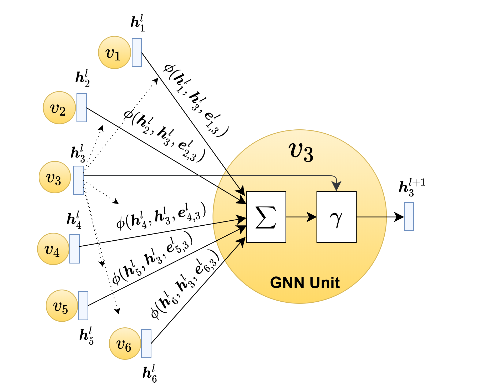{#fig:GNN_Unit width=60%}

## 2.2 图神经网络的分类

[@tbl:gnn_overview]中列出了我们调研到的典型的图神经网络算法.表中列出了各个GNN中点/边计算的表达式,表达式中的大写粗体字母表示GNN模型参数.表中的网络类型来源于文献[@zhou2018_gnn_review].因为本文主要关注GNN算法的计算特性,我们分析了各GNN算法的点、边计算的计算复杂度,并根据计算复杂度将GNN算法划分到四个象限中,如[@fig:GNN_complexity_quadrant]所示.

其中, $d_{in}, d_{out}, k, d_a, d_v, d_m$为超参数

**表: 图神经网络概览** [tbl:gnn_overview]

|          名称          |            网络类型             | 边计算 $\Sigma$  | 边计算 $\phi$                                                |          边计算复杂度           | 点计算 $\gamma$                                              |                     点计算复杂度                     |
| :--------------------: | :-----------------------------: | :--------------- | :----------------------------------------------------------- | :-----------------------------: | :----------------------------------------------------------- | :--------------------------------------------------: |
|  ChebNet (ICLR, 2016)  |        Spectral Methods         | sum              | $\boldsymbol{m}_{j, i, , k}^l = T_k(\widetilde{L} )_{ij} \boldsymbol{h}_j^l$ |         $O(K * d_{in})$         | $\boldsymbol{h}_i^{l+1} = \sum_{k=0}^K \boldsymbol{W}^k \cdot \boldsymbol{s}_{i, k}^{l} $ |                $O(d_{in} * d_{out})$                 |
|  **GCN** (ICLR, 2017)  |        Spectral Methods         | sum              | $\boldsymbol{m}_{j, i}^l = e_{j, i} \boldsymbol{h}_j^l$      |           $O(d_{in})$           | $\boldsymbol{h}_i^{l+1} = \boldsymbol{W} \cdot \boldsymbol{s}_i^{l}$ |                $O(d_{in} * d_{out})$                 |
|   AGCN (AAAI, 2018)    |        Spectral Methods         | sum              | $\boldsymbol{m}_{j, i}^l = \tilde{e}_{j, i}^l \boldsymbol{h}_j^l$ |           $O(d_{in})$           | $\boldsymbol{h}_i^{l+1} = \boldsymbol{W} \cdot \boldsymbol{s}_i^{l}$ |                $O(d_{in} * d_{out})$                 |
| GraphSAGE(NIPS, 2017)  |          Non-spectral           | sum, mean, max   | $\boldsymbol{m}_{j, i}^l =  \boldsymbol{h}_j^l$              |             $O(1)$              | $\boldsymbol{h}_i^{l+1} =   \delta(\boldsymbol{W} \cdot [\boldsymbol{s}_i^{l} \parallel \boldsymbol{h}_i^l])$ |                $O(d_{in} * d_{out})$                 |
| Neural FPs(NIPS, 2015) |      Non-spectral Methods       | sum              | $\boldsymbol{m}_{j, i}^l = \boldsymbol{h}_j^l$               |           $O(d_{in})$           | $\boldsymbol{h}_i^{l+1} = \delta(\boldsymbol{W}^{\boldsymbol{N}_i} \cdot \boldsymbol{s}_i^{l})$ |                $O(d_{in} * d_{out})$                 |
|    SSE(ICML, 2018)     | Recurrent Graph Neural Networks | sum              | $\boldsymbol{m}_{j, i}^l = [\boldsymbol{h}_i^{l} \parallel \boldsymbol{h}_j^l]$ |             $O(1)$              | $\boldsymbol{h}_i^{l+1} = (1 - \alpha) \cdot \boldsymbol{h}_i^l +\alpha   \cdot \delta(\boldsymbol{W}_1 \delta(\boldsymbol{W}_2), \boldsymbol{s}_i^l)$ |                $O(d_{in} * d_{out})$                 |
|  **GGNN**(ICLR, 2015)  |   Gated Graph Neural Networks   | sum              | $\boldsymbol{m}_{j, i}^l = \boldsymbol{W} \boldsymbol{h}_j^l$ |      $O(d_{in} * d_{out})$      | $\boldsymbol{z}_i^l = \delta ( \boldsymbol{W}^z \boldsymbol{s}_i^l + \boldsymbol{b}^{sz} + \boldsymbol{U}^z \boldsymbol{h}_i^{l} + \boldsymbol{b}^{hz}) \\ \boldsymbol{r}_i^l = \delta ( \boldsymbol{W}^r \boldsymbol{s}_i^l+ \boldsymbol{b}^{sr} +\boldsymbol{U}^r \boldsymbol{h}_i^{l} + \boldsymbol{b}^{hr}) \\ \boldsymbol{h}_i^{l+1} = tanh ( \boldsymbol{W} \boldsymbol{s}_i^l + \boldsymbol{b}^s + \boldsymbol{U} ( \boldsymbol{r}_i^l \odot \boldsymbol{h}_i^{l} + \boldsymbol{b}^h))) \\ \boldsymbol{h}_i^{l+1} = (1 - \boldsymbol{z}_i^l) \odot \boldsymbol{h}_i^l +  \boldsymbol{z}_i^l \odot \boldsymbol{h}_i^{l+1}$ |         $O(max(d_{in}, d_{out}) * d_{out})$          |
|  Tree-LSTM(ACL, 2015)  |           Graph LSTM            | sum              | $\boldsymbol{m}_{j, i}^l = \boldsymbol{h}_j^l$               |             $O(1)$              | $h_i^{l+1} = LSTM(\boldsymbol{s}_i^l, \boldsymbol{h}_i^{l})$ |                $O(d_{in} * d_{out})$                 |
|  **GAT**(ICLR, 2017)   |    Graph Attention Networks     | sum, mean        | $\alpha_{ij}^k = \frac {\exp(LeakyReLU(a^T [ \boldsymbol{W}^k \cdot \boldsymbol{h}_i^l \parallel \boldsymbol{W}^k \cdot \boldsymbol{h}_j^l] ))} {\sum_{k \in \mathcal{N}(i)}\exp(LeakyReLU(a^T [ \boldsymbol{W}^k \cdot \boldsymbol{h}_i^l \parallel \boldsymbol{W}^k \cdot \boldsymbol{h}_k^l] ))} \\  \boldsymbol{m}_{j, i}^l = \parallel_{k=1}^K \delta(\alpha_{ij}^k \boldsymbol{W}^k \boldsymbol{h}_j^{l})$ |    $O(K * d_{in} * d_{out})$    | $\boldsymbol{h}_i^{l+1} = \boldsymbol{s}_i^l$                |                        $O(1)$                        |
|  **GaAN**(UAI, 2018)   |    Graph Attention Networks     | sum + max + mean | $\alpha_{ij}^k = \frac {\exp(\boldsymbol{W}^a \cdot [ \boldsymbol{W}^a \cdot \boldsymbol{h}_i^l \parallel \boldsymbol{W}^a \cdot \boldsymbol{h}_j^l] )} {\sum_{k \in \mathcal{N}(i)}\exp(a^T [ \boldsymbol{W}^k \cdot \boldsymbol{h}_i^l \parallel \boldsymbol{W}^k \cdot \boldsymbol{h}_k^l] )} \\  \boldsymbol{m}_{j, i, 1}^l = \parallel_{k=1}^K \delta(\alpha_{ij}^k \boldsymbol{W}^k_v \boldsymbol{h}_j^{l}) \\ \boldsymbol{m}_{j, i, 2}^l = \boldsymbol{W}_m \cdot \boldsymbol{h}_j^{l} \\ \boldsymbol{m}_{j, i, 3}^l = \boldsymbol{h}_j^l$ | $O(max(d_a, d_m) * K * d_{in})$ | $\boldsymbol{g}_i = \boldsymbol{W}_g \cdot [\boldsymbol{h}_i^{l} \parallel \boldsymbol{s}_{i, 2}^l \parallel \boldsymbol{s}_{i, 3}^l]  \\ \boldsymbol{h}_i^{l+1} = \boldsymbol{W}_o [\boldsymbol{h}_i^l \parallel (\boldsymbol{g}_{i} \odot \boldsymbol{s}_{i, 3}^l) ]$ | $O(max(d_{in} + K * d_v, 2 * d_{in} + d_m) d_{out})$ |

**图: GNN的计算复杂度象限图** [@fig:GNN_complexity_quadrant]

## 2.3 典型图神经网络

1. GCN

2. GGNN

3. GAT

4. GaAN

## 2.4 采样技术

根据对采样技术的调研，我们

## 2.5 图神经网络训练中的梯度更新

# 3 实验设计

## 3.1 实验环境

## 3.2 实验数据集

**表: 实验数据集概览** {#tbl:dataset_overview}

|                       数据集                        |  点数   |  边数   | 平均度数 | 输入特征向量维度 | 特征稀疏度 | 类别数 | 图类型 |
| :-------------------------------------------------: | :-----: | :-----: | :------: | :--------------: | :--------: | :----: | :----: |
| pubmed (pub) [@yang2016_revisiting_semisupervised]  | 19,717  | 44,324  |   4.5    |       500        |    0.90    |   3    | 有向图 |
|   amazon-photo (amp) [@shchur2018_pitfall_of_gnn]   |  7,650  | 119,081 |   31.1   |       745        |    0.65    |   8    | 有向图 |
| amazon-computers (amc) [@shchur2018_pitfall_of_gnn] | 13,752  | 245,861 |   35.8   |       767        |    0.65    |   10   | 有向图 |
| coauthor-physics (cph) [@shchur2018_pitfall_of_gnn] | 34,493  | 247,962 |   14.4   |       8415       |   0.996    |   5    | 有向图 |
|         flickr (fli) [@zeng2020_graphsaint]         | 89,250  | 899,756 |   10.1   |       500        |    0.54    |   7    | 无向图 |
|        com-amazon (cam) [@yang2012_defining]        | 334,863 | 925,872 |   2.8    |        32        |    0.0     |   10   | 无向图 |

实验中为了测量图的关键拓扑特征(例如平均度数)对性能的影响情况, 我们也利用R-MAT生成器[@rmat-generator]生成随机图.
如果不额外说明, 随机图顶点的特征向量为随机生成的32维稠密向量, 将顶点随机分到10个类别中, 75%的顶点参与训练.

## 3.3 图神经网络算法选择与实现

## 3.4 数据处理方法

## 3.5 实验方案概览

- 实验 1：第2.2节中的计算复杂度分析是否与实际表现相符合？

# 4 实验结果与分析

## 4.1 实验1：超参数对训练耗时的影响分析

本实验的目标是通过观察GNN的超参数(例如$d_{in}$、$d_{out}$、$K$等)对训练耗时、显存使用的影响, 验证[@tbl:gnn_overview]中复杂度分析的准确性.

[@fig:exp_absolute_training_time]中比较了各GNN每个epoch的训练耗时,其排名为GaAN >> GAT > GGNN > GCN. 其耗时排名与复杂度分析相符. 因为图中边的数量一般远超点的数量, 因此边计算复杂度更高的GAT算法比点计算复杂度高的算法GGNN更耗时. [@fig:exp_absolute_training_time] 同时表明个别epoch的训练耗时异常地高, 其主要是由profiling overhead和python解释器的GC停顿造成.该现象证实了去处异常epoch的必要性.

(a) pubmed

(b) amazon-photo

(c) amazon-computers

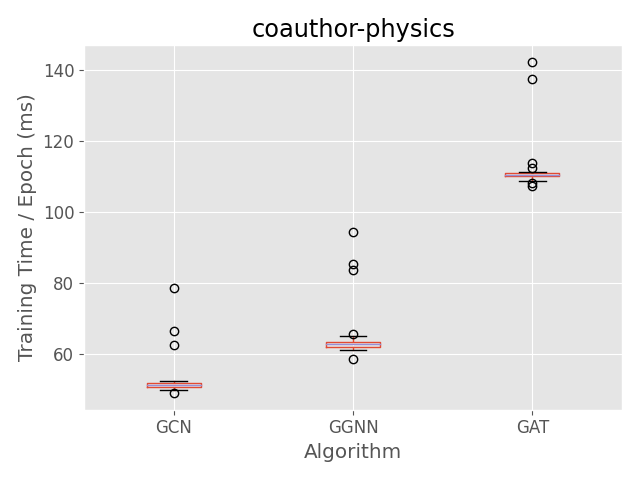

(d) coauthor-physics

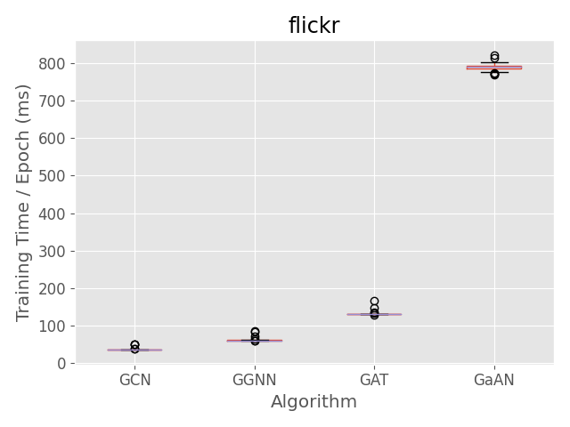

(e) flickr

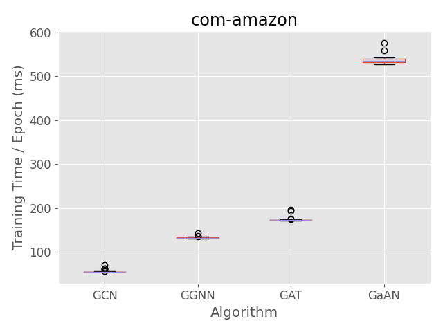

(f) com-amazon

**图: 训练耗时的影响 [@fig:exp_absolute_training_time].**

根据[@tbl:gnn_overview]中的复杂度分析, 各GNN的点、边计算复杂度与各算法超参数(例如$h_{dim}$、$K$等)呈线性关系.
为了验证该线性关系, 我们测量了各GNN的训练时间随超参数的变化情况.

GCN和GGNN的计算复杂度受隐向量维度$h_{dim}$影响.
$h_{dim}$同时影响Layer0的输出隐向量维度和Layer1的输入隐向量维度（即$h_{dim}=h^0_{out}=h^1_{in})$.
[@fig:exp_hyperparameter_on_vertex_edge_phase_time_gcn]和[@fig:exp_hyperparameter_on_vertex_edge_phase_time_ggnn]展示了GCN和GGNN训练耗时受$h_{dim}$的影响情况.
随着$h_{dim}$的增加,训练耗时呈线性增长.

GAT采用了多头机制,其计算复杂度受输入隐向量维度$d_{in}$, 每个头的隐向量维度$h_{head}$和头数$K$的影响.
每一层的输出隐向量维度$d_{out}=K h_{head}$.
因为在GAT结构中$h^1_{in}=h^0_{out}$, 调整$h_{head}$和$K$即相当于调整了Layer1的$h^1_{in}$.
[@fig:exp_hyperparameter_on_vertex_edge_phase_time_gat]展示了GAT训练耗时受超参数$h_{head}$和$K$的影响.
GAT训练耗时随$h_{head}$和$K$呈线性增长.

GaAN同样采用多头机制,其计算复杂度受$d_{in}$、$d_v$、$d_a$和头数$K$的影响.
[@fig:exp_hyperparameter_on_vertex_edge_phase_time_gat]展示了GaAN训练耗时受超参数的影响.
实验验证了[@tbl:gnn_overview]中给出的复杂度分析结果,各GNN算法的训练耗时随着超参数的增加呈线性增长.
当隐向量维度$d_{in}$过低时, 涉及隐向量的计算占总计算时间比例很低, 导致其总训练耗时变化不明显.
当隐向量维度足够大时, 总训练时间随$d_{in}$呈线性增长.

(a) GCN [#fig:exp_hyperparameter_on_vertex_edge_phase_time_gcn]

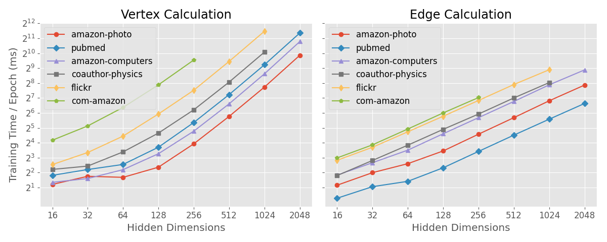

(b) GGNN [#fig:exp_hyperparameter_on_vertex_edge_phase_time_ggnn]

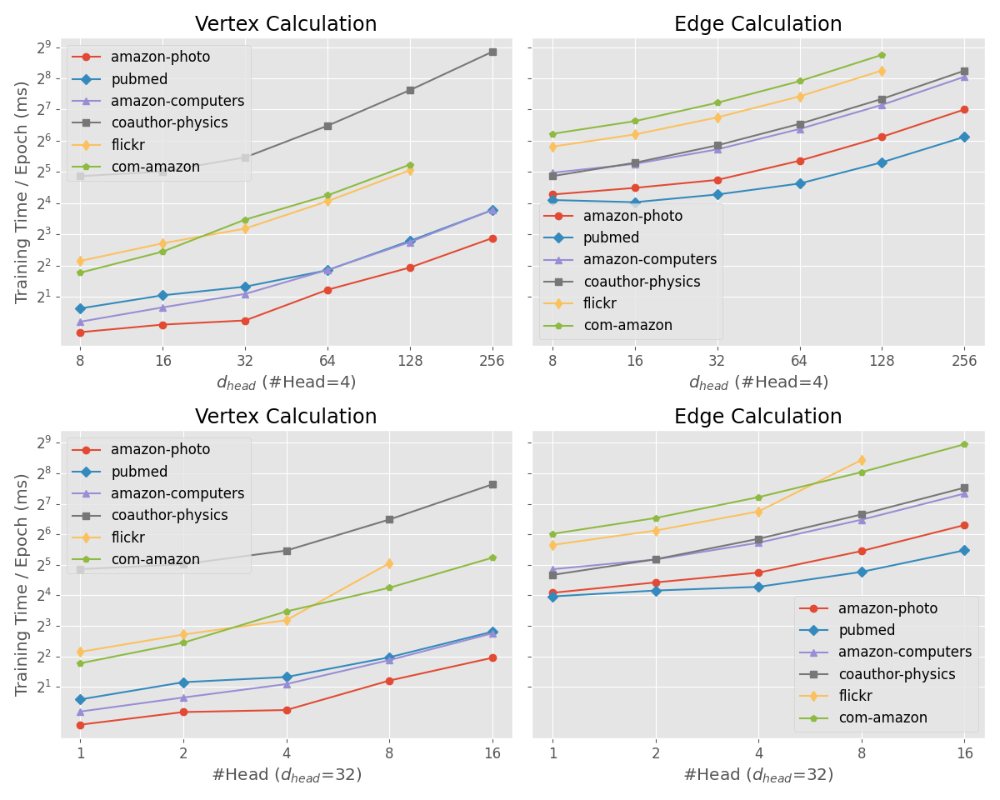

(c) GAT [#fig:exp_hyperparameter_on_vertex_edge_phase_time_gat]

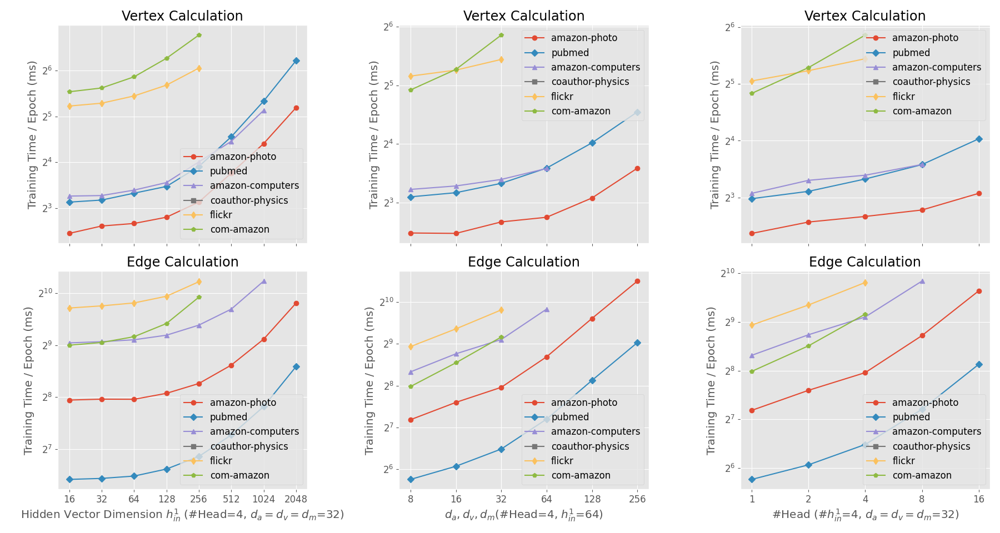

(d) GaAN [#fig:exp_hyperparameter_on_vertex_edge_phase_time_gaan]

**图: 超参数对GNN中点/边计算耗时的影响** [#fig:exp_hyperparameter_on_vertex_edge_phase_time]

[@fig:exp_hyperparameter_on_memory_usage]同时展示了各GNN对GPU显存的使用情况随算法超参数的变化情况.
随着超参数的增加,GNN的显存使用也线性增长.

(a) GCN

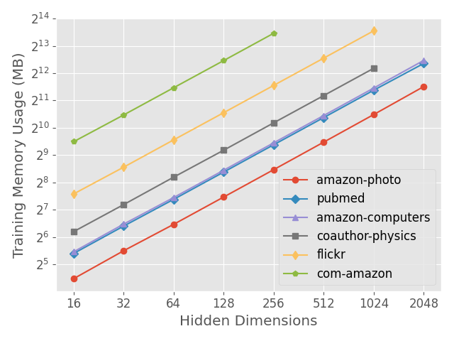

(b) GGNN

(c) GAT

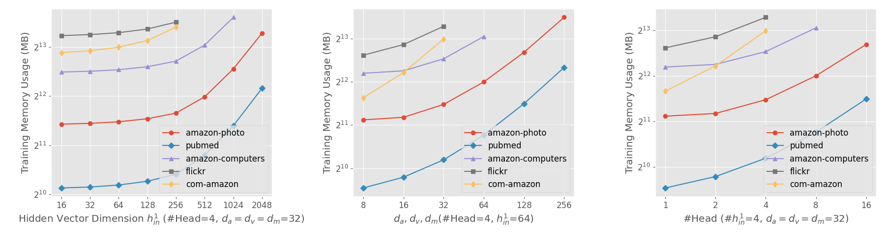

(d) GaAN

**图: 超参数对训练阶段显存使用的影响(不含数据集本身).** [#fig:exp_hyperparameter_on_memory_usage]

实验验证了[@tbl:gnn_overview]中复杂度分析的有效性. *GNN的训练耗时与显存使用均与超参数呈线性关系*. 这允许算法工程师使用更大的超参数来提升GNN的复杂度,而不用担心训练耗时和显存使用呈现爆炸性增长.

## 4.2 实验2: 训练耗时分解

本实验的目标是通过对训练耗时的分解, 发掘GNN训练中的计算性能瓶颈.

**点/边计算耗时比例分析**: 对于点计算和边计算, [@fig:exp_vertex_edge_cal_proportion]展示了各算法不同GNN层点/边计算耗时占总训练耗时的比例情况(含forward, backward和evaluation阶段). GCN算法在大多数数据集上边计算耗时占据主导. 只有`cph`数据集是特例, 因为该数据集输入特征向量维度非常高, 导致Layer0的点计算耗时额外的高. GGNN因为其点计算复杂度高, 使其点计算耗时占比明显高于其他算法, 但在大多数数据集上依然是边计算占据主要的计算耗时. 只有在`pub`和`cam`数据集上,边计算开销和点计算开销接近,因为两个数据集平均度数较低 (仅为4.5和2.8). 对于GAT和GaAN算法, 因为其边计算复杂度高, 其边计算耗时占绝对主导. 综上, *边计算是GNN训练的主要耗时因素*, 尤其是在边计算较为复杂的情况下.

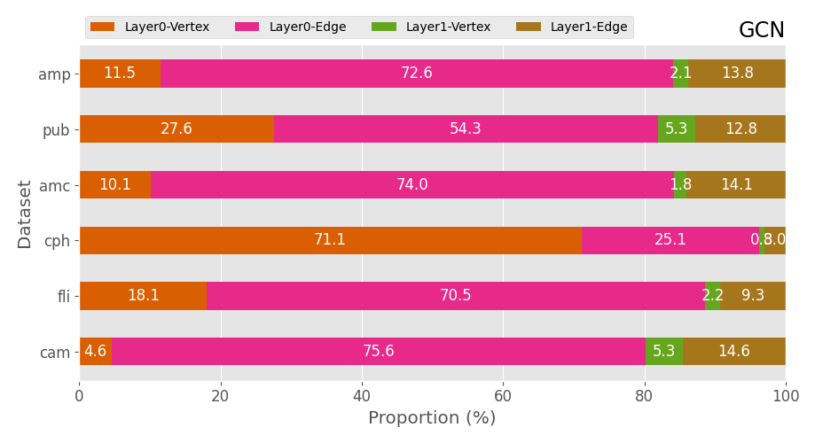 (a) GCN

 (b) GGNN

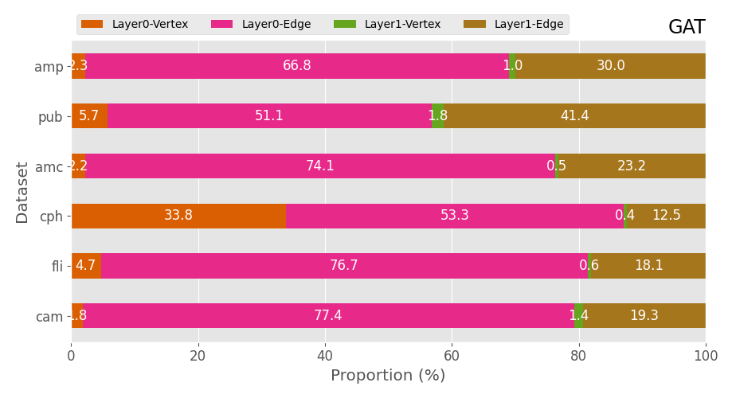 (c) GAT

 (d) GaAN

**图: 点/边计算耗时占比.** [#fig:exp_vertex_edge_cal_proportion]

实验也表明*数据集的平均度数影响点/边计算的耗时比例*. 我们固定图的顶点数为50k, 利用R-MAT生成器生成平均度数在10到100之间的随机图. 我们测量了各GNN中点/边计算的耗时比例随图平均度数的变化情况, 如[@fig:exp_avg_degree_vertex_edge_cal_time]所示. 边计算的耗时随着平均度数的增加呈线性增长, *边计算耗时在绝大部分情况下主导了整个计算耗时*, 只有在点计算复杂度非常高且平均度数非常低的情况下点计算耗时才能赶超边计算耗时. 因此, *GNN训练优化的重点应该是提升边计算的效率*.

 (a) GCN

 (b) GGNN

 (c) GAT

 (d) GaAN

**图: 平均顶点度数对点/边计算耗时比例的影响.** [#fig:exp_avg_degree_vertex_edge_cal_time]

**边计算耗时分解分析**: 边计算阶段可以进一步分解为collect, message, aggregate和update四个步骤, 如图[@fig:steps_in_edge_calculation]所示. 图中展示的是第$l$层GNN的边计算过程. edge index是一个保存由图的边集的规模为M*2的矩阵, 其中M是图的边数, 该矩阵的两列分别保存每条边的源顶点和目标顶点. edge index在整个计算过程中保持不变. 其中collect步骤用于准备边计算所需要的数据结构. 该步骤将输入GNN层的顶点隐向量$h_i^l (1 \leq i \leq N)$根据edge index拷贝到各边的两层, 构成输入边计算函数$\phi$的输入参数张量(包含$h_i^l$,$h_j^l$和$e_{ij}$). 此步骤没有计算,只涉及数据访问. message步骤调用用户给出的函数$\phi$完成边计算过程, 并得到每条边的消息向量$m_{ij}^l (e_{ij} \in E(G))$. aggregate步骤根据每条边的目标顶点, 将目标顶点相同的消息向量通过聚合算子$\Sigma$聚合在一起, 得到每个顶点聚合向量$a_i^l (1 \leq i \leq N)$. 最后的update步骤是可选的, 其可以对聚合后的向量进行额外的修正处理(例如在GCN和GAT中增加bias).经过update处理后的聚合向量$a_i^l$将被输入到点计算函数$\gamma$中作为输入参数.

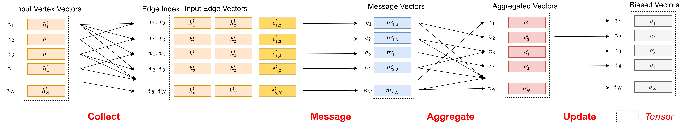

**图: 边计算的步骤分解.** [#fig:steps_in_edge_calculation]

我们对各GNN算法在不同数据集上的边计算过程进行了执行时间分解, 结果如图[fig:exp_edge_cal_decomposition](#fig:exp_edge_cal_decomposition)所示. collect步骤虽然只进行了数据准备, 但其在所有的GNN中均占据了不少的执行时间. 对于message步骤, 在边计算复杂度高的GNN (GAT和GaAN)中其,占据了绝对主导; 在GCN中虽然其边计算只有简单的数乘操作, 但其耗时依然有20%以上; 在GGNN中, 因为其边计算函数$\boldsymbol{m}_{j,i}^l=\boldsymbol{W}\boldsymbol{h}_{j}^l$只与源顶点有关, 所以在PyG的实现中将$\boldsymbol{W}\boldsymbol{h}_j^l$的计算移动到边计算开始之前预先进行 (因为这部分计算只与顶点相关, 因此我们将该计算计入点计算阶段), 计算出的结果被缓存下来, 在进行message步骤时直接读取, 因而GGNN的message步骤耗时为0. 对于aggregate步骤, 在边计算复杂度低的GNN (GCN和GGNN)中其占据了至少35%的耗时, 而在边计算复杂度高的GNN (GAT和GaAN), 其耗时与collect步骤接近, 均远低于message步骤. 实验表明*对于边计算复杂度高的算法, 其message步骤是其性能的瓶颈, 应重点优化*; 而**对于边计算复杂度低的算法, 优化collect和aggregate步骤能显著降低训练耗时*.

 (a) GCN

 (b) GGNN

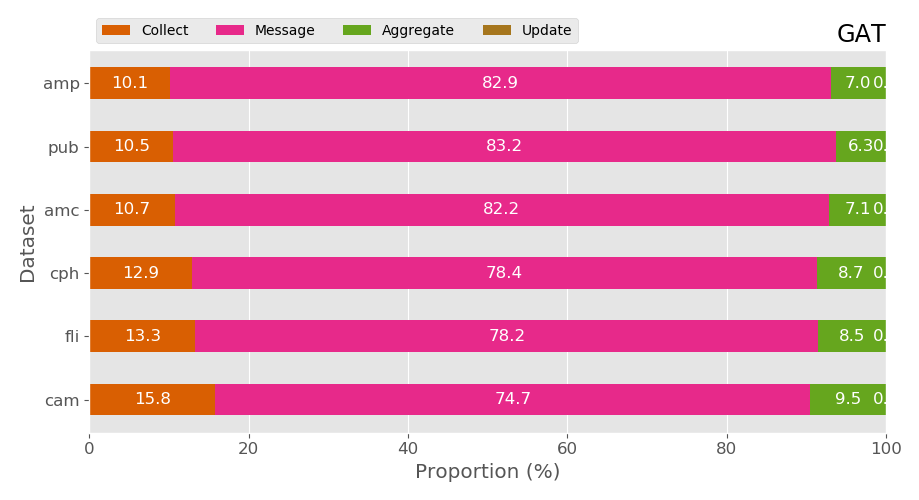 (c) GAT

 (d) GaAN

<a name="fig:exp_edge_cal_decomposition"> **图: 边计算耗时分解 (包含Layer0和Layer1).** </a>

**热点算子分析**: 点/边计算的各种函数$\phi, \Sigma,\gamma$由一系列基本算子构成, 基本算子被映射到GPU上的具体基本算子(例如矩阵乘法mm, 按元素数乘elementwise_kernel和张量按index选择index_select). 图[@fig:exp_top_basic_ops](#fig:exp_top_basic_ops)展示了各GNN中耗时比例最高的5个算子, 图例中算子顺序由平均耗时占比确定.

 (a) GCN

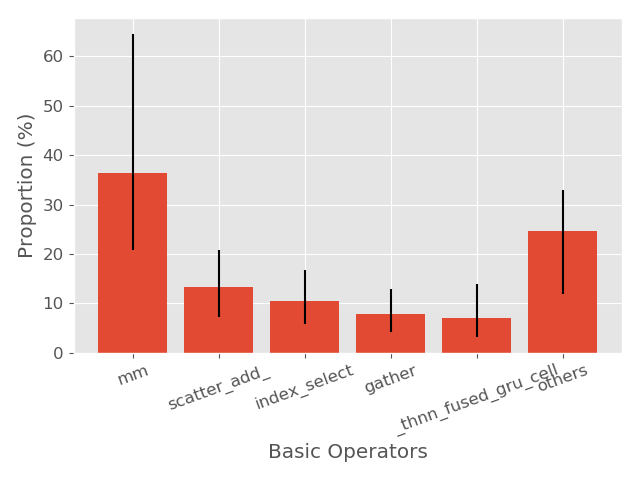 (b) GGNN

 (c) GAT

 (c) GaAN

<a name="fig:exp_top_basic_ops">**图: 基本算子的耗时比例 (含forward, backward和evaluation阶段)**</a>

各算法的高耗时算子分析如下:

- GCN中矩阵乘法算子mm主要用于点计算中$\gamma$,  该算子在cph数据集上尤其耗时, 因为cph输入的顶点特征向量维度非常高, 使得Layer0的点计算中矩阵乘法的计算量很高. mul是边计算函数$\phi$中的数乘操作.  scatter_add和gather均用于实现边计算中的聚合步骤$\Sigma$, 其中前者用于forward阶段后者用于backward阶段. index_select算子用于边计算中的collect步骤. 对于GCN算法来说, 边计算相关算子占据了主要的耗时, 各算子之间耗时比较平均, 没有特别突出的性能瓶颈.
- GGNN中最耗时的也是矩阵乘法mm算子, 主要用于点计算函数$\gamma$. scatter_add, index_select和gather算子用于边计算. 而thnn_fused_gru_cell用于GRU的backward计算中. GGNN因为点计算复杂度的提升, mm算子的耗时时间明显提高.
- GAT中最耗时的5个算子均与边计算相关. inpux_put_impl, mul和mm用于实现边计算函数$\phi$. index_select和index算子用于边计算中的collect阶段.
- GaAN中最耗时的矩阵乘法算子mm同时用于边计算和点计算, 其中边计算占主导. mul和cat用于边计算中的$\phi$函数.

从共性来说, *GNN计算的主要耗时还是在矩阵乘法mm, 按元素数乘mul等算子*, 因此非常适合用GPU进行计算.  边计算中的aggregate步骤虽然计算较为简单, 但因为涉及数据同步和非规整计算(不同顶点的度数差距很大), 其相关算子scatter_add和gather的依然占据了一定的耗时. 边计算中的collect步骤虽然没有任何的计算, 但是其相关算子index_select依然占据了10%左右的耗时. *aggregate步骤和collect步骤是所有GNN训练的计算性能瓶颈之一*, 优化相应的算子将能提升所有GNN的训练效率.

**性能瓶颈总结**:  

- GNN训练性能瓶颈受数据集的平均度数影响. 因为绝大部分现实世界中的图的平均度数在10度以上[@network-repository], GNN训练中的性能瓶颈将集中在边计算部分.
- 根据边计算函数$\phi$的计算复杂度不同, GNN的在边计算中的性能瓶颈不同:
  - 如果$\phi$的计算复杂度较高, 性能瓶颈集中在实现$\phi$所用的基本算子. 优化相应基本算子的实现将能提升这类GNN的训练性能. 以GAT为例, GAT中最耗时的算子input_put_impl用于$\phi$中softmax计算($\alpha^k_{ij}$)的backward阶段, 该算子只涉及数据移动. 优化的softmax在GPU上的实现能够显著降低GAT的训练耗时.
  - 如果$\phi$的计算复杂度较低, 其边计算中的collect和aggregate步骤是计算性能瓶颈. collect步骤只涉及大量的数据移动. 而aggregate步骤计算较为简单(例如求和/平均/最大值等), 但因为涉及数据同步和不规整计算, 其耗时依然显著. 优化这两个步骤在GPU上的实现将能提升这类GNN的训练性能.

## 4.3 实验3: GPU内存使用分析

目前PyG在利用GPU训练GNN的过程中所有数据(含数据集和中间计算结果)均保存在GPU的内存中. 相比系统的主存, GPU上内存容量非常有限. *GPU内存容量是限制能够训练的数据集规模的决定因素*.

图[@fig:exp_memory_usage_stage_cam](#fig:exp_memory_usage_stage_cam)展示了各个GNN在cam数据集上训练时各个阶段的最大内存使用的情况, 其他的数据集上情况类似. 在训练过程中, 内存使用在forward阶段逐渐升高, 因为在forward阶段会对于关键的中间计算结果进行缓存, 这些中间计算结果将用于backward阶段的梯度计算, 可以避免从头再计算.

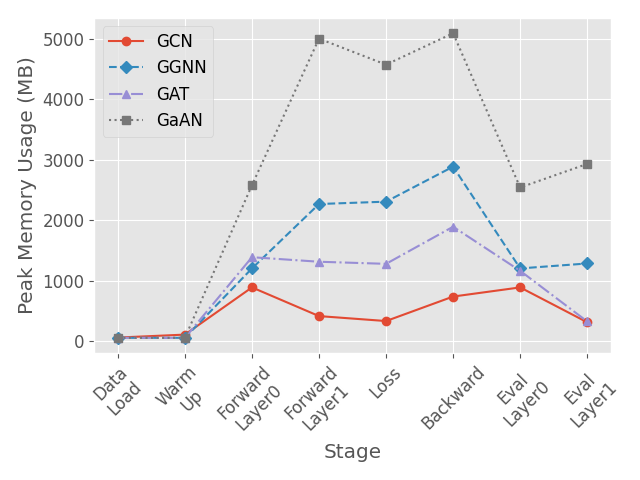

<a name="fig:exp_memory_usage_stage_cam">**图: 各阶段中最大内存使用. 数据集:com-amazon.**</a>

GNN对内存使用在forward我们测量了GNN经过warm up epoch之后的内存使用和训练过程中峰值 

## 4.4 实验4: 采样技术对训练性能的影响分析

# 5 系统设计建议

# 6 相关工作

# 7 总结与展望

# 参考文献

1. ZHOU J, CUI G, ZHANG Z, 等. Graph Neural Networks: A Review of Methods and Applications[J]. 2018.[@zhou2018_gnn_review]
2. YANG Z, COHEN W W, SALAKHUTDINOV R. Revisiting Semi-Supervised Learning with Graph Embeddings[C]//BALCAN M, WEINBERGER K Q. Proceedings of the 33nd International Conference on Machine Learning, ICML 2016, New York City, NY, USA, June 19-24, 2016. JMLR.org, 2016, 48: 40–48. [@yang2016_revisiting_semisupervised]
3. SHCHUR O, MUMME M, BOJCHEVSKI A, 等. Pitfalls of Graph Neural Network Evaluation[J]. CoRR, 2018, abs/1811.05868. [@shchur2018_pitfall_of_gnn]
4. ZENG H, ZHOU H, SRIVASTAVA A, 等. GraphSAINT: Graph Sampling Based Inductive Learning Method[C]//8th International Conference on Learning Representations, ICLR 2020, Addis Ababa, Ethiopia, April 26-30, 2020. OpenReview.net, 2020. [@zeng2020_graphsaint]
5. YANG J, LESKOVEC J. Defining and Evaluating Network Communities Based on Ground-Truth[C]//ZAKI M J, SIEBES A, YU J X, 等. 12th IEEE International Conference on Data Mining, ICDM 2012, Brussels, Belgium, December 10-13, 2012. IEEE Computer Society, 2012: 745–754. [@yang2012_defining]
6. CHAKRABARTI D, ZHAN Y, FALOUTSOS C. R-MAT: A Recursive Model for Graph Mining[C]//Proceedings of the 2004 SIAM International Conference on Data Mining.: 442–446. [@rmat-generator]
7. Fey, M., & Lenssen, J. E. (2019). Fast Graph Representation Learning with PyTorch Geometric. (1), 1–9. [@fey_2019_pyg]
8. https://github.com/dmlc/dgl [@dgl_website]
9. Gilmer, J., Schoenholz, S. S., Riley, P. F., Vinyals, O., & Dahl, G. E. (n.d.). Neural Message Passing for Quantum Chemistry. [@gilmer_messgae_passing]
10. Rossi R A , Ahmed N K . The Network Data Repository with Interactive Graph Analytics and Visualization[C]// Proceedings of the Twenty-Ninth AAAI Conference on Artificial Intelligence. AAAI Press, 2015. http://networkrepository.com/networks.php [@network-repository]

