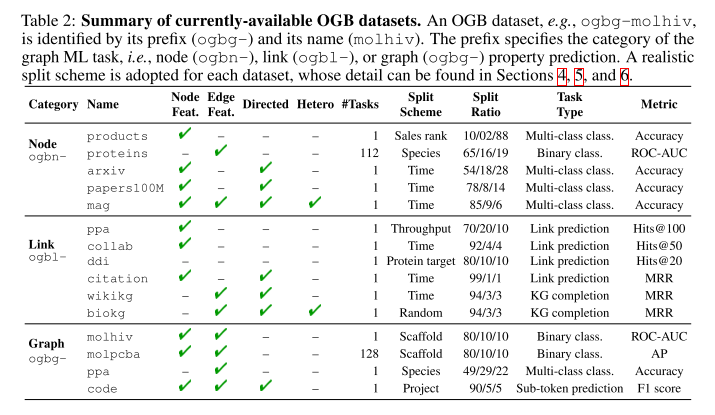
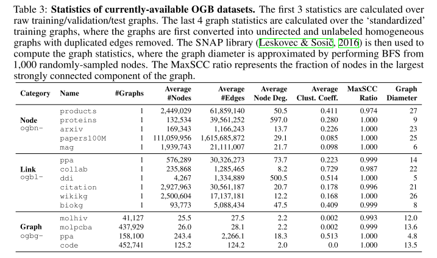
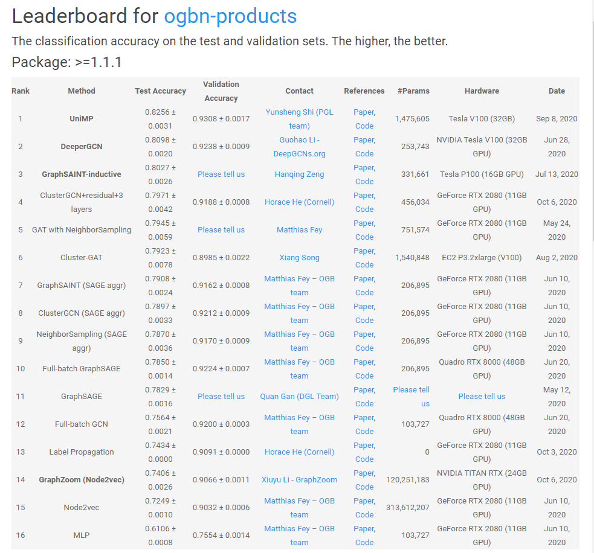
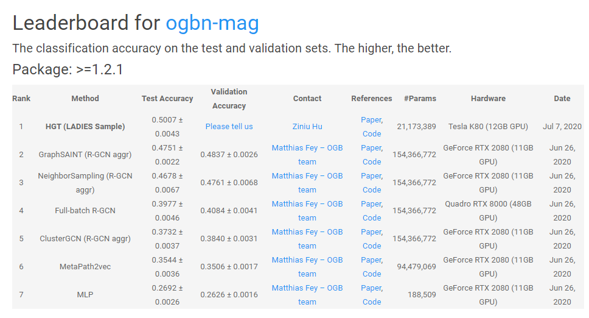
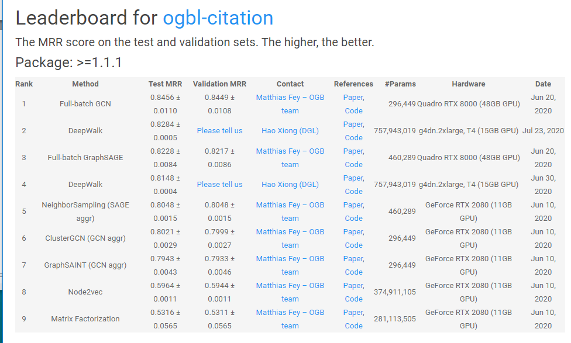

参考benchmark: [Open Graph Benchmark: Datasets for Machine Learning on Graphs](https://ogb.stanford.edu/docs/home/), 已经被NIPS2020接收

## Benchmark

### 数据集

### 学习任务

根据Task分类，可以分为：
- node property prediction
    - [ogbn-products](https://ogb.stanford.edu/docs/leader_nodeprop/)
    
        - GraphSAINT(SAGE aggr)
        - ClusterGCN(SAGE aggr)
        - NeighborSampling(SAGE aggr)
        - Full-batch GraphSAGE
        - GAT+NeighborSampling
        - Cluster-GAT
    - [ogbn-mag](https://ogb.stanford.edu/docs/leader_nodeprop/)
    
        - HGT(LADIES Sample)
        - GraphSAINT(R-GCN aggr)
        - NeighborSampling(R-GCN aggr)
        - Full-batch(R-GCN aggr)
        - ClusterGCN(R-GCN aggr)
- link prboperty prediction
    - [ogbl-citation](https://ogb.stanford.edu/docs/leader_linkprop/)
    
        - Full-batch GCN
        - Full-batch GraphSAGE
        - NeighborSampling(SAGE aggr)
        - ClusterGCN(GCN aggr)
        - GraphSAINT(GCN aggr)
- graph property prediction(无合适)

## Motivation验证实验

选取ogbn-products, ogbn-mag, ogbl-citaton三个数据集，数据集基本信息为

| 数据集 | 点数 | 边数 | 平均度数 | 点特征数 | 边特征数 | 学习任务 | 采样算法 | 基本模型 |
| --- | --- | --- | --- | --- | --- | --- | --- | -- |
| ogbn-products | 2,449,029 | 61,859,140 | 50.5 | 有 | 无 | Multi-class type | full, NS(NeigborSampling), Cluster, GraphSAINT |SAGE aggr |
| ogbn-mag | 1,939,743 | 21,111,007 | 21.7 | 有 | 有 | Multi-class type | full, NS(NeigborSampling), Cluster, GraphSAINT | RGCN aggr |
| ogbl-citation | 2,927,963 | 30,561,187 | 20.7| 有 | 无 | Link Prediction |  full, NS(NeigborSampling), Cluster, GraphSAINT | GCN aggr(缺NS) |

### 实验环境

Tesla T4 16GB * 2
[参数Tesla T4 vs V100](https://blog.csdn.net/tony_vip/article/details/105658715)

- [x] 代码审查
- [x] 可执行测试
    > ogdb-products和ogbl-citations下Full-batch内存不够, 不能运行
- [x] 正确性测试, 并记录训练参数
    - ogdb-products
        - cluster_gcn: valid91.75, Test78.33  epochs: 10*50
        - graph_saint: Vaild91.68, Test78.91  epochs: 10*20
        - neighbor_sampling: Test0.7852 epochs: 10*3
    - ogdb-mag
        - cluster_gcn: Valid32.47, Test32.90, epochs: 10*30
        - graph_saint: Valid48.44, Test47.68, epochs: 10*30
        - neighbor_sampling: Valid47.80, Test46.75, epochs: 10*3
        - rgcn: Valid41.28, Test40.26, epochs: 10*50
    - ogbl-citations(运行时间太长，抛弃)
        - cluster_gcn: 
        - graph_saint:
        - neighbor_sampling: 
- [x] 参数收集, 划分比例为1%, 3%, 6%, 10%, 25%, 50%
    - [x] 收集Cluster-GCN的num_partitions, batch_size
        - ogdn-products: 15000, 32
            > [150.0, 450.0, 900.0, 1500.0, 3750.0, 7500.0]
        - ogbn-mag: 5000, 500
            > [50.0, 150.0, 300.0, 500.0, 1250.0, 2500.0]
        - ogbl-citation: 15000, 256
    - [x] 收集GraphSAINT的Batch Size
        - ogdn-products: 20000, test(4096)
            > 2449029
            > [24490, 73470, 146941, 244902, 612257, 1224514]
        - ogdn-mag: 20000
            > 1939743
            > [19397, 58192, 116384, 193974, 484935, 969871]
        - ogbl-citation: 16*1024
            > 2927963
            > [29279, 87838, 175677, 292796, 731990, 1463981]
    - [x] 收集NS的Batch Size
        - ogdn-products: 1024, test(4096)
        - ogdn-mag: 1024
- [ ] 设置参数，收集结果:(sample采样时间占总时间的比例，收敛轮数和收敛精度)
    > 备注: 
    > 1. 原本的模式没有进行改变，比如test的时机, 唯一发生改变的就是batch_size的大小
    > 2. 计时方式同之前的实验一样, 与之前记录avg_batch时间不同，这里记录总时间；
    > 3. 测量方式同之前的测量方式